**Setup**

```sh
git clone https://github.com/gcanti/functional-programming.git
cd functional-programming
npm i
```

# Che cos'è la programmazione funzionale

> Functional Programming is programming with pure functions. Mathematical functions.

Una rapida ricerca su internet vi può portare alla seguente definizione:

> Una funzione pura è una procedura che dato lo stesso input restituisce sempre lo stesso output e non ha alcun side effect osservabile.

Il termine "side effect" non ha ancora un significato preciso (vedremo in seguito come darne una definizione formale), ciò che conta per ora è averne una qualche intuizione, pensate per esempio ad aprire un file per leggerne il contenuto, oppure scrivere su un database.

Ma com'è strutturato un programma che usa solo funzioni pure?

Un programma in stile funzionale tende ad essere scritto come una **pipeline**:

```ts
const program = pipe(
  input,
  f1, // funzione pura
  f2, // funzione pura
  f3, // funzione pura
  ...
)
```

Ciò che accade è che `input` viene passato come input alla prima funzione `f1`, la quale restituisce un valore in output che viene passato come input alla seconda funzione `f2`, la quale restituisce un valore in output che viene passato come input alla terza funzione `f3`, e così di seguito.

**Demo**

[`00_pipe_and_flow.ts`](src/00_pipe_and_flow.ts)

Vedremo come la programmazione funzionale ci fornisce i mezzi per strutturare il nostro codice in questo stile.

Oltre a capire cosa sia la programmazione funzionale, è altrettanto fondamentale capire quale sia il suo scopo.

L'obbiettivo della programmazione funzionale è **dominare la complessità di un sistema** usando modelli formali e ponendo particolare attenzione alle **proprietà del codice** e alla facilità di refactoring.

> Functional programming will help teach people the mathematics behind program construction:
> - how to write composable code
> - how to reason about side effects
> - how to write consistent, general, less ad-hoc APIs

Che vuol dire porre attenzione alle proprietà del codice? Vediamo un esempio

**Esempio**

Perché possiamo dire che la funzione `map` di `Array` è "più funzionale" di un ciclo `for`?

```ts
// input
const xs: Array<number> = [1, 2, 3]

// trasformazione
const double = (n: number): number => n * 2

// risultato: voglio un array con tutti gli elementi di `xs` raddoppiati
const ys: Array<number> = []
for (let i = 0; i < xs.length; i++) {
  ys.push(double(xs[i]))
}
```

Un ciclo `for` è molto flessibile, posso modificare:

- l'indice di partenza
- la condizione di fine
- il passo

Ma ciò vuol dire anche che ci sono più possibilità di introdurre **errori** e non ho alcuna **garanzia sul risultato**.

**Quiz**. Avete controllato che io abbia scritto bene il ciclo?

Vediamo ora come si utilizza `map`

```ts
// risultato: voglio un array con tutti gli elementi di `xs` raddoppiati
const ys = xs.map(double)
```

Notate come `map` sia meno flessibile, tuttavia dà più garanzie:

- gli elementi dell'input verrano processati tutti dal primo all'ultimo
- qualunque sia l'operazione che viene fatta nella callback, il risultato sarà sempre un array con lo stesso numero di elementi
dell'array in input

Dal punto di vista funzionale, ambito in cui sono importanti le proprietà del codice piuttosto che i dettagli implementativi, l'operazione `map` è interessante **proprio in quanto limitata**.

Pensate per esempio a quanto sia più facile la review di una PR che coinvolga una `map` rispetto ad un ciclo `for`.

# I due pilastri della programmazione funzionale

La programmazione funzionale si appoggia a questi due pilastri:

- trasparenza referenziale
- composizione come design pattern universale

Tutto ciò che vedremo in seguito nel corso deriva direttamente o indirettamente da questi due punti.

Incominciamo dalla trasparenza referenziale.

## Trasparenza referenziale

> **Definition**. An **expression** is said to be _referentially transparent_ if it can be replaced with its corresponding value without changing the program's behavior

**Esempio** (la trasparenza referenziale implica l'uso di funzioni pure)

```ts
const double = (n: number): number => n * 2

const x = double(2)
const y = double(2)
```

L'espressione `double(2)` gode della proprietà di trasparenza referenziale perché posso sostituirla con il suo valore `4`.

Posso perciò tranquillamente procedere con il seguente refactoring

```ts
const x = 4
const y = x
```

Non tutte le espressioni godono della proprietà di trasparenza referenziale, vediamo qualche esempio

**Esempio** (la trasparenza referenziale implica non lanciare eccezioni)

```ts
const inverse = (n: number): number => {
  if (n === 0) throw new Error('cannot divide by zero')
  return 1 / n
}

const x = inverse(0) + 1
```

Non posso sostituire l'espressione `inverse(0)` con il suo valore, perciò l'espressione non gode della proprietà di trasparenza referenziale.

**Esempio** (la trasparenza referenziale implica l'utilizzo di strutture dati immutabili)

```ts
const xs = [1, 2, 3]

const append = (xs: Array<number>): void => {
  xs.push(4)
}

append(xs)

const ys = xs
```

Nell'ultima riga non posso sostituire l'espressione `xs` con il suo valore iniziale `[1, 2, 3]` dato che il suo valore attuale è stato cambiato dalla chiamata alla funzione `append`.

Perché è così importante la trasparenza referenziale? Perché permette di:

- **ragionare localmente** sul codice (ovvero non ho bisogno di conoscere un contesto più ampio per capire un frammento di codice)
- **rifattorizzare** senza cambiare il comportamento del programma (per la definizione stessa di trasparenza referenziale)

**Quiz**. Supponiamo di avere il seguente programma:

```ts
// In TypeScript `declare` permette di introdurre una definizione senza specificarne l'implementazione.
declare const question: (message: string) => Promise<string>

const x = await question('What is your name?')
const y = await question('What is your name?')
```

Posso rifattorizzarlo in questo modo? Il comportamento del programma è lo stesso o è cambiato?

```ts
const x = await question('What is your name?')
const y = x
```

Come potete vedere il refactoring di un programma che contiene espressioni che non godono della proprietà di trasparenza referenziale va affontato con molta cautela. Nella programmazione funzionale, ove ogni espressione gode della proprietà di trasparenza referenziale, il carico cognitivo in fase di refactoring è ridotto.

Parliamo ora del secondo pilastro, la composizione.

## Composizione

Il pattern fondamentale della programmazione funzionale è la _componibilità_, ovvero la costruzione di piccole unità
che fanno qualcosa di specifico in grado di essere combinate tra loro al fine di ottenere entità più grandi e complesse.

Come esempi, e in un percorso dal "più piccolo al più grande", possiamo pensare:

- alla composizione di due semplici valori (come due numeri o due stringhe)
- oppure alla composizione di funzioni
- o anche alla composizione di interi programmi

In questo ultimo caso possiamo parlare di "programmazione modulare":

> By modular programming I mean the process of building large programs by gluing together smaller programs - Simon Peyton Jones

Vediamo nella pratica come è possibile tendere verso questo stile di programmazione attraverso l'uso di quelli che vengono chiamati combinatori.

Il termine **combinatore** si riferisce al [combinator pattern](https://wiki.haskell.org/Combinator):

> A style of organizing libraries centered around the idea of combining things. Usually there is some type `T`, some "primitive" values of type `T`, and some "combinators" which can combine values of type `T` in various ways to build up more complex values of type `T`

Il concetto di combinatore è piuttosto sfumato e si può presentare in diverse forme, ma la sua forma più semplice è questa:

```ts
combinator: Thing -> Thing
```

**Esempio**. Possiamo pensare alla funzione `double` come ad un combinatore di numeri.

Lo scopo di un combinatore è quello di creare nuove "cose" da "cose" definite precedentemente.

Notate che il risultato del combinatore può essere nuovamente passato come input, si ottiene perciò una esplosione combinatoria di possibilità, il che rende questo pattern molto potente.

**Esempio**

```ts
import { pipe } from 'fp-ts/function'

const double = (n: number): number => n * 2

console.log(pipe(2, double, double, double)) // => 16
```

Perciò il design generale che potete spesso trovare in un modulo funzionale è questo:

- un modello per `T`
- un insieme di semplici "primitive" di tipo `T`
- un insieme di combinatori per combinare le primitive in strutture più complesse

Proviamo ad implementare un modulo di questo tipo:

**Demo**

[`01_retry.ts`](src/01_retry.ts)

Come potete vedere dalla demo precedente, con sole tre primitive e due combinatori siamo stati in grado di esprimere una policy piuttosto complessa.

Pensate a come, aggiungendo anche una sola nuova primitiva (o un nuovo combinatore) a quelli già definiti, le possibilità espressive aumentano esponenzialmente.

Dei due combinatori definiti in `01_retry.ts` una menzione speciale va a `concat` dato che è possibile collegarlo ad una importante astrazione della programmazione funzionale: i semigruppi.

# Modellare la composizione con i semigruppi

Un semigruppo è una ricetta per combinare due (o più) valori.

Tecnicamente un semigruppo è un'algebra, in generale con il termine "algebra" si intende una particolare combinazione di:

- uno o più insiemi
- una o più operazioni sugli insiemi precedenti
- una o più leggi a cui devono obbedire le operazioni precedenti

Le algebre sono il modo in cui i matematici catturano un concetto nel modo più diretto eliminando tutto ciò che è superfluo.

> Quando si manipola un'algebra sono permesse solo le operazioni definite dall'algebra stessa e in conformità alle sue leggi

L'equivalente delle algebre in programmazione sono le **interfacce**:

> Quando si manipola una interfaccia sono permesse solo le operazioni definite dall'interfaccia stessa e in conformità alle sue leggi.

Prima di affrontare i semigruppi vediamo un primo semplice esempio di algebra che li precede: il magma.

## Definizione di magma

Possiamo usare una `interface` di TypeScript per modellare un magma:

```ts
interface Magma<A> {
  readonly concat: (first: A, second: A) => A
}
```

Abbiamo quindi un'operazione `concat` che prende due valori di un certo tipo `A` e restituisce un nuovo valore dello stesso tipo (proprietà di chiusura). Dato che il risultato può a sua volta essere utilizzato come input l'operazione può essere ripetuta a piacimento. In altre parole `concat` è un [combinatore](#composizione) per il tipo `A`.

**Quiz**. Il fatto che una operazione sia chiusa non è una proprietà banale, potete fare un esempio di operazione sui numeri naturali (ovvero i numeri interi positivi) per cui la proprietà di chiusura non vale?

Per avere una istanza concreta di magma per un determinato tipo occorre perciò definire un oggetto conforme a questa interfaccia.

**Esempio** (una istanza di `Magma` per il tipo `number`)

```ts
import { Magma } from 'fp-ts/Magma'

const MagmaSub: Magma<number> = {
  concat: (first, second) => first - second
}

// helper
const getPipeableConcat = <A>(M: Magma<A>) => (second: A) => (first: A): A =>
  M.concat(first, second)

const concat = getPipeableConcat(MagmaSub)

// esempio di utilizzo

import { pipe } from 'fp-ts/function'

pipe(10, concat(2), concat(3), concat(1), concat(2), console.log)
// => 2
```

Notate che la definizione di `concat` è stata concepita per agevolarne l'uso con `pipe`.

**Quiz**. Consideriamo la seguente funzione che trasforma una lista in un dizionario, perché si richiede un `Magma` come parametro?

```ts
import { pipe } from 'fp-ts/function'
import { Magma } from 'fp-ts/Magma'

declare const fromReadonlyArray: <A>(
  M: Magma<A>
) => (as: ReadonlyArray<readonly [string, A]>) => Record<string, A>

// esempio di utilizzo

const MagmaSub: Magma<number> = {
  concat: (first, second) => first - second
}

pipe(
  [
    ['a', 1],
    ['b', 2]
  ],
  fromReadonlyArray(MagmaSub),
  console.log
) // => { a: 1, b: 2 }
pipe(
  [
    ['a', 1],
    ['b', 2],
    ['a', 3]
  ],
  fromReadonlyArray(MagmaSub),
  console.log
) // => { a: -2, b: 2 }
```

Un `Magma<A>` è un'algebra molto semplice:

- un insieme (`A`)
- una operazione (`concat`)
- nessuna legge

vediamo ora un'algebra che definisce una legge: i semigruppi.

## Definizione di semigruppo

Se l'operazione `concat` di un `Magma` è anche **associativa** allora parliamo di semigruppo.

Un'operazione binaria `*` si dice "associativa" se vale:

```ts
(x * y) * z = x * (y * z)
```

per ogni `x`, `y`, `z`.

L'associatività ci dice che non dobbiamo preoccuparci delle parentesi nelle espressioni e che, volendo, possiamo scrivere semplicemente `x * y * z` (non c'è ambiguità).

**Esempio**

La concatenazione di stringhe (`+`) gode della proprietà associativa.

```ts
("a" + "b") + "c" = "a" + ("b" + "c") = "abc"
```

Ogni semigruppo è un magma, ma non ogni magma è un semigruppo.

<center>
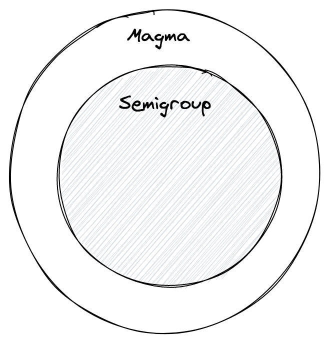
</center>

**Esempio**

Il magma `MagmaSub` che abbiamo visto nella sezione precedente non è un semigruppo poiché la sua operazione `concat` non è associativa:

```ts
import { pipe } from 'fp-ts/function'
import { Magma } from 'fp-ts/Magma'

const MagmaSub: Magma<number> = {
  concat: (first, second) => first - second
}

pipe(MagmaSub.concat(MagmaSub.concat(1, 2), 3), console.log) // => -4
pipe(MagmaSub.concat(1, MagmaSub.concat(2, 3)), console.log) // => 2
```

I semigruppi catturano l'essenza delle operazioni parallelizzabili.

Infatti se sappiamo che una data operazione `*` gode della proprietà associativa possiamo suddividere una computazione in due sotto computazioni, ognuna delle quali può essere ulteriormente suddivisa

```ts
a * b * c * d * e * f * g * h = ((a * b) * (c * d)) * ((e * f) * (g * h))
```

Le sotto computazioni possono essere distribuite ed eseguite parallelamente per poi raccoglierne i risultati parziali e comporre il risultato finale.

Come già successo per `Magma`, i semigruppi possono essere modellati con una `interface` di TypeScript:

```ts
interface Semigroup<A> {
  readonly concat: (first: A, second: A) => A
}
```

Come vedete la definizione è identica a quella di `Magma` ma c'è una differenza importante, deve valere la seguente legge (che purtroppo non può essere codificata nel type system di TypeScript):

**Associativity**. Se `S` è un semigruppo deve valere:

```ts
S.concat(S.concat(x, y), z) = S.concat(x, S.concat(y, z))
```

per ogni `x`, `y`, `z` in `A`

**Esempio**

Implementiamo un semigruppo per `ReadonlyArray<string>`

```ts
import * as Se from 'fp-ts/Semigroup'

const Semigroup: Se.Semigroup<ReadonlyArray<string>> = {
  concat: (first, second) => first.concat(second)
}
```

Come potete vedere il nome `concat` ha particolarmente senso per i `ReadonlyArray` ma, in base al contesto e al tipo `A` per il quale stiamo implementando una istanza, l'operazione di semigruppo `concat` può essere interpretata con diversi significati:

- "concatenare"
- "combinare"
- "merging"
- "fondere"
- "selezionare"
- "sommare"
- "sostituire"

e altri ancora.

**Esempio**

Ecco come implementare il semigruppo `(number, +)` dove `+` è l'usuale addizione di numeri:

```ts
import { Semigroup } from 'fp-ts/Semigroup'

/** number `Semigroup` under addition */
const SemigroupSum: Semigroup<number> = {
  concat: (first, second) => first + second
}
```

**Quiz**. Il combinatore `concat` definito nella demo [`01_retry.ts`](src/01_retry.ts) può essere utilizzato per definire una istanza di `Semigroup` per il tipo `RetryPolicy`?

Si noti che, fissato un tipo, si possono definire **molteplici istanze** dell'interfaccia `Semigroup`.

Per esempio, considerando ancora il tipo `number`, possiamo definire il semigruppo `(number, *)` dove `*` è l'usuale moltiplicazione di numeri:

```ts
import { Semigroup } from 'fp-ts/Semigroup'

/** number `Semigroup` under multiplication */
const SemigroupProduct: Semigroup<number> = {
  concat: (first, second) => first * second
}
```

Un'altro esempio, con le stringhe questa volta:

```ts
import { Semigroup } from 'fp-ts/Semigroup'

const SemigroupString: Semigroup<string> = {
  concat: (first, second) => first + second
}
```

E ancora altri due esempi, con `boolean`:

```ts
import { Semigroup } from 'fp-ts/Semigroup'

const SemigroupAll: Semigroup<boolean> = {
  concat: (first, second) => first && second
}

const SemigroupAny: Semigroup<boolean> = {
  concat: (first, second) => first || second
}
```

## La funzione `concatAll`

Per definizione `concat` combina solo due elementi di `A` alla volta, è possibile combinare più elementi?

La funzione `concatAll` prende in input una istanza di semigruppo, un valore iniziale e un array di elementi da combinare:

```ts
import * as S from 'fp-ts/Semigroup'
import * as N from 'fp-ts/number'

const sum = S.concatAll(N.SemigroupSum)(2)

console.log(sum([1, 2, 3, 4])) // => 12

const product = S.concatAll(N.SemigroupProduct)(3)

console.log(product([1, 2, 3, 4])) // => 72
```

**Quiz**. Perché ho bisogno di un valore iniziale?

**Esempio**

Come altri esempi di applicazione di `concatAll`, possiamo reimplementare alcune popolari funzioni della standard library di JavaScript:

```ts
import * as B from 'fp-ts/boolean'
import { concatAll } from 'fp-ts/Semigroup'
import * as S from 'fp-ts/struct'

const every = <A>(predicate: (a: A) => boolean) => (
  as: ReadonlyArray<A>
): boolean => concatAll(B.SemigroupAll)(true)(as.map(predicate))

const some = <A>(predicate: (a: A) => boolean) => (
  as: ReadonlyArray<A>
): boolean => concatAll(B.SemigroupAny)(false)(as.map(predicate))

const assign: (as: ReadonlyArray<object>) => object = concatAll(
  S.getAssignSemigroup<object>()
)({})
```

**Quiz**. La seguente istanza è "legale" (ovvero rispetta le leggi dei semigruppi)?

```ts
import { Semigroup } from 'fp-ts/Semigroup'

/** Always return the first argument */
const first = <A>(): Semigroup<A> => ({
  concat: (first, _second) => first
})
```

**Quiz**. La seguente istanza è legale?

```ts
import { Semigroup } from 'fp-ts/Semigroup'

/** Always return the second argument */
const last = <A>(): Semigroup<A> => ({
  concat: (_first, second) => second
})
```

## Il semigruppo duale

Data una istanza di semigruppo, è possibile ricavarne un'altra semplicemente scambiando l'ordine in cui sono combinati gli elementi:

```ts
import { pipe } from 'fp-ts/function'
import { Semigroup } from 'fp-ts/Semigroup'
import * as S from 'fp-ts/string'

// questo è un combinatore di semigruppi...
const reverse = <A>(S: Semigroup<A>): Semigroup<A> => ({
  concat: (first, second) => S.concat(second, first)
})

pipe(S.Semigroup.concat('a', 'b'), console.log) // => 'ab'
pipe(reverse(S.Semigroup).concat('a', 'b'), console.log) // => 'ba'
```

**Quiz**. Questo combinatore ha senso perché in generale l'operazione `concat` non è **commutativa**, ovvero non è detto che valga sempre `concat(x, y) = concat(y, x)`, potete portare un esempio in cui `concat` non è commutativa? E uno in cui è commutativa?

## Non riesco a trovare una istanza!

Cosa accade se, dato un particolare tipo `A`, non si riesce a trovare una operazione associativa su `A`?

Potete **sempre** definire una istanza di semigruppo per un **qualsiasi** tipo costruendo una istanza di semigruppo non per `A` ma per `ReadonlyNonEmptyArray<A>` chiamata il **semigruppo libero** di `A`

```ts
import { Semigroup } from 'fp-ts/Semigroup'

type ReadonlyNonEmptyArray<A> = ReadonlyArray<A> & {
  readonly 0: A
}

const getSemigroup = <A>(): Semigroup<ReadonlyNonEmptyArray<A>> => ({
  concat: (first, second) => [first[0], ...first.slice(1), ...second]
})
```

e poi mappare gli elementi di `A` ai "singoletti" di `ReadonlyNonEmptyArray<A>`, ovvero un array con un solo elemento:

```ts
const of = <A>(a: A): ReadonlyNonEmptyArray<A> => [a]
```

Il semigruppo libero di `A` quindi non è altro che il semigruppo in cui gli elementi sono tutte le possibili sequenze finite e non vuote di elementi di `A`.

Il semigruppo libero di `A` può essere visto come un modo *lazy* di concatenare elementi di `A`, mantenendo in tal modo tutto il contenuto informativo.

**Esempio**

```ts
import { pipe } from 'fp-ts/function'
import * as N from 'fp-ts/number'
import { ReadonlyNonEmptyArray } from 'fp-ts/ReadonlyNonEmptyArray'
import * as S from 'fp-ts/Semigroup'

// eseguo subito la concatenazione di 1, 2, 3
pipe(N.SemigroupSum.concat(1, N.SemigroupSum.concat(2, 3)), console.log) // => 6

// impacchetto 1, 2, 3 in un ReadonlyNonEmptyArray...
const as: ReadonlyNonEmptyArray<number> = [1, 2, 3]

// ...ed eseguo la concatenazione solo in un secondo momento
pipe(as, S.concatAll(N.SemigroupSum)(0), console.log) // => 6
```

Anche se ho a disposizione una istanza di semigruppo per `A`, potrei decidere di usare ugualmente il suo semigruppo libero perché:

- evita di eseguire computazioni possibilmente inutili
- evita di passare in giro l'istanza di semigruppo
- permette al consumer delle mie API di stabilire la strategia di merging

## Semigruppo prodotto

Proviamo a definire delle istanze di semigruppo per tipi più complessi:

```ts
import * as N from 'fp-ts/number'
import { Semigroup } from 'fp-ts/Semigroup'

// modella un vettore che parte dall'origine
type Vector = {
  readonly x: number
  readonly y: number
}

// modella la somma di due vettori
const SemigroupVector: Semigroup<Vector> = {
  concat: (first, second) => ({
    x: N.SemigroupSum.concat(first.x, second.x),
    y: N.SemigroupSum.concat(first.y, second.y)
  })
}
```

**Esempio**

```ts
const v1: Vector = { x: 1, y: 1 }
const v2: Vector = { x: 1, y: 2 }

console.log(SemigroupVector.concat(v1, v2)) // => { x: 2, y: 3 }
```

<center>
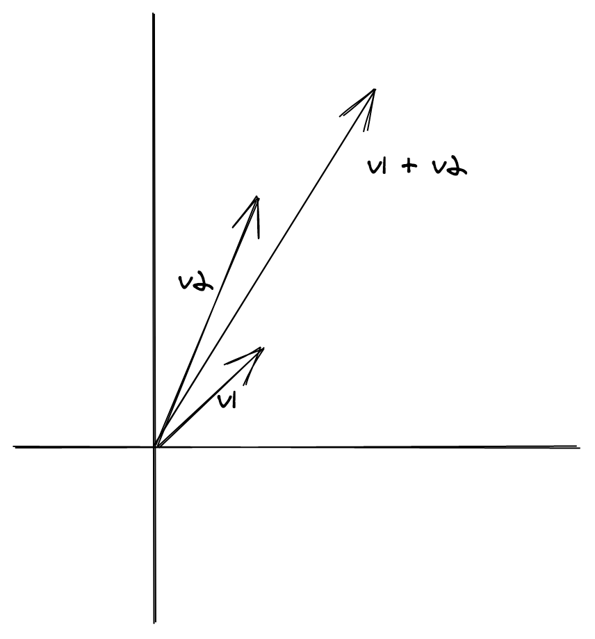
</center>

Troppo boilerplate? La buona notizia è che **la teoria matematica** che sta dietro al concetto di semigruppo ci dice che possiamo costruire una istanza di semigruppo per una struct come `Vector` se siamo in grado di fornire una istanza di semigruppo per ogni suo campo.

Convenientemente il modulo `fp-ts/Semigroup` esporta una combinatore `struct`:

```ts
import { struct } from 'fp-ts/Semigroup'

// modella la somma di due vettori
const SemigroupVector: Semigroup<Vector> = struct({
  x: N.SemigroupSum,
  y: N.SemigroupSum
})
```

**Nota**. Esiste un combinatore simile a `struct` ma che lavora con le tuple: `tuple`

```ts
import * as N from 'fp-ts/number'
import { Semigroup, tuple } from 'fp-ts/Semigroup'

// modella un vettore che parte dall'origine
type Vector = readonly [number, number]

// modella la somma di due vettori
const SemigroupVector: Semigroup<Vector> = tuple(N.SemigroupSum, N.SemigroupSum)

const v1: Vector = [1, 1]
const v2: Vector = [1, 2]

console.log(SemigroupVector.concat(v1, v2)) // => [2, 3]
```

**Quiz**. E' vero che dato un semigruppo per `A` e scelto un qualsiasi elemento `middle` di `A`, se lo infilo tra i due parametri di `concat`, ottengo ancora un semigruppo?

```ts
import { pipe } from 'fp-ts/function'
import { Semigroup } from 'fp-ts/Semigroup'
import * as S from 'fp-ts/string'

export const intercalate = <A>(middle: A) => (
  S: Semigroup<A>
): Semigroup<A> => ({
  concat: (first, second) => S.concat(S.concat(first, middle), second)
})

const SemigroupIntercalate = pipe(S.Semigroup, intercalate('|'))

pipe(
  SemigroupIntercalate.concat('a', SemigroupIntercalate.concat('b', 'c')),
  console.log
) // => 'a|b|c'
```

## Semigruppi derivabili da un ordinamento

Dato che `number` è **totalmente ordinabile** (ovvero dati due qualsiasi numeri `x` e `y`, una tra le seguenti condizioni vale: `x <= y` oppure `y <= x`) possiamo definire due sue ulteriori istanze di semigruppo usando `min` e `max` come operazioni:

```ts
import { Semigroup } from 'fp-ts/Semigroup'

const SemigroupMin: Semigroup<number> = {
  concat: (first, second) => Math.min(first, second)
}

const SemigroupMax: Semigroup<number> = {
  concat: (first, second) => Math.max(first, second)
}
```

**Quiz**. Perché è importante che `number` sia *totalmente* ordinabile?

Sarebbe utile poter definire questi due semigruppi (`SemigroupMin` e `SemigroupMax`) anche per altri tipi oltre a `number`.

È possibile catturare la nozione di totalmente ordinabile per altri tipi? Per farlo dobbiamo prima di tutto catturare la nozione di *uguaglianza*.

# Modellare l'uguaglianza con `Eq`

Ancora una volta possiamo modellare la nozione di uguaglianza tramite una `interface` di TypeScript:

```ts
interface Eq<A> {
  readonly equals: (first: A, second: A) => boolean
}
```

Intuitivamente:

- se `equals(x, y)` è uguale a `true` allora diciamo che `x` e `y` sono uguali
- se `equals(x, y)` è uguale a `false` allora diciamo che `x` e `y` sono diversi

**Esempio**

Proviamo a definire una istanza di `Eq` per il tipo `number`:

```ts
import { Eq } from 'fp-ts/Eq'
import { pipe } from 'fp-ts/function'

const EqNumber: Eq<number> = {
  equals: (first, second) => first === second
}

pipe(EqNumber.equals(1, 1), console.log) // => true
pipe(EqNumber.equals(1, 2), console.log) // => false
```

Devono valere le seguenti leggi:

1. **Reflexivity**: `equals(a, a) === true`, per ogni `a` in `A`
2. **Symmetry**: `equals(a, b) === equals(b, a)`, per ogni `a`, `b` in `A`
3. **Transitivity**: se `equals(a, b) === true` e `equals(b, c) === true`, allora `equals(a, c) === true`, per ogni `a`, `b`, `c` in `A`

**Quiz**. Ha senso un combinatore `reverse: <A>(E: Eq<A>) => Eq<A>`?

**Quiz**. Ha senso un combinatore `not: <A>(E: Eq<A>) => Eq<A>`?

**Esempio**

Come primo esempio di utilizzo dell'astrazione `Eq` definiamo una funzione `elem` che indica se un dato valore è un elemento di un `ReadonlyArray`:

```ts
import { Eq } from 'fp-ts/Eq'
import { pipe } from 'fp-ts/function'
import * as N from 'fp-ts/number'

// restituisce `true` se l'elemento `a` compare nella lista `as`
const elem = <A>(E: Eq<A>) => (a: A) => (as: ReadonlyArray<A>): boolean =>
  as.some((e) => E.equals(a, e))

pipe([1, 2, 3], elem(N.Eq)(2), console.log) // => true
pipe([1, 2, 3], elem(N.Eq)(4), console.log) // => false
```

Ma perché non usare il metodo nativo `includes` degli array?

```ts
console.log([1, 2, 3].includes(2)) // => true
console.log([1, 2, 3].includes(4)) // => false
```

Per avere una risposta proviamo a definire una istanza per un tipo più complesso:

```ts
import { Eq } from 'fp-ts/Eq'

type Point = {
  readonly x: number
  readonly y: number
}

const EqPoint: Eq<Point> = {
  equals: (first, second) => first.x === second.x && first.y === second.y
}

console.log(EqPoint.equals({ x: 1, y: 2 }, { x: 1, y: 2 })) // => true
console.log(EqPoint.equals({ x: 1, y: 2 }, { x: 1, y: -2 })) // => false
```

e utilizzare fianco a fianco `elem` e `includes`

```ts
const points: ReadonlyArray<Point> = [
  { x: 0, y: 0 },
  { x: 1, y: 1 },
  { x: 2, y: 2 }
]

const search: Point = { x: 1, y: 1 }

console.log(points.includes(search)) // => false :(
console.log(pipe(points, elem(EqPoint)(search))) // => true :)
```

**Quiz** (JavaScript). Come mai usando `includes` ottengo `false`?

Aver catturato il concetto di uguaglianza è fondamentale, soprattutto in un linguaggio come JavaScript in cui alcune strutture dati possiedono delle API poco usabili rispetto ad un concetto di uguaglianza custom. E' anche il caso di `Set` per esempio:

```ts
type Point = {
  readonly x: number
  readonly y: number
}

const points: Set<Point> = new Set([{ x: 0, y: 0 }])

points.add({ x: 0, y: 0 })

console.log(points)
// => Set { { x: 0, y: 0 }, { x: 0, y: 0 } }
```

Dato che `Set` utilizza `===` ("strict equality") come concetto di uguaglianza (fisso), `points` ora contiene **due copie identiche** di `{ x: 0, y: 0 }`, un risultato certo non voluto. Conviene perciò definire una nuova API che sfrutti l'astrazione `Eq`.

**Quiz**. Che firma potrebbe avere questa nuova API?

Per definire `EqPoint` occorre troppo boilerplate? La buona notizia è che la teoria ci dice che possiamo costruire una istanza di `Eq` per una struct come `Point` se siamo in grado di fornire una istanza di `Eq` per ogni suo campo.

Convenientemente il modulo `fp-ts/Eq` esporta un combinatore `struct`:

```ts
import { Eq, struct } from 'fp-ts/Eq'
import * as N from 'fp-ts/number'

type Point = {
  readonly x: number
  readonly y: number
}

const EqPoint: Eq<Point> = struct({
  x: N.Eq,
  y: N.Eq
})
```

**Nota**. Esiste un combinatore simile a `struct` ma che lavora con le tuple: `tuple`

```ts
import { Eq, tuple } from 'fp-ts/Eq'
import * as N from 'fp-ts/number'

type Point = readonly [number, number]

const EqPoint: Eq<Point> = tuple(N.Eq, N.Eq)

console.log(EqPoint.equals([1, 2], [1, 2])) // => true
console.log(EqPoint.equals([1, 2], [1, -2])) // => false
```

Ci sono altri combinatori messi a disposizione da `fp-ts`, ecco un combinatore che permette di derivare una istanza di `Eq` per i `ReadonlyArray`:

```ts
import { Eq, tuple } from 'fp-ts/Eq'
import * as N from 'fp-ts/number'
import * as RA from 'fp-ts/ReadonlyArray'

type Point = readonly [number, number]

const EqPoint: Eq<Point> = tuple(N.Eq, N.Eq)

const EqPoints: Eq<ReadonlyArray<Point>> = RA.getEq(EqPoint)
```

Come succede con i semigruppi, potete definire più di una istanza di `Eq` per lo stesso tipo. Supponiamo di aver modellato un utente con il seguente tipo

```ts
type User = {
  readonly id: number
  readonly name: string
}
```

possiamo definire una istanza di `Eq` "standard" usando il combinatore `struct`:

```ts
import { Eq, struct } from 'fp-ts/Eq'
import * as N from 'fp-ts/number'
import * as S from 'fp-ts/string'

type User = {
  readonly id: number
  readonly name: string
}

const EqStandard: Eq<User> = struct({
  id: N.Eq,
  name: S.Eq
})
```

**Nota**. In un linguaggio come Haskell l'istanza di `Eq` standard per una struct come `User` può essere prodotta automaticamente dal compilatore.

```haskell
data User = User Int String
     deriving (Eq)
```

Potremmo però avere delle situazioni particolari in cui ci può interessare avere un tipo di uguaglianza tra utenti differente, per esempio potremmo considerare due utenti uguali se hanno il campo `id` uguale

```ts
/** due utenti sono uguali se sono uguali il loro campi `id` */
const EqID: Eq<User> = {
  equals: (first, second) => N.Eq.equals(first.id, second.id)
}
```

Avendo "reificato" l'azione di confrontare due valori, cioè l'abbiamo resa concreta rappresentandola come una struttura dati, possiamo **manipolare programmaticamente** le istanze di `Eq` come facciamo per altre strutture dati, vediamo un esempio.

**Esempio**. Invece di definire `EqId` "a mano", possiamo utilizzare l'utile combinatore `contramap`: data una istanza di `Eq` per `A` e una funzione da `B` ad `A`, possiamo derivare una istanza di `Eq` per `B`

```ts
import { Eq, struct, contramap } from 'fp-ts/Eq'
import { pipe } from 'fp-ts/function'
import * as N from 'fp-ts/number'
import * as S from 'fp-ts/string'

type User = {
  readonly id: number
  readonly name: string
}

const EqStandard: Eq<User> = struct({
  id: N.Eq,
  name: S.Eq
})

const EqID: Eq<User> = pipe(
  N.Eq,
  contramap((_: User) => _.id)
)

console.log(
  EqStandard.equals({ id: 1, name: 'Giulio' }, { id: 1, name: 'Giulio Canti' })
) // => false (le proprietà `name` sono diverse)

console.log(
  EqID.equals({ id: 1, name: 'Giulio' }, { id: 1, name: 'Giulio Canti' })
) // => true (nonostante le proprietà `name` siano diverse)

console.log(EqID.equals({ id: 1, name: 'Giulio' }, { id: 2, name: 'Giulio' }))
// => false (nonostante le proprietà `name` siano uguali)
```

**Quiz**. Dato un tipo `A`, è possibile definire una istanza di semigruppo per `Eq<A>`? Cosa potrebbe rappresentare?

# Modellare l'ordinamento con `Ord`

Ora che abbiamo modellato il concetto di uguaglianza, vediamo in questo capitolo come modellare il concetto di **ordinamento**.

Una relazione d'ordine totale può essere modellata in TypeScript con i seguenti tipi:

```ts
import { Eq } from 'fp-ts/Eq'

type Ordering = -1 | 0 | 1

interface Ord<A> extends Eq<A> {
  readonly compare: (first: A, second: A) => Ordering
}
```

Intuitivamente:

- `x < y` se e solo se `compare(x, y) = -1`
- `x = y` se e solo se `compare(x, y) = 0`
- `x > y` se e solo se `compare(x, y) = 1`

**Esempio**

Proviamo a definire una istanza di `Ord` per il tipo `number`:

```ts
import { Ord } from 'fp-ts/Ord'

const OrdNumber: Ord<number> = {
  equals: (first, second) => first === second,
  compare: (first, second) => (first < second ? -1 : first > second ? 1 : 0)
}
```

Devono valere le seguenti leggi:

1. **Reflexivity**: `compare(x, x) <= 0`, per ogni `x` in `A`
2. **Antisymmetry**: se `compare(x, y) <= 0` e `compare(y, x) <= 0` allora `x = y`, per ogni `x`, `y` in `A`
3. **Transitivity**: se `compare(x, y) <= 0` e `compare(y, z) <= 0` allora `compare(x, z) <= 0`, per ogni `x`, `y`, `z` in `A`

In più `compare` deve essere compatibile con l'operazione `equals` di `Eq`:

`compare(x, y) === 0` se e solo se `equals(x, y) === true`, per ogni `x`, `y` in `A`

**Nota**. `equals` può essere derivato da `compare` nel modo seguente

```ts
equals: (first, second) => compare(first, second) === 0
```

Perciò il modulo `fp-ts/Ord` esporta un comodo helper `fromCompare` che permette di definire una istanza di `Ord` semplicemente specificando la funzione `compare`:

```ts
import { Ord, fromCompare } from 'fp-ts/Ord'

const OrdNumber: Ord<number> = fromCompare((first, second) =>
  first < second ? -1 : first > second ? 1 : 0
)
```

**Quiz**. E' possibile definire un ordinamento per il gioco Sasso-Carta-Forbice compatibile con le mosse vincenti (ovvero `move1 <= move2` se `move2` batte `move1`)?

Come primo esempio di utilizzo definiamo una funzione `sort` che ordina gli elementi di un `ReadonlyArray`

```ts
import { pipe } from 'fp-ts/function'
import * as N from 'fp-ts/number'
import { Ord } from 'fp-ts/Ord'

export const sort = <A>(O: Ord<A>) => (
  as: ReadonlyArray<A>
): ReadonlyArray<A> => as.slice().sort(O.compare)

pipe([3, 1, 2], sort(N.Ord), console.log) // => [1, 2, 3]
```

**Quiz** (JavaScript). Perché nell'implementazione viene chiamato il metodo `slice`?

Come altro esempio di utilizzo definiamo una funzione `min` che restituisce il minimo fra due valori:

```ts
import { pipe } from 'fp-ts/function'
import * as N from 'fp-ts/number'
import { Ord } from 'fp-ts/Ord'

const min = <A>(O: Ord<A>) => (second: A) => (first: A): A =>
  O.compare(first, second) === 1 ? second : first

pipe(2, min(N.Ord)(1), console.log) // => 1
```

## L'ordinamento duale

Così come possiamo invertire l'operazione `concat` per ottenere il semigruppo duale (con il combinatore [`reverse`](#il-semigruppo-duale)), così anche l'operazione `compare` può essere invertita per ottenere l'ordinamento duale.

Definiamo perciò il combinatore `reverse` per `Ord`:

```ts
import { pipe } from 'fp-ts/function'
import * as N from 'fp-ts/number'
import { fromCompare, Ord } from 'fp-ts/Ord'

export const reverse = <A>(O: Ord<A>): Ord<A> =>
  fromCompare((first, second) => O.compare(second, first))
```

Come esempio di utilizzo di `reverse` possiamo ricavare la funzione `max` dalla funzione `min`:

```ts
import { flow, pipe } from 'fp-ts/function'
import * as N from 'fp-ts/number'
import { Ord, reverse } from 'fp-ts/Ord'

const min = <A>(O: Ord<A>) => (second: A) => (first: A): A =>
  O.compare(first, second) === 1 ? second : first

// const max: <A>(O: Ord<A>) => (second: A) => (first: A) => A
const max = flow(reverse, min)

pipe(2, max(N.Ord)(1), console.log) // => 2
```

La **totalità** dell'ordinamento (ovvero dati due qualsiasi `x` e `y`, una tra le seguenti condizioni vale: `x <= y` oppure `y <= x`) può sembrare ovvia quando parliamo di numeri, ma non è sempre così. Consideriamo un caso più complesso

```ts
type User = {
  readonly name: string
  readonly age: number
}
```

Non è così chiaro stabilire quando un utente "è minore o uguale" ad un altro utente.

Come possiamo definire un `Ord<User>`?

Dipende davvero dal contesto, ma una possibile scelta potrebbe essere quella per esempio di ordinare gli utenti a seconda della loro età:

```ts
import * as N from 'fp-ts/number'
import { fromCompare, Ord } from 'fp-ts/Ord'

type User = {
  readonly name: string
  readonly age: number
}

const byAge: Ord<User> = fromCompare((first, second) =>
  N.Ord.compare(first.age, second.age)
)
```

Possiamo eliminare un po' di boilerplate usando il combinatore `contramap`: data una istanza di `Ord` per `A` e una funzione da `B` ad `A`, possiamo derivare una istanza di `Ord` per `B`:

```ts
import { pipe } from 'fp-ts/function'
import * as N from 'fp-ts/number'
import { contramap, Ord } from 'fp-ts/Ord'

type User = {
  readonly name: string
  readonly age: number
}

const byAge: Ord<User> = pipe(
  N.Ord,
  contramap((_: User) => _.age)
)
```

Ora possiamo ottenere il più giovane di due utenti usando la funzione `min` che abbiamo precedentemente definito

```ts
// const getYounger: (second: User) => (first: User) => User
const getYounger = min(byAge)

pipe(
  { name: 'Guido', age: 50 },
  getYounger({ name: 'Giulio', age: 47 }),
  console.log
) // => { name: 'Giulio', age: 47 }
```

**Quiz**. Nel modulo `fp-ts/ReadonlyMap` è contenuta la seguente API

```ts
/**
 * Get a sorted `ReadonlyArray` of the keys contained in a `ReadonlyMap`.
 */
declare const keys: <K>(O: Ord<K>) => <A>(m: ReadonlyMap<K, A>) => ReadonlyArray<K>
```

per quale motivo questa API richiede un `Ord<K>`?

Torniamo finalmente al quesito iniziale: definire i due semigruppi `SemigroupMin` e `SemigroupMax` anche per altri tipi oltre a `number`:

```ts
import { Semigroup } from 'fp-ts/Semigroup'

const SemigroupMin: Semigroup<number> = {
  concat: (first, second) => Math.min(first, second)
}

const SemigroupMax: Semigroup<number> = {
  concat: (first, second) => Math.max(first, second)
}
```

Ora che abbiamo a disposizione l'astrazione `Ord` possiamo farlo:

```ts
import { pipe } from 'fp-ts/function'
import * as N from 'fp-ts/number'
import { Ord, contramap } from 'fp-ts/Ord'
import { Semigroup } from 'fp-ts/Semigroup'

export const min = <A>(O: Ord<A>): Semigroup<A> => ({
  concat: (first, second) => (O.compare(first, second) === 1 ? second : first)
})

export const max = <A>(O: Ord<A>): Semigroup<A> => ({
  concat: (first, second) => (O.compare(first, second) === 1 ? first : second)
})

type User = {
  readonly name: string
  readonly age: number
}

const byAge: Ord<User> = pipe(
  N.Ord,
  contramap((_: User) => _.age)
)

console.log(
  min(byAge).concat({ name: 'Guido', age: 50 }, { name: 'Giulio', age: 47 })
) // => { name: 'Giulio', age: 47 }
console.log(
  max(byAge).concat({ name: 'Guido', age: 50 }, { name: 'Giulio', age: 47 })
) // => { name: 'Guido', age: 50 }
```

**Esempio**

Ricapitoliamo tutto con un esempio finale (adattato da [Fantas, Eel, and Specification 4: Semigroup](http://www.tomharding.me/2017/03/13/fantas-eel-and-specification-4/))

Supponiamo di dover costruire un sistema in cui, in un database, sono salvati dei record di un cliente, modellati nel seguente modo

```ts
interface Customer {
  readonly name: string
  readonly favouriteThings: ReadonlyArray<string>
  readonly registeredAt: number // since epoch
  readonly lastUpdatedAt: number // since epoch
  readonly hasMadePurchase: boolean
}
```

Per qualche ragione potreste finire per avere dei record duplicati per la stessa persona.

Abbiamo bisogno di una strategia di merging. Ma questo è proprio quello di cui si occupano i semigruppi!

```ts
import * as B from 'fp-ts/boolean'
import { pipe } from 'fp-ts/function'
import * as N from 'fp-ts/number'
import { contramap } from 'fp-ts/Ord'
import * as RA from 'fp-ts/ReadonlyArray'
import { max, min, Semigroup, struct } from 'fp-ts/Semigroup'

interface Customer {
  readonly name: string
  readonly favouriteThings: ReadonlyArray<string>
  readonly registeredAt: number // since epoch
  readonly lastUpdatedAt: number // since epoch
  readonly hasMadePurchase: boolean
}

const SemigroupCustomer: Semigroup<Customer> = struct({
  // keep the longer name
  name: max(
    pipe(
      N.Ord,
      contramap((s: string) => s.length)
    )
  ),
  // accumulate things
  favouriteThings: RA.getSemigroup<string>(),
  // keep the least recent date
  registeredAt: min(N.Ord),
  // keep the most recent date
  lastUpdatedAt: max(N.Ord),
  // boolean semigroup under disjunction
  hasMadePurchase: B.SemigroupAny
})

console.log(
  SemigroupCustomer.concat(
    {
      name: 'Giulio',
      favouriteThings: ['math', 'climbing'],
      registeredAt: new Date(2018, 1, 20).getTime(),
      lastUpdatedAt: new Date(2018, 2, 18).getTime(),
      hasMadePurchase: false
    },
    {
      name: 'Giulio Canti',
      favouriteThings: ['functional programming'],
      registeredAt: new Date(2018, 1, 22).getTime(),
      lastUpdatedAt: new Date(2018, 2, 9).getTime(),
      hasMadePurchase: true
    }
  )
)
/*
{ name: 'Giulio Canti',
  favouriteThings: [ 'math', 'climbing', 'functional programming' ],
  registeredAt: 1519081200000, // new Date(2018, 1, 20).getTime()
  lastUpdatedAt: 1521327600000, // new Date(2018, 2, 18).getTime()
  hasMadePurchase: true
}
*/
```

**Quiz**. Dato un tipo `A` è possibile definire una istanza di semigruppo per `Ord<A>`? Cosa potrebbe rappresentare?

**Demo**

[`02_ord.ts`](src/02_ord.ts)

# Modellare la composizione con i monoidi

Se aggiungiamo una condizione in più alla definizione di un semigruppo, ovvero che esista un elemento `empty` in `A`
tale che per ogni elemento `a` in `A` vale

- **Right identity**: `concat(a, empty) = a`
- **Left identity**: `concat(empty, a) = a`

allora parliamo di monoide e l'elemento `empty` viene detto **unità** (o "elemento neutro").

Come già successo per `Magma` e `Semigroup`, i monoidi possono essere modellati con una `interface` di TypeScript:

```ts
import { Semigroup } from 'fp-ts/Semigroup'

interface Monoid<A> extends Semigroup<A> {
  readonly empty: A
}
```

Molti dei semigruppi che abbiamo visto nelle sezioni precedenti possono essere arricchiti e diventare istanze di `Monoid`:

```ts
import { Monoid } from 'fp-ts/Monoid'

/** number `Monoid` under addition */
const MonoidSum: Monoid<number> = {
  concat: (first, second) => first + second,
  empty: 0
}

/** number `Monoid` under multiplication */
const MonoidProduct: Monoid<number> = {
  concat: (first, second) => first * second,
  empty: 1
}

const MonoidString: Monoid<string> = {
  concat: (first, second) => first + second,
  empty: ''
}

/** boolean monoid under conjunction */
const MonoidAll: Monoid<boolean> = {
  concat: (first, second) => first && second,
  empty: true
}

/** boolean monoid under disjunction */
const MonoidAny: Monoid<boolean> = {
  concat: (first, second) => first || second,
  empty: false
}
```

**Quiz**. Nella sezione sui semigruppi abbiamo visto che `ReadonlyArray<string>` ammette una istanza di `Semigroup`:

```ts
import { Semigroup } from 'fp-ts/Semigroup'

const Semigroup: Semigroup<ReadonlyArray<string>> = {
  concat: (first, second) => first.concat(second)
}
```

esiste anche l'unità? E' possibile generalizzare il risultato per `ReadonlyArray<A>` per qualsiasi tipo `A`?


**Quiz** (difficile). Dimostrare che, dato un monoide, l'elemento neutro è unico.

La conseguenza pratica è che se avete trovato una unità smettete di cercare!

Ogni monoide è un semigruppo, ma non ogni semigruppo è un monoide.

<center>

</center>

**Esempio**

Si consideri il seguente esempio:

```ts
import { pipe } from 'fp-ts/function'
import { intercalate } from 'fp-ts/Semigroup'
import * as S from 'fp-ts/string'

const SemigroupIntercalate = pipe(S.Semigroup, intercalate('|'))

console.log(S.Semigroup.concat('a', 'b')) // => 'ab'
console.log(SemigroupIntercalate.concat('a', 'b')) // => 'a|b'
console.log(SemigroupIntercalate.concat('a', '')) // => 'a|'
```

Notate come non sia possibile trovare un valore `empty` di tipo `string` tale che `concat(a, empty) = a`.

Infine un esempio più "esotico", sulle funzioni:

**Esempio**

Un **endomorfismo** è una funzione in cui il tipo in input e il tipo in output coincidono:

```ts
type Endomorphism<A> = (a: A) => A
```

Dato un tipo `A`, gli endomorfismi su `A` sono un monoide, tale che:

- l'operazione `concat` è l'usuale composizione di funzioni
- l'unità è la funzione identità

```ts
import { Endomorphism, flow, identity } from 'fp-ts/function'
import { Monoid } from 'fp-ts/Monoid'

export const getEndomorphismMonoid = <A>(): Monoid<Endomorphism<A>> => ({
  concat: flow,
  empty: identity
})
```

## La funzione `concatAll`

Quando usiamo un monoide invece di un semigruppo, la concatenazione di più elementi è ancora più semplice: non è necessario fornire esplicitamente un valore iniziale.

**Quiz**. Perché non è necessario fornire un valore iniziale?

```ts
import { concatAll } from 'fp-ts/Monoid'
import * as S from 'fp-ts/string'
import * as N from 'fp-ts/number'
import * as B from 'fp-ts/boolean'

console.log(concatAll(N.MonoidSum)([1, 2, 3, 4])) // => 10
console.log(concatAll(N.MonoidProduct)([1, 2, 3, 4])) // => 24
console.log(concatAll(S.Monoid)(['a', 'b', 'c'])) // => 'abc'
console.log(concatAll(B.MonoidAll)([true, false, true])) // => false
console.log(concatAll(B.MonoidAny)([true, false, true])) // => true
```

## Monoide prodotto

Come abbiamo già visto per i semigruppi, è possibile costruire una istanza di monoide per una struct se siamo in grado di fornire una istanza di monoide per ogni suo campo.

**Esempio**

```ts
import { Monoid, struct } from 'fp-ts/Monoid'
import * as N from 'fp-ts/number'

type Point = {
  readonly x: number
  readonly y: number
}

const Monoid: Monoid<Point> = struct({
  x: N.MonoidSum,
  y: N.MonoidSum
})
```

**Nota**. Esiste un combinatore simile a `struct` ma che lavora con le tuple: `tuple`.

```ts
import { Monoid, tuple } from 'fp-ts/Monoid'
import * as N from 'fp-ts/number'

type Point = readonly [number, number]

const Monoid: Monoid<Point> = tuple(N.MonoidSum, N.MonoidSum)
```

**Demo** (implementare un sistema per disegnare forme geometriche su un canvas)

[`03_shapes.ts`](src/03_shapes.ts)

# Funzioni pure e funzioni parziali

Nel primo capitolo del corso abbiamo visto una definizione informale di funzione pura:

> Una funzione pura è una procedura che dato lo stesso input restituisce sempre lo stesso output e non ha alcun side effect osservabile.

Un tale enunciato può lasciare spazio a qualche dubbio (per esempio, che cos'è un "side effect"?)

Vediamo perciò una definizione formale:

Ricordiamo che se `X` e `Y` sono due insiemi, allora con `X × Y` si indica il loro _prodotto cartesiano_, ovvero l'insieme

```
X × Y = { (x, y) | x ∈ X, y ∈ Y }
```

**Definizione**. Una _funzione_ `f: X ⟶ Y` è un sottoinsieme `f` di `X × Y` tale che
per ogni `x ∈ X` esiste esattamente un `y ∈ Y` tale che la coppia `(x, y) ∈ f`.

L'insieme `X` si dice il _dominio_ di `f`, `Y` il suo _codominio_.

Si noti che l'insieme `f` deve essere descritto _staticamente_ in fase di definizione della funzione
(ovvero gli elementi di quell'insieme non possono variare nel tempo e per nessuna condizione interna o esterna).

**Esempio**

La funzione `double: Nat ⟶ Nat`, ove `Nat` è l'insieme dei numeri naturali, è il sottoinsieme del prodotto cartesiano `Nat × Nat` dato dalle coppie `{ (1, 2), (2, 4), (3, 6), ...}`.

In TypeScript `f` potrebbe essere definita così:

```ts
const f: Record<number, number> = {
  1: 2,
  2: 4,
  3: 6
  ...
}
```

Quella dell'esempio viene detta definizione _estensionale_ di una funzione, ovvero si enumerano uno per uno gli elementi del dominio e per ciascuno di essi si indica il corrispondente elemento del codominio.
Naturalmente quando l'insieme è infinito, come in questo caso, la definizione può risultare un po' "scomoda".

Si può ovviare a questo problema introducendo quella che viene detta definizione _intensionale_,
ovvero si esprime una condizione che deve valere per tutte le coppie `(x, y)` appartenenti all'insieme `f`, ovvero `y = x * 2`. Questa è la forma familiare con cui scriviamo la funzione `double` e come la definiamo in TypeScript:

```ts
const double = (x: number): number => x * 2
```

La definizione di funzione come sottoinsieme di un prodotto cartesiano mostra come in matematica tutte le funzioni siano pure:
non c'è azione, modifica di stato o modifica degli elementi (che sono considerati immutabili) degli insiemi coinvolti.
Nella programmazione funzionale l'implementazione delle funzioni deve tendere a questo modello ideale.

**Quiz**. Quali delle seguenti procedure sono funzioni pure?

```ts
const coefficient1 = 2
export const f1 = (n: number) => n * coefficient1

// ------------------------------------------------------

let coefficient2 = 2
export const f2 = (n: number) => n * coefficient2++

// ------------------------------------------------------

let coefficient3 = 2
export const f3 = (n: number) => n * coefficient3

// ------------------------------------------------------

export const f4 = (n: number) => {
  const out = n * 2
  console.log(out)
  return out
}

// ------------------------------------------------------

interface User {
  readonly id: number
  readonly name: string
}

export declare const f5: (id: number) => Promise<User>

// ------------------------------------------------------

import * as fs from 'fs'

export const f6 = (path: string): string =>
  fs.readFileSync(path, { encoding: 'utf8' })

// ------------------------------------------------------

export const f7 = (
  path: string,
  callback: (err: Error | null, data: string) => void
): void => fs.readFile(path, { encoding: 'utf8' }, callback)
```

Che una funzione sia pura non implica necessariamente che sia bandita la mutabilità, localmente è ammissibile
se non esce dai confini della implementazione.


**Esempio** (Implementazione della funzione `concatAll` dei monoidi)

```ts
import { Monoid } from 'fp-ts/Monoid'

const concatAll = <A>(M: Monoid<A>) => (as: ReadonlyArray<A>): A => {
  let out: A = M.empty // <= mutabilità locale
  for (const a of as) {
    out = M.concat(out, a)
  }
  return out
}
```

L'obbiettivo vero è sempre quello di garantire la proprietà fondamentale di **trasparenza referenziale**.

Il contratto che stipuliamo con l'utente della nostra API è definito dalla sua firma:

```ts
declare const concatAll: <A>(M: Monoid<A>) => (as: ReadonlyArray<A>) => A
```

e dalla promessa di rispettare la trasparenza referenziale, i dettagli tecnici di come la funzione è concretamente implementata non interessano e non sono sotto esame, c'è quindi la massima libertà.

Dunque come si definisce un "side effect"? Semplicemente negando la trasparenza referenziale:

> Una espressione contiene un "side effect" se non gode della trasparenza referenziale.

Non solo le funzioni appoggiano sul primo dei due pilastri della programmazione funzionale, ma sono un esempio
anche del secondo pilastro: la **composizione**.

Infatti le funzioni compongono:

**Definizione**. Siano `f: Y ⟶ Z` e `g: X ⟶ Y` due funzioni, allora la funzione `h: X ⟶ Z` definita da

```
h(x) = f(g(x))
```

si dice _composizione_ di `f` e `g` e si scrive `h = f ∘ g`

Si noti che affinché due funzioni `f` e `g` possano comporre, il dominio di `f` deve coincidere col codominio di `g`.

**Definizione**. Una funzione _parziale_ è una funzione che non è definita per tutti i valori del dominio.

Viceversa una funzione definita per tutti i valori del dominio è detta _totale_.

**Esempio**

```ts
// Get the first element of a `ReadonlyArray`
declare const head: <A>(as: ReadonlyArray<A>) => A
```

**Quiz**. Perché la funzione `head` è parziale?

**Quiz**. La funzione `JSON.parse` è totale?

```ts
parse: (text: string, reviver?: (this: any, key: string, value: any) => any) => any
```

**Quiz**. La funzione `JSON.stringify` è totale?

```ts
stringify: (value: any, replacer?: (this: any, key: string, value: any) => any, space?: string | number) => string
```

In ambito funzionale si tende a definire solo **funzioni pure e totali** (d'ora in poi userò il termine "funzione" come sinonimo di "funzione pura e totale"), quindi come ci si deve comportare se si ha a che fare con una funzione parziale?

Fortunatamente una funzione parziale `f: X ⟶ Y` può essere sempre ricondotta ad una funzione totale aggiungendo al codominio un valore speciale **non appartenente** a `Y`, chiamiamolo `None`, e associandolo ad ogni valore di `X` per cui `f` non è definita

```
f': X ⟶ Y ∪ None
```

Chiamiamo `Option(Y) = Y ∪ None`.

```
f': X ⟶ Option(Y)
```

E' possibile definire `Option(Y)` in TypeScript? Nei prossimi due capitoli vedremo come poterlo fare.

# Algebraic Data Types

Un buon primo passo quando si sta construendo una nuova applicazione è quello di definire il suo modello di dominio. TypeScript offre molti strumenti che aiutano in questo compito. Gli **Algebraic Data Types** (abbreviato in ADT) sono uno di questi strumenti.

## Che cos'è un algebraic Data Types?

> In computer programming, especially functional programming and type theory, an algebraic data type is a kind of composite type, i.e., a type formed by combining other types.

Due famiglie comuni di algebraic data types sono: **product types** e **sum types**.

<center>

</center>

Cominciamo da quelli più familiari: i product type.

## Product types

Un product type è una collezione di tipi T<sub>i</sub> inidicizzati da un insieme `I`.

Due membri comuni di questa famiglia sono le `n`-tuple, dove `I` è un intervallo di numeri naturali:

```ts
type Tuple1 = [string] // I = [0]
type Tuple2 = [string, number] // I = [0, 1]
type Tuple3 = [string, number, boolean] // I = [0, 1, 2]

// Accessing by index
type Fst = Tuple2[0] // string
type Snd = Tuple2[1] // number
```

e le struct, ove `I` è un insieme di label:

```ts
// I = {"name", "age"}
interface Person {
  name: string
  age: number
}

// Accessing by label
type Name = Person['name'] // string
type Age = Person['age'] // number
```

I product type possono essere **polimorfici**.

**Esempio**

```ts
//                ↓ type parameter
type HttpResponse<A> = {
  readonly code: number
  readonly body: A
}
```

### Da dove viene il nome "product types"?

Se indichiamo con `C(A)` il numero di abitanti del tipo `A`, chiamata **cardinalità**, allora vale la seguente uguaglianza:

```ts
C([A, B]) = C(A) * C(B)
```

> la cardinalità del prodotto è il prodotto delle cardinalità

**Esempio**

Il tipo `null` ha cardinalità `1` perchè ha un solo abitante: `null`.

**Esempio**

Il tipo `boolean` ha cardinalità `2` perchè ha due abitanti: `true` e `false`.

**Esempio**

```ts
type Hour = 1 | 2 | 3 | 4 | 5 | 6 | 7 | 8 | 9 | 10 | 11 | 12
type Period = 'AM' | 'PM'
type Clock = readonly [Hour, Period]
```

Il tipo `Hour` ha `12` abitanti.
Il tipo `Period` ha `2` abitanti.
Il tipo `Clock` ha `12 * 2 = 24` abitanti.

**Quiz**. Quanti abitanti ha il seguente tipo `Clock`?

```ts
// same as before
type Hour = 1 | 2 | 3 | 4 | 5 | 6 | 7 | 8 | 9 | 10 | 11 | 12
// same as before
type Period = 'AM' | 'PM'

type Clock = {
  readonly hour: Hour
  readonly period: Period
}
```

### Quando posso usare un product type?

Ogniqualvolta le sue componenti sono **indipendenti**.

```ts
type Clock = readonly [Hour, Period]
```

Qui `Hour` e `Period` sono indipendenti, ovvero il valore di `Hour` non influisce sul valore di `Period` e viceversa, tutte le coppie sono legali e hanno senso.

## Sum types

Un sum type è una struttura dati che contiene un valore che può assumere diversi tipi (ma fissi). Solo uno dei tipi può essere in uso in un dato momento, e un campo che fa da "tag" indica quale di questi è in uso.

Nella documentazione ufficiale di TypeScript sono indicati col nome [discriminated union](https://www.typescriptlang.org/docs/handbook/unions-and-intersections.html).

E' importante sottolineare che i membri dell'unione che forma un sum type devono essere **disgiunti**, ovvero non devono esistere valori che appartengono a più di un membro.

**Esempio**

Il tipo

```ts
type StringsOrNumbers = ReadonlyArray<string> | ReadonlyArray<number>
```

non è una unione disgiunta perché il valore `[]` (array vuoto) appartiene ad ambedue i membri dell'unione.

**Quiz**. La seguente unione è disgiunta?

```ts
type Member1 = { readonly a: string }
type Member2 = { readonly b: number }
type MyUnion = Member1 | Member2
```

In programmazione funzionale si tende ad usare sempre unioni disgiunte.

Fortunatamente in TypeScript c'è un modo sicuro per garantire che una unione sia disgiunta: aggiungere un apposito campo che fa da **tag**.

**Esempio** (redux actions)

```ts
export type Action =
  | {
      readonly type: 'ADD_TODO'
      readonly text: string
    }
  | {
      readonly type: 'UPDATE_TODO'
      readonly id: number
      readonly text: string
      readonly completed: boolean
    }
  | {
      readonly type: 'DELETE_TODO'
      readonly id: number
    }
```

Il campo `type`, essendo obbligatorio e avendo un tipo diverso per ogni membro dell'unione, può essere eletto come tag e assicura che i membri siano disgiunti.

**Nota**. Il nome del campo che fa da tag è a discrezione dello sviluppatore, non deve essere necessariamente "type" (in `fp-ts` per esempio, per convenzione si usa il nome "_tag").

Ora che abbiamo visto un po' di esempi possiamo riformulare in modo più esplicito che cos'è un algebraic data type:

> In general, an algebraic data type specifies a sum of one or more alternatives, where each alternative is a product of zero or more fields.

**Quiz** (TypeScript). Delle seguenti strutture dati dire se sono dei product type o dei sum type

- `ReadonlyArray<A>`
- `Record<string, A>`
- `Record<'k1' | 'k2', A>`
- `ReadonlyMap<string, A>`
- `ReadonlyMap<'k1' | 'k2', A>`

I sum type possono essere **polimorfici** e **ricorsivi**.

**Esempio** (linked lists)

```ts
//               ↓ type parameter
export type List<A> =
  | { readonly _tag: 'Nil' }
  | { readonly _tag: 'Cons'; readonly head: A; readonly tail: List<A> }
//                                                              ↑ recursion
```

### Costruttori

Un sum type con `n` membri necessita di (almeno) `n` **costruttori**, uno per ogni membro.

**Esempio** (redux action creators)

```ts
export type Action =
  | {
      readonly type: 'ADD_TODO'
      readonly text: string
    }
  | {
      readonly type: 'UPDATE_TODO'
      readonly id: number
      readonly text: string
      readonly completed: boolean
    }
  | {
      readonly type: 'DELETE_TODO'
      readonly id: number
    }

export const add = (text: string): Action => ({
  type: 'ADD_TODO',
  text
})

export const update = (id: number, text: string, completed: boolean): Action => ({
  type: 'UPDATE_TODO',
  id,
  text,
  completed
})

export const del = (id: number): Action => ({
  type: 'DELETE_TODO',
  id
})
```

**Esempio** (linked lists)

```ts
export type List<A> =
  | { readonly _tag: 'Nil' }
  | { readonly _tag: 'Cons'; readonly head: A; readonly tail: List<A> }

// a nullary constructor can be implemented as a constant
export const nil: List<never> = { _tag: 'Nil' }

export const cons = <A>(head: A, tail: List<A>): List<A> => ({
  _tag: 'Cons',
  head,
  tail
})

// equivalente ad un array [1, 2, 3]
const myList = cons(1, cons(2, cons(3, nil)))
```

### Pattern matching

JavaScript non ha il [pattern matching](https://github.com/tc39/proposal-pattern-matching) (e quindi neanche TypeScript) tuttavia possiamo simularlo tramite una funzione `match`.

**Esempio** (usando ancora `Action`)

```ts
export type Action =
  | {
      readonly type: 'ADD_TODO'
      readonly text: string
    }
  | {
      readonly type: 'UPDATE_TODO'
      readonly id: number
      readonly text: string
      readonly completed: boolean
    }
  | {
      readonly type: 'DELETE_TODO'
      readonly id: number
    }

export const match = <R>(
  onAdd: (text: string) => R,
  onUpdate: (id: number, text: string, completed: boolean) => R,
  onDelete: (id: number) => R
) => (fa: Action): R => {
  switch (fa.type) {
    case 'ADD_TODO':
      return onAdd(fa.text)
    case 'UPDATE_TODO':
      return onUpdate(fa.id, fa.text, fa.completed)
    case 'DELETE_TODO':
      return onDelete(fa.id)
  }
}

type State = { ... }

const reducer = (action: Action, state: State): State => pipe(action, match(
  onAdd: (text) => ...,
  onUpdate: (id, text, completed) => ...,
  onDelete: (id) => ...
))
```

**Esempio** (linked lists)

```ts
export type List<A> =
  | { readonly _tag: 'Nil' }
  | { readonly _tag: 'Cons'; readonly head: A; readonly tail: List<A> }

export const match = <R, A>(
  onNil: () => R,
  onCons: (head: A, tail: List<A>) => R
) => (fa: List<A>): R => {
  switch (fa._tag) {
    case 'Nil':
      return onNil()
    case 'Cons':
      return onCons(fa.head, fa.tail)
  }
}

// restituisce `true` se la lista è vuota
export const isEmpty = match(
  () => true,
  () => false
)

// restituisce il primo elemento della lista oppure `undefined`
export const head = match(
  () => undefined,
  (head, _tail) => head
)

// calcola la lunghezza di una lista (ricorsivamente)
export const length: <A>(fa: List<A>) => number = match(
  () => 0,
  (_, tail) => 1 + length(tail)
)
```

**Quiz**. Perchè l'API `head` è sub ottimale?

**Nota**. TypeScript offre una ottima feature legata ai sum type: **exhaustive check**. Ovvero il type checker è in grado di determinare se tutti i casi sono stati gestiti nello `switch` definito nel body della funzione `match`.

### Da dove viene il nome "sum types"?

Vale la seguente uguaglianza:

```ts
C(A | B) = C(A) + C(B)
```

> la cardinalità della somma è la somma delle cardinalità

**Esempio** (the `Option` type)

```ts
type None = {
  readonly _tag: 'None'
}

type Some<A> = {
  readonly _tag: 'Some'
  readonly value: A
}

type Option<A> = None | Some<A>
```

Dalla formula generale ottengo `C(Option<A>) = C(None) + C(Some<A>) = 1 + C(A)`, da cui possiamo derivare per esempio la cardinalità di `Option<boolean>`, ovvero `1 + 2 = 3` abitanti:

- `{ _tag: 'None' }`
- `{ _tag: 'Some', value: true }`
- `{ _tag: 'Some', value: false }`

### Quando dovrei usare un sum type?

Quando le sue componenti sarebbero **dipendenti** se implementate con un product type.

**Esempio** (`React` props)

```ts
interface Props {
  readonly editable: boolean
  readonly onChange?: (text: string) => void
}

class Textbox extends React.Component<Props> {
  render() {
    if (this.props.editable) {
      // error: Cannot invoke an object which is possibly 'undefined' :(
      this.props.onChange(...)
    }
  }
}
```

Il problema qui è che `Props` è modellato come un prodotto ma `onChange` **dipende** da `editable`.

Un sum type è una scelta migliore:

```ts
type Props =
  | {
      readonly type: 'READONLY'
    }
  | {
      readonly type: 'EDITABLE'
      readonly onChange: (text: string) => void
    }

class Textbox extends React.Component<Props> {
  render() {
    switch (this.props.type) {
      case 'EDITABLE' :
        this.props.onChange(...) // :)
      ...
    }
  }
}
```

**Esempio** (node callbacks)

```ts
declare function readFile(
  path: string,
  //         ↓ ---------- ↓ CallbackArgs
  callback: (err?: Error, data?: string) => void
): void
```

Il risultato dell'operazione `readFile` è modellato con un product type (più precisamente una tupla) che viene passato come input alla funzione `callback`:

```ts
type CallbackArgs = [Error | undefined, string | undefined]
```

tuttavia le sue componenti sono **dipendenti**: si riceve un errore **oppure** una stringa:

| err         | data        | legale? |
| ----------- | ----------- | ------- |
| `Error`     | `undefined` | ✓       |
| `undefined` | `string`    | ✓       |
| `Error`     | `string`    | ✘       |
| `undefined` | `undefined` | ✘       |

Questa API non è modellata seguendo questo adagio:

> Make impossible state unrepresentable

Un sum type sarebbe una scelta migliore, ma quale? Vediamo come si gestiscono gli errori in modo funzionale.

**Quiz**. Recentemente alle API a callback si preferiscono le API che restituiscono una `Promise`

```ts
declare function readFile(path: string): Promise<string>
```

potete indicare un contro di questa seconda soluzione quando si utilizza un linguaggio a tipi statici come TypeScript?

# Functional error handling

Vediamo come gestire gli errori in modo funzionale.

Nel capitolo [Funzioni pure e funzioni parziali](#funzioni-pure-e-funzioni-parziali) abbiamo visto che ogni funzione parziale `f` può essere sempre ricondotta ad una funzione totale `f'`

```
f': X ⟶ Option(Y)
```

Ora che sappiamo qualcosa di più sui sum type in TypeScript possiamo definire `Option` senza ulteriore indugio.

## Il tipo `Option`

Il tipo `Option<A>` rappresenta l'effetto di una computazione che può fallire (caso `None`) oppure restituire un valore di tipo `A` (caso `Some`):

```ts
// represents a failure
type None = {
  readonly _tag: 'None'
}

// represents a success
type Some<A> = {
  readonly _tag: 'Some'
  readonly value: A
}

type Option<A> = None | Some<A>
```

Vediamone anche i costruttori e la sua funzione `match` di "pattern matching":

```ts
const none: Option<never> = { _tag: 'None' }

const some = <A>(value: A): Option<A> => ({ _tag: 'Some', value })

const match = <R, A>(onNone: () => R, onSome: (a: A) => R) => (
  fa: Option<A>
): R => {
  switch (fa._tag) {
    case 'None':
      return onNone()
    case 'Some':
      return onSome(fa.value)
  }
}
```

Il tipo `Option` può essere usato per evitare di lanciare eccezioni e/o rappresentare i valori opzionali, così possiamo passare da:

```ts
//                        this is a lie ↓
const head = <A>(as: ReadonlyArray<A>): A => {
  if (as.length === 0) {
    throw new Error('Empty array')
  }
  return as[0]
}

let s: string
try {
  s = String(head([]))
} catch (e) {
  s = e.message
}
```

in cui il type system è all'oscuro di un possibile fallimento, a:

```ts
import { pipe } from 'fp-ts/function'

//                                      ↓ the type system "knows" that this computation may fail
const head = <A>(as: ReadonlyArray<A>): Option<A> =>
  as.length === 0 ? none : some(as[0])

declare const numbers: ReadonlyArray<number>

const result = pipe(
  head(numbers),
  match(
    () => 'Empty array',
    (n) => String(n)
  )
)
```

ove la possibilità di errore è codificata nel type system.

Infatti se proviamo ad accedere alla proprietà `value` di una `Option` senza controllare in quale dei due casi siamo, il type system ci avverte del possibile errore:

```ts
declare const numbers: ReadonlyArray<number>

const result = head(numbers)
result.value // type checker error: Property 'value' does not exist on type 'Option<number>'
```

L'unico modo per accedere al valore contenuto in una `Option` è gestire anche il caso di fallimento utilizzando la funzione `match`

```ts
pipe(result, match(
  () => ...handle error...
  (n) => ...go on with my business logic...
))
```

E' possibile definire delle istanze per le astrazioni che abbiamo visto nei capitoli precedenti? Cominciamo da `Eq`.

### Una istanza per `Eq`

Supponiamo di avere due valori di tipo `Option<string>` e volerli confrontare per capire se sono uguali:

```ts
import { pipe } from 'fp-ts/function'
import { match, Option } from 'fp-ts/Option'

declare const o1: Option<string>
declare const o2: Option<string>

const result: boolean = pipe(
  o1,
  match(
    // onNone o1
    () =>
      pipe(
        o2,
        match(
          // onNone o2
          () => true,
          // onSome o2
          () => false
        )
      ),
    // onSome o1
    (s1) =>
      pipe(
        o2,
        match(
          // onNone o2
          () => false,
          // onSome o2
          (s2) => s1 === s2 // <= qui uso l'uguaglianza tra stringhe
        )
      )
  )
)
```

E se avessimo due `Option<number>`? Il codice sarebbe pressoché uguale tranne alla fine quando confronto i valori contenuti nelle due `Option`, per i quali userò l'uguaglianza tra numeri.

Ma allora possiamo generalizzare il codice richiedendo all'utente una istanza di `Eq` per `A` e quindi derivare una istanza di `Eq` per `Option<A>`.

In altre parole possiamo definire un **combinatore** `getEq`: dato un `Eq<A>` il combinatore restituisce un `Eq<Option<A>>`:

```ts
import { Eq } from 'fp-ts/Eq'
import { pipe } from 'fp-ts/function'
import { match, Option, none, some } from 'fp-ts/Option'

export const getEq = <A>(E: Eq<A>): Eq<Option<A>> => ({
  equals: (second) => (first) =>
    pipe(
      first,
      match(
        () =>
          pipe(
            second,
            match(
              () => true,
              () => false
            )
          ),
        (a1) =>
          pipe(
            second,
            match(
              () => false,
              (a2) => pipe(a1, E.equals(a2)) // <= qui uso l'uguaglianza tra `A`
            )
          )
      )
    )
})

import * as S from 'fp-ts/string'

const EqOptionString = getEq(S.Eq)

console.log(pipe(none, EqOptionString.equals(none))) // => true
console.log(pipe(none, EqOptionString.equals(some('b')))) // => false
console.log(pipe(some('a'), EqOptionString.equals(none))) // => false
console.log(pipe(some('a'), EqOptionString.equals(some('b')))) // => false
console.log(pipe(some('a'), EqOptionString.equals(some('a')))) // => true
```

Naturalmente possiamo usare tutti i combinatori già visti per `Eq`, ad esempio ecco come definire una istanza di `Eq` per `Option<readonly [string, number]>`:

```ts
import { tuple } from 'fp-ts/Eq'
import { pipe } from 'fp-ts/function'
import * as N from 'fp-ts/number'
import { getEq, Option, some } from 'fp-ts/Option'
import * as S from 'fp-ts/string'

type MyTuple = readonly [string, number]

const EqMyTuple = tuple<MyTuple>(S.Eq, N.Eq)

const EqOptionMyTuple = getEq(EqMyTuple)

const o1: Option<MyTuple> = some(['a', 1])
const o2: Option<MyTuple> = some(['a', 2])
const o3: Option<MyTuple> = some(['b', 1])

console.log(pipe(o1, EqOptionMyTuple.equals(o1))) // => true
console.log(pipe(o1, EqOptionMyTuple.equals(o2))) // => false
console.log(pipe(o1, EqOptionMyTuple.equals(o3))) // => false
```

Se modifichiamo di poco gli import dello snippet precedente possiamo ottenere un risultato analogo per `Ord`:

```ts
import { pipe } from 'fp-ts/function'
import * as N from 'fp-ts/number'
import { getOrd, Option, some } from 'fp-ts/Option'
import { tuple } from 'fp-ts/Ord'
import * as S from 'fp-ts/string'

type MyTuple = readonly [string, number]

const OrdMyTuple = tuple<MyTuple>(S.Ord, N.Ord)

const OrdOptionMyTuple = getOrd(OrdMyTuple)

const o1: Option<MyTuple> = some(['a', 1])
const o2: Option<MyTuple> = some(['a', 2])
const o3: Option<MyTuple> = some(['b', 1])

console.log(pipe(o1, OrdOptionMyTuple.compare(o1))) // => 0
console.log(pipe(o1, OrdOptionMyTuple.compare(o2))) // => -1
console.log(pipe(o1, OrdOptionMyTuple.compare(o3))) // => -1
```

### Una istanza per `Semigroup`

Ora supponiamo di voler fare un "merge" di due `Option<A>`, ci sono quattro casi:

| x        | y        | x \|> concat(y) |
| -------- | -------- | --------------- |
| none     | none     | none            |
| some(a1) | none     | none            |
| none     | some(a2) | none            |
| some(a1) | some(a2) | ?               |

C'è un problema nell'ultimo caso, ci occorre un modo per fare un "merge" di due `A`.

Ma questo è proprio il lavoro di `Semigroup`!

| x        | y        | x \|> concat(y)                          |
| -------- | -------- | ---------------------------------------- |
| some(a1) | some(a2) | some(pipe(a1.value, S.concat(a2.value))) |

Possiamo richiedere una istanza di semigruppo per `A` e quindi derivare una istanza di semigruppo per `Option<A>`

```ts
// l'implementazione è lasciata come esercizio
declare const getSemigroup: <A>(S: Semigroup<A>) => Semigroup<Option<A>>
```

**Quiz**. E' possibile definire una istanza di monoide per `Option<A>` che si comporta come il semigruppo precedente?

Possiamo derivare altri due monoidi per `Option<A>` (per ogni `A`)

1. `getFirstMonoid`...

Monoid returning the left-most non-`None` value:

| x        | y        | x \|> concat(y) |
| -------- | -------- | --------------- |
| none     | none     | none            |
| some(a1) | none     | some(a1)        |
| none     | some(a2) | some(a2)        |
| some(a1) | some(a2) | some(a1)        |

```ts
import { getFirstMonoid, some, none } from 'fp-ts/Option'
import { pipe } from 'fp-ts/function'

const M = getFirstMonoid<number>()

console.log(pipe(some(1), M.concat(none))) // => some(1)
console.log(pipe(some(1), M.concat(some(2)))) // => some(1)
```

2. ...e il suo **duale**: `getLastMonoid`

Monoid returning the right-most non-`None` value:

| x        | y        | x \|> concat(y) |
| -------- | -------- | --------------- |
| none     | none     | none            |
| some(a1) | none     | some(a1)        |
| none     | some(a2) | some(a2)        |
| some(a1) | some(a2) | some(a2)        |

```ts
import { getLastMonoid, some, none } from 'fp-ts/Option'
import { pipe } from 'fp-ts/function'

const M = getLastMonoid<number>()

console.log(pipe(some(1), M.concat(none))) // => some(1)
console.log(pipe(some(1), M.concat(some(2)))) // => some(2)
```

**Esempio**

`getLastMonoid` può essere utile per gestire valori opzionali:

```ts
import { Monoid, struct } from 'fp-ts/Monoid'
import { Option, some, none, getLastMonoid } from 'fp-ts/Option'
import { pipe } from 'fp-ts/function'

/** VSCode settings */
interface Settings {
  /** Controls the font family */
  readonly fontFamily: Option<string>
  /** Controls the font size in pixels */
  readonly fontSize: Option<number>
  /** Limit the width of the minimap to render at most a certain number of columns. */
  readonly maxColumn: Option<number>
}

const monoidSettings: Monoid<Settings> = struct({
  fontFamily: getLastMonoid<string>(),
  fontSize: getLastMonoid<number>(),
  maxColumn: getLastMonoid<number>()
})

const workspaceSettings: Settings = {
  fontFamily: some('Courier'),
  fontSize: none,
  maxColumn: some(80)
}

const userSettings: Settings = {
  fontFamily: some('Fira Code'),
  fontSize: some(12),
  maxColumn: none
}

/** userSettings overrides workspaceSettings */
console.log(pipe(workspaceSettings, monoidSettings.concat(userSettings)))
/*
{ fontFamily: some("Fira Code"),
  fontSize: some(12),
  maxColumn: some(80) }
*/
```

**Quiz**. Supponiamo che VSCode non possa gestire delle colonne più larghe di `80`, come potremmo modificare la definizione di `monoidSettings` per tenerne conto?

## Il tipo `Either`

Un uso comune di `Either` è come alternativa ad `Option` per gestire l'effetto di una computazione che può fallire, potendo però specificare il motivo del fallimento.

In questo uso, `None` è sostituito da `Left` che contiene informazione utile relativa all'errore. `Right` invece sostituisce `Some`.

```ts
// represents a failure
type Left<E> = {
  readonly _tag: 'Left'
  readonly left: E
}

// represents a success
type Right<A> = {
  readonly _tag: 'Right'
  readonly right: A
}

type Either<E, A> = Left<E> | Right<A>
```

Costruttori e pattern matching:

```ts
const left = <E, A>(left: E): Either<E, A> => ({ _tag: 'Left', left })

const right = <A, E>(right: A): Either<E, A> => ({ _tag: 'Right', right })

const match = <E, R, A>(onLeft: (left: E) => R, onRight: (right: A) => R) => (
  fa: Either<E, A>
): R => {
  switch (fa._tag) {
    case 'Left':
      return onLeft(fa.left)
    case 'Right':
      return onRight(fa.right)
  }
}
```

Tornando all'esempio con la callback:

```ts
declare function readFile(
  path: string,
  callback: (err?: Error, data?: string) => void
): void

readFile('./myfile', (err, data) => {
  let message: string
  if (err !== undefined) {
    message = `Error: ${err.message}`
  } else if (data !== undefined) {
    message = `Data: ${data.trim()}`
  } else {
    // should never happen
    message = 'The impossible happened'
  }
  console.log(message)
})
```

possiamo cambiare la sua firma in:

```ts
declare function readFile(
  path: string,
  callback: (result: Either<Error, string>) => void
): void
```

e consumare l'API in questo modo:

```ts
import { flow } from 'fp-ts/function'

readFile(
  './myfile',
  flow(
    match(
      (err) => `Error: ${err.message}`,
      (data) => `Data: ${data.trim()}`
    ),
    console.log
  )
)
```

# Teoria delle categorie

Abbiamo visto che una pietra miliare della programmazione funzionale è la **composizione**.

> And how do we solve problems? We decompose bigger problems into smaller problems. If the smaller problems are still too big,
we decompose them further, and so on. Finally, we write code that solves all the small problems. And then comes the essence of programming: we compose those pieces of code to create solutions to larger problems. Decomposition wouldn't make sense if we weren't able to put the pieces back together. - Bartosz Milewski

Ma cosa significa esattamente? Quando possiamo dire che due cose *compongono*? E quando possiamo dire che due cose compongono *bene*?

> Entities are composable if we can easily and generally combine their behaviors in some way without having to modify the entities being combined. I think of composability as being the key ingredient necessary for acheiving reuse, and for achieving a combinatorial expansion of what is succinctly expressible in a programming model. - Paul Chiusano

Nel primo capitolo abbiamo appreso che un programma in stile funzionale tende ad essere scritto come una pipeline:

```ts
const program = pipe(
  input,
  f1, // funzione pura
  f2, // funzione pura
  f3, // funzione pura
  ...
)
```

Ma quanto è facile attenersi a questo stile? E' davvero fattibile questa cosa? Proviamoci:

```ts
import { pipe } from 'fp-ts/function'
import * as RA from 'fp-ts/ReadonlyArray'

const double = (n: number): number => n * 2

/**
 * Dato un ReadonlyArray<number> il programma restituisce il primo elemento raddoppiato
 */
const program = (input: ReadonlyArray<number>): number =>
  pipe(
    input,
    RA.head, // errore di compilazione! Type 'Option<number>' is not assignable to type 'number'
    double
  )
```

Perché ottengo un errore di compilazione?

Il fatto è che `head` e `double` non compongono!

```ts
head: (as: ReadonlyArray<number>) => Option<number>
double: (n: number) => number
```

il codominio di `head` non coincide con il dominio di `double`.

Che fare allora? Rinunciare?

Occorrerebbe poter fare riferimento ad una **teoria rigorosa** che possa fornire risposte a domande così fondamentali.
Ci occorre una **definizione formale** del concetto di composizione.

Fortunatamente da più di 70 anni un vasto gruppo di studiosi appartenenti al più longevo e mastodontico progetto open source nella storia
dell'umanità (la matematica) si occupa di sviluppare una teoria specificatamente dedicata a questo argomento: la **teoria delle categorie**, fondata da Saunders Mac Lane, insieme a Samuel Eilenberg (1945).

<center>


(Saunders Mac Lane)


(Samuel Eilenberg)
</center>

Vedremo nei prossimi capitoli come una categoria possa costituire:

- un modello di un generico **linguaggio di programmazione**
- un modello per il concetto di **composizione**

## Definizione

> Categories capture the essence of composition.

La definizione di categoria, anche se non particolarmente complicata, è un po' lunga perciò la dividerò in due parti:

- la prima è tecnica (prima di tutto dobbiamo definire i suoi costituenti)
- la seconda parte contiene ciò a cui siamo più interessati: una nozione di composizione

**Parte I (Costituenti)**

Una categoria è una coppia `(Objects, Morphisms)` ove:

- `Objects` è una collezione di **oggetti**
- `Morphisms` è una collezione di **morfismi** (dette anche "frecce") tra oggetti


**Nota**. Il termine "oggetto" non ha niente a che fare con la OOP, pensate agli oggetti come a scatole nere che non potete ispezionare, oppure come a dei semplici placeholder utili a definire i morfismi.

Ogni morfismo `f` possiede un oggetto sorgente `A` e un oggetto target `B`, dove sia `A` che `B` sono contenuti in `Objects`. Scriviamo `f: A ⟼ B` e diciamo che "f è un morfismo da A a B"

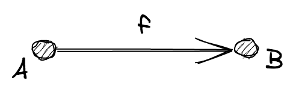

**Nota**. Per semplicità d'ora in poi nei grafici userò solo le etichette per gli oggetti, omettendo il cerchietto.

**Parte II (Composizione)**

Esiste una operazione `∘`, chiamata "composizione", tale che valgono le seguenti proprietà:

(**composition of morphisms**) ogni volta che `f: A ⟼ B` and `g: B ⟼ C` sono due morfismi in `Morphisms` allora deve esistere un terzo morfismo `g ∘ f: A ⟼ C` in `Morphisms` che è detto la _composizione_ di `f` e `g`


(**associativity**) se `f: A ⟼ B`, `g: B ⟼ C` e `h: C ⟼ D` allora `h ∘ (g ∘ f) = (h ∘ g) ∘ f`

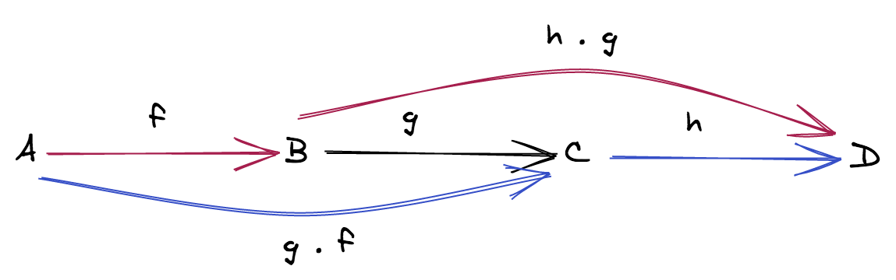

(**identity**) per ogni oggetto `X`, esiste un morfismo `idX: X ⟼ X` chiamato *il morfismo identità* di `X`, tale che per ogni morfismo `f: A ⟼ X` e ogni morfismo `g: X ⟼ B`, vale `idX ∘ f = f` e `g ∘ idX = g`.

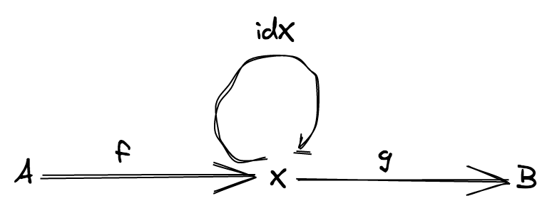

Vediamo un piccolo esempio

**Esempio**

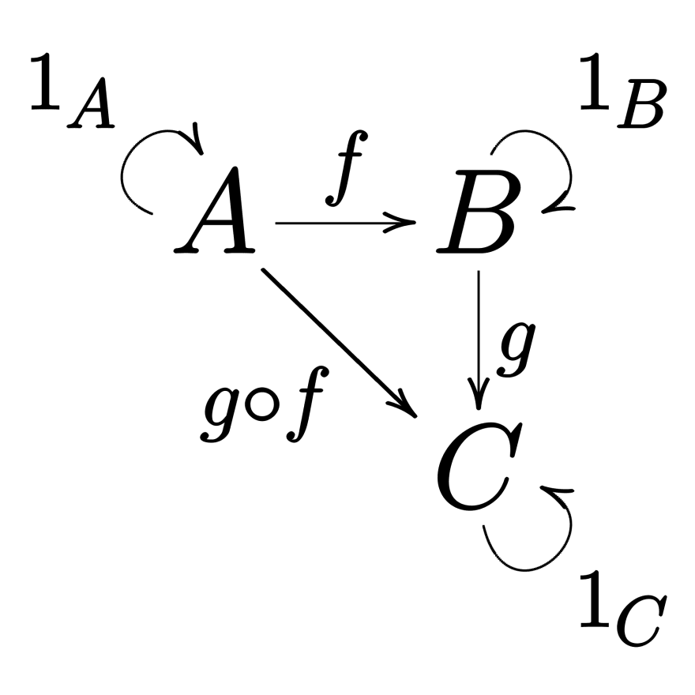

Questa categoria è molto semplice, ci sono solo tre oggetti e sei morfismi (idA, idB, idC sono i morfismi identità di `A`, `B`, `C`).

## Modellare i linguaggi di programmazione con le categorie

Una categoria può essere interpretata come un modello semplificato di un **typed programming language**, ove:

- gli oggetto sono **tipi**
- i morfismi sono **funzioni**
- `∘` è l'usuale **composizione di funzioni**

Il diagramma:


può perciò essere interpretato come un immaginario (e molto semplice) linguaggio di programmazione con solo tre tipi e sei funzioni.

Per esempio potremmo pensare a:

- `A = string`
- `B = number`
- `C = boolean`
- `f = string => number`
- `g = number => boolean`
- `g ∘ f = string => boolean`

L'implementazione potrebbe essere qualcosa come:

```ts
const idA = (s: string): string => s

const idB = (n: number): string => n

const idC = (b: boolean): boolean => B

const f = (s: string): number => s.length

const g = (n: number): boolean => n > 2

// gf = g ∘ f
const gf = (s: string): boolean => g(f(s))
```

## Una categoria per TypeScript

Possiamo definire una categoria, chiamiamola *TS*, come modello semplificato del linguaggio TypeScript, ove:

- gli **oggetti** sono tutti i tipi di TypeScript: `string`, `number`, `ReadonlyArray<string>`, ecc...
- i **morfismi** sono tutte le funzioni di TypeScript: `(a: A) => B`, `(b: B) => C`, ecc... ove `A`, `B`, `C`, ... sono tipi di TypeScript
- i **morfismi identità** sono tutti codificati da una singola funzione polimorfica `const identity = <A>(a: A): A => a`
- la **composizione di morfismi** è l'usuale composizione di funzione (che è associativa)

Come modello di TypeScript, la categoria *TS* a prima vista può sembrare troppo limitata: non ci sono cicli, niente `if`, non c'è *quasi* nulla... e tuttavia questo modello semplificato è abbastanza ricco per soddisfare il nostro obbiettivo principale: ragionare su una nozione ben definita di composizione.

Ora che abbiamo un semplice modello per il nostro linguaggio di programmazione, affrontiamo il problema centrale della composizione.

## Il problema centrale della composizione di funzioni

In _TS_ possiamo comporre due funzioni generiche `f: (a: A) => B` and `g: (c: C) => D` fintanto che `C = B`.

Se sussiste questa condizione possiamo utilizzare le funzioni `flow` (o `pipe`):

```ts
function flow<A, B, C>(f: (a: A) => B, g: (b: B) => C): (a: A) => C {
  return (a) => g(f(a))
}

function pipe<A, B, C>(a: A, f: (a: A) => B, g: (b: B) => C): C {
  return flow(f, g)(a)
}
```

Ma che succede se `B != C`? Come possiamo comporre due funzioni con queste caratteristiche?

Nei prossimi capitoli vedremo sotto quali condizioni una tale composizione è possibile.

**Spoiler**

- per comporre `f: (a: A) => B` con `g: (b: B) => C` abbiamo solo bisogno della usuale composizione di funzioni
- per comporre `f: (a: A) => F<B>` con `g: (b: B) => C` abbiamo bisogno di una istanza di **funtore** per `F`
- per comporre `f: (a: A) => F<B>` con `g: (b: B, c: C) => D` abbiamo bisogno di una istanza di **funtore applicativo** per `F`
- per comporre `f: (a: A) => F<B>` con `g: (b: B) => F<C>` abbiamo bisogno di una istanza di **monade** per `F`

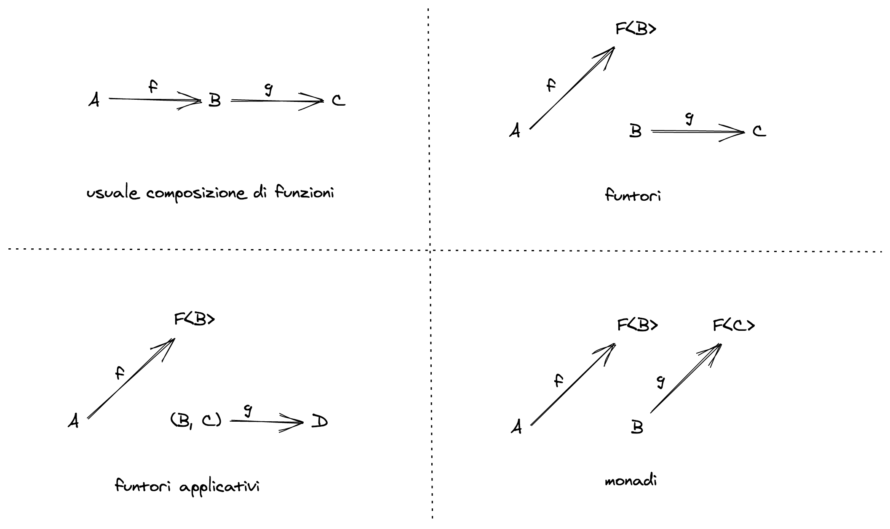

Il problema da cui siamo partiti all'inizio del capitolo corrisponde alla situazione ②, quando al posto del generico `F` mettiamo `Option`:

```
head: (as: ReadonlyArray<number>) => Option<number>
double: (n: number) => number
```

Per risolverlo il prossimo capitolo parlerà di funtori.

# Funtori

Nell'ultimo capitolo ho presentato la categoria *TS* (la categoria di TypeScript) e il problema centrale con la composizione di funzioni:

> Come possiamo comporre due funzioni generiche `f: (a: A) => B` e `g: (c: C) => D`?

Ma perché trovare soluzioni a questo problema è così importante?

Perché, se è vero che le categorie possono essere usate per modellare i linguaggi di programmazione, i morfismi (ovvero le funzioni in *TS*) possono essere usate per modellare i **programmi**.

Perciò risolvere quel problema astratto significa anche trovare un modo di **comporre i programmi in modo generico**.
E *questo* sì che è molto interessante per uno sviluppatore, non è vero?

## Funzioni come programmi

Se vogliamo usare le funzioni per modellare i programmi dobbiamo affrontare subito un problema:

> Come è possibile modellare un programma che produce side effect con una funzione pura?

La risposta è modellare i side effect tramite quelli che vengono chiamati **effetti**, ovvero tipi che **rappresentano** i side effect.

Vediamo due tecniche possibili per farlo in JavaScript:

- definire un DSL (domain specific language) per gli effetti
- usare i *thunk*

La prima tecnica, usare cioè un DSL, significa modificare un programma come:

```ts
const log = (message: string): void => {
  console.log(message) // side effect
}
```

cambiando il suo codominio e facendo in modo che sia una funzione che restituisce una **descrizione** del side effect:

```ts
type DSL = ... // sum type di tutti i possibili effetti gestiti dal sistema

const log = (message: string): DSL => {
  return { _tag: 'log', message } // un effetto che descrive l'atto di scrivere sulla console
}
```

**Quiz**. La funzione `log` appena definita è davvero pura? Eppure `log('foo') !== log('foo')`!

Questa prima tecnica presuppone un modo per combinare gli effetti e la definizione di un interprete in grado di eseguire concretamente gli effetti quando si vuole lanciare il programma finale.

Una seconda tecnica, più semplice e possibile in TypeScript, è racchiudere la computazione in un *thunk*:

```ts
// un thunk che rappresenta un side effect sincrono
type IO<A> = () => A

const log = (message: string): IO<void> => {
  return () => console.log(message) // restituisce un thunk
}
```

Il programma `log`, quando viene eseguito, non provoca immediatamente il side effect ma restituisce **un valore che rappresenta la computazione**.

```ts
import { IO } from 'fp-ts/IO'

export const log = (message: string): IO<void> => {
  return () => console.log(message) // restituisce un thunk
}

export const main = log('hello!')
// a questo punto non vedo nulla sulla console
// perchè `main` è solo un valore inerte
// che rappresenta la computazione

main()
// solo dopo aver lanciato esplicitamente il programma
// vedo il risultato sulla console
```

Nella programmazione funzionale si tende a spingere i side effect (sottoforma di effetti) ai confini del sistema (ovvero la funzione `main`)
ove vengono eseguiti, si ottiene perciò il seguente schema:

> system = pure core + imperative shell

Nei linguaggi *puramente funzionali* (come Haskell, PureScript o Elm) questa divisione è netta ed è imposta dal linguaggio stesso.

Anche con questa seconda tecnica (quella usata da `fp-ts`) occorre un modo per combinare gli effetti, il che ci riporta alla nostra volontà di comporre i programmi in modo generico, vediamo come fare.

Innanzi tutto un po' di terminologia (informale): chiamiamo **programma puro** una funzione con la seguente firma:

```ts
(a: A) => B
```

Una tale firma modella un programma che accetta un input di tipo `A` e restituisce un risultato di tipo `B`, senza alcun effetto.

**Esempio**

Il programma `len`:

```ts
const len = (s: string): number => s.length
```

Chiamiamo **programma con effetti** una funzione con la seguente firma:

```ts
(a: A) => F<B>
```

per un qualche type constructor `F`.

Una tale firma modella un programma che accetta un input di tipo `A` e restituisce un risultato di tipo `B` insieme ad un **effetto** `F`.

Ricordiamo che un [type constructor](https://en.wikipedia.org/wiki/Type_constructor) è un operatore a livello di tipi `n`-ario che prende come argomento zero o più tipi e che restituisce un tipo (esempi: `Option`, `ReadonlyArray`).

**Esempio**

Il programma `head`

```ts
import { Option, some, none } from 'fp-ts/Option'

const head = <A>(as: ReadonlyArray<A>): Option<A> =>
  as.length === 0 ? none : some(as[0])
```

è un programma con effetto `Option`.

Quando parliamo di effetti siamo interessati a type constructor `n`-ari con `n >= 1`, per esempio:

| Type constructor   | Effect (interpretation)                        |
| ------------------ | ---------------------------------------------- |
| `ReadonlyArray<A>` | a non deterministic computation                |
| `Option<A>`        | a computation that may fail                    |
| `Either<E, A>`     | a computation that may fail                    |
| `IO<A>`            | a synchronous computation that **never fails** |
| `Task<A>`          | an asynchronous computation **never fails**    |
| `Reader<R, A>`     | reading from an environment                    |

ove

```ts
// un thunk che restituisce una `Promise`
type Task<A> = () => Promise<A>
```

```ts
// `R` represents an "environment" needed for the computation
// (we can "read" from it) and `A` is the result
type Reader<R, A> = (r: R) => A
```

Torniamo ora al nostro problema principale:

> Come possiamo comporre due funzioni generiche `f: (a: A) => B` e `g: (c: C) => D`?

Dato che il problema generale non è trattabile, dobbiamo aggiungere qualche **vincolo** a `B` e `C`.

Sappiamo già che se `B = C` allora la soluzione è l'usuale composizione di funzioni

```ts
function flow<A, B, C>(f: (a: A) => B, g: (b: B) => C): (a: A) => C {
  return (a) => g(f(a))
}
```

Ma cosa fare negli altri casi?

## Un vincolo che conduce ai funtori

Consideriamo il seguente vincolo: `B = F<C>` per un qualche type constructor `F`, abbiamo perciò la seguente situazione:

- `f: (a: A) => F<B>` è un programma con effetti
- `g: (b: B) => C` è un programma puro

Per poter comporre `f` con `g` dobbiamo trovare un procedimento che permetta di tramutare `g` da una funzione `(b: B) => C` ad una funzione `(fb: F<B>) => F<C>` in modo tale che possiamo usare la normale composizione di funzioni (infatti in questo modo il codominio di `f` sarebbe lo stesso insieme che fa da dominio della nuova funzione).


Abbiamo perciò tramutato il problema originale in uno nuovo e diverso: possiamo trovare una funzione, chiamiamola `map`, che agisce in questo modo?

Vediamo qualche esempio pratico:

**Esempio** (`F = ReadonlyArray`)

```ts
import { flow, pipe } from 'fp-ts/function'

// trasforma funzioni `B -> C` in funzioni `ReadonlyArray<B> -> ReadonlyArray<C>`
const map = <B, C>(g: (b: B) => C) => (
  fb: ReadonlyArray<B>
): ReadonlyArray<C> => fb.map(g)

// -------------------
// esempio di utilizzo
// -------------------

interface User {
  readonly id: number
  readonly name: string
  readonly followers: ReadonlyArray<User>
}

const getFollowers = (user: User): ReadonlyArray<User> => user.followers
const getName = (user: User): string => user.name

// getFollowersNames: User -> ReadonlyArray<string>
const getFollowersNames = flow(getFollowers, map(getName))

// o se preferite usare `pipe` al posto di `flow`...
export const getFollowersNames2 = (user: User) =>
  pipe(user, getFollowers, map(getName))

const user: User = {
  id: 1,
  name: 'Ruth R. Gonzalez',
  followers: [
    { id: 2, name: 'Terry R. Emerson', followers: [] },
    { id: 3, name: 'Marsha J. Joslyn', followers: [] }
  ]
}

console.log(getFollowersNames(user)) // => [ 'Terry R. Emerson', 'Marsha J. Joslyn' ]
```

**Esempio** (`F = Option`)

```ts
import { flow } from 'fp-ts/function'
import { none, Option, match, some } from 'fp-ts/Option'

// trasforma funzioni `B -> C` in funzioni `Option<B> -> Option<C>`
const map = <B, C>(g: (b: B) => C): ((fb: Option<B>) => Option<C>) =>
  match(
    () => none,
    (b) => {
      const c = g(b)
      return some(c)
    }
  )

// -------------------
// esempio di utilizzo
// -------------------

import * as RA from 'fp-ts/ReadonlyArray'

const head: (input: ReadonlyArray<number>) => Option<number> = RA.head
const double = (n: number): number => n * 2

// getDoubleHead: ReadonlyArray<number> -> Option<number>
const getDoubleHead = flow(head, map(double))

console.log(getDoubleHead([1, 2, 3])) // => some(2)
console.log(getDoubleHead([])) // => none
```

**Esempio** (`F = IO`)

```ts
import { flow } from 'fp-ts/function'
import { IO } from 'fp-ts/IO'

// trasforma funzioni `B -> C` in funzioni `IO<B> -> IO<C>`
const map = <B, C>(g: (b: B) => C) => (fb: IO<B>): IO<C> => () => {
  const b = fb()
  return g(b)
}

// -------------------
// esempio di utilizzo
// -------------------

interface User {
  readonly id: number
  readonly name: string
}

// a dummy in memory database
const database: Record<number, User> = {
  1: { id: 1, name: 'Ruth R. Gonzalez' },
  2: { id: 2, name: 'Terry R. Emerson' },
  3: { id: 3, name: 'Marsha J. Joslyn' }
}

const getUser = (id: number): IO<User> => () => database[id]
const getName = (user: User): string => user.name

// getUserName: number -> IO<string>
const getUserName = flow(getUser, map(getName))

console.log(getUserName(1)()) // => Ruth R. Gonzalez
```

**Esempio** (`F = Task`)

```ts
import { flow } from 'fp-ts/function'
import { Task } from 'fp-ts/Task'

// trasforma funzioni `B -> C` in funzioni `Task<B> -> Task<C>`
const map = <B, C>(g: (b: B) => C) => (fb: Task<B>): Task<C> => () => {
  const promise = fb()
  return promise.then(g)
}

// -------------------
// esempio di utilizzo
// -------------------

interface User {
  readonly id: number
  readonly name: string
}

// a dummy remote database
const database: Record<number, User> = {
  1: { id: 1, name: 'Ruth R. Gonzalez' },
  2: { id: 2, name: 'Terry R. Emerson' },
  3: { id: 3, name: 'Marsha J. Joslyn' }
}

const getUser = (id: number): Task<User> => () => Promise.resolve(database[id])
const getName = (user: User): string => user.name

// getUserName: number -> Task<string>
const getUserName = flow(getUser, map(getName))

getUserName(1)().then(console.log) // => Ruth R. Gonzalez
```

**Esempio** (`F = Reader`)

```ts
import { flow } from 'fp-ts/function'
import { Reader } from 'fp-ts/Reader'

// trasforma funzioni `B -> C` in funzioni `Reader<R, B> -> Reader<R, C>`
const map = <B, C>(g: (b: B) => C) => <R>(fb: Reader<R, B>): Reader<R, C> => (
  r
) => {
  const b = fb(r)
  return g(b)
}

// -------------------
// esempio di utilizzo
// -------------------

interface User {
  readonly id: number
  readonly name: string
}

interface Env {
  // a dummy in memory database
  readonly database: Record<string, User>
}

const getUser = (id: number): Reader<Env, User> => (env) => env.database[id]
const getName = (user: User): string => user.name

// getUserName: number -> Reader<Env, string>
const getUserName = flow(getUser, map(getName))

console.log(
  getUserName(1)({
    database: {
      1: { id: 1, name: 'Ruth R. Gonzalez' },
      2: { id: 2, name: 'Terry R. Emerson' },
      3: { id: 3, name: 'Marsha J. Joslyn' }
    }
  })
) // => Ruth R. Gonzalez
```

Più in generale, quando un certo type constructor `F` ammette una `map` che agisce in questo modo, diciamo che ammette una **istanza di funtore**.

Dal punto di vista matematico, i funtori sono delle **mappe tra categorie** che preservano la struttura categoriale, ovvero che preservano i morfismi identità e l'operazione di composizione.

Dato che le categorie sono costituite da due cose (gli oggetti e i morfismi) anche un funtore è costituito da due cose:

- una **mappa tra oggetti** che associa ad ogni oggetto `X` in _C_ un oggetto `F<X>` in _D_
- una **mappa tra morfismi** che associa ad ogni morfismo `f` in _C_ un morfismo `map(f)` in _D_

ove _C_ e _D_ sono due categorie (aka due linguaggi di programmazione).


Anche se una mappa tra due linguaggi di programmazione è un'idea intrigante, siamo più interessati ad una mappa in cui _C_ and _D_ coincidono (con la categoria *TS*). In questo caso parliamo di **endofuntori** ("endo" significa "dentro", "interno").

D'ora in poi, se non diversamente specificato, quando scrivo "funtore" intendo un endofuntore in *TS*.

Ora che sappiamo qual'è l'aspetto pratico che ci interessa dei funtori, vediamone la definizione formale.

**Definizione**. Un funtore è una coppia `(F, map)` ove:

- `F` è un type constructor `n`-ario (`n >= 1`) che mappa ogni tipo `X` in un tipo `F<X>` (**mappa tra oggetti**)
- `map` è una funzione con la seguente firma:

```ts
map: <A, B>(f: (a: A) => B) => ((fa: F<A>) => F<B>)
```

che mappa ciascuna funzione `f: (a: A) => B` in una funzione `map(f): (fa: F<A>) => F<B>` (**mappa tra morfismi**)

Devono valere le seguenti leggi:

- `map(1`<sub>X</sub>`)` = `1`<sub>F(X)</sub> (**le identità vanno in identità**)
- `map(g ∘ f) = map(g) ∘ map(f)` (**l'immagine di una composizione è la composizione delle immagini**)

La seconda legge vi permette di rifattorizzare ottimizzando la computazione:

```ts
import { flow, increment, pipe } from 'fp-ts/function'
import { map } from 'fp-ts/ReadonlyArray'

const double = (n: number): number => n * 2

// cicla due volte
console.log(pipe([1, 2, 3], map(double), map(increment))) // => [ 3, 5, 7 ]

// cicla una volta sola
console.log(pipe([1, 2, 3], map(flow(double, increment)))) // => [ 3, 5, 7 ]
```

## Funtori e gestione degli errori funzionale

I funtori hanno un impatto positivo sulla gestione degli errori funzionale, vediamo un esempio pratico:

```ts
declare const doSomethingWithIndex: (index: number) => string

export const program = (ns: ReadonlyArray<number>): string => {
  // un risultato di -1 indica che nessun elemento è stato trovato
  const i = ns.findIndex((n) => n > 0)
  if (i !== -1) {
    return doSomethingWithIndex(i)
  }
  throw new Error('cannot find a positive number')
}
```

Usando l'API nativa `findIndex` per procedere con il flusso del programma occorre testare il risultato parziale con un `if` (sempre che ce ne ricordiamo! Il risultato di `findIndex` può essere tranquillamente passato come input a `doSomethingWithIndex`).

Vediamo invece come si può ottenere più facilmente un risultato analogo usando `Option` e la sua istanza di funtore:

```ts
import { pipe } from 'fp-ts/function'
import { map, Option } from 'fp-ts/Option'
import { findIndex } from 'fp-ts/ReadonlyArray'

declare const doSomethingWithIndex: (index: number) => string

export const program = (ns: ReadonlyArray<number>): Option<string> =>
  pipe(
    ns,
    findIndex((n) => n > 0),
    map(doSomethingWithIndex)
  )
```

In pratica, utilizzando `Option`, abbiamo sempre di fronte l'*happy path*, la gestione dell'errore avviene dietro le quinte grazie alla sua `map`.

**Demo** (opzionale)

[`04_functor.ts`](src/04_functor.ts)

**Quiz**. `Task<A>` rappresenta una computazione asincrona che non può fallire, come possiamo modellare invece una computazione asincrona che può fallire?

## I funtori compongono

I funtori compongono, ovvero dati due funtori `F` e `G`, allora la composizione `F<G<A>>` è ancora un funtore e la `map` della composizione è la composizione delle `map`.

**Esempio** (`F = Task`, `G = Option`)

```ts
import { flow } from 'fp-ts/function'
import * as O from 'fp-ts/Option'
import * as T from 'fp-ts/Task'

type TaskOption<A> = T.Task<O.Option<A>>

export const map: <A, B>(
  f: (a: A) => B
) => (fa: TaskOption<A>) => TaskOption<B> = flow(O.map, T.map)

// -------------------
// esempio di utilizzo
// -------------------

interface User {
  readonly id: number
  readonly name: string
}

// a dummy remote database
const database: Record<number, User> = {
  1: { id: 1, name: 'Ruth R. Gonzalez' },
  2: { id: 2, name: 'Terry R. Emerson' },
  3: { id: 3, name: 'Marsha J. Joslyn' }
}

const getUser = (id: number): TaskOption<User> => () =>
  Promise.resolve(O.fromNullable(database[id]))
const getName = (user: User): string => user.name

// getUserName: number -> TaskOption<string>
const getUserName = flow(getUser, map(getName))

getUserName(1)().then(console.log) // => some('Ruth R. Gonzalez')
```

## Funtori controvarianti

Prima di procedere voglio mostrarvi una variante del concetto di funtore che abbiamo visto nella sezione precedente: i **funtori controvarianti**.

Ad essere pignoli infatti quelli che abbiamo chiamato semplicemente "funtori" dovrebbero essere più propriamente chiamati **funtori covarianti**.

La definizione di funtore controvariante è del tutto analoga a quella di funtore covariante, eccetto per la firma della sua operazione fondamentale (che viene chiamata `contramap` invece di `map`)


**Esempio**

```ts
import { map } from 'fp-ts/Option'
import { contramap } from 'fp-ts/Eq'

type User = {
  readonly id: number
  readonly name: string
}

const getId = (_: User): number => _.id

// const getIdOption: (fa: Option<User>) => Option<number>
const getIdOption = map(getId)

// const getIdEq: (fa: Eq<number>) => Eq<User>
const getIdEq = contramap(getId)

import * as N from 'fp-ts/number'

const EqID = getIdEq(N.Eq)

/*

Nel capitolo su `Eq` avevamo fatto:

const EqID: Eq<User> = pipe(
  N.Eq,
  contramap((_: User) => _.id)
)
*/
```

## Funtori in `fp-ts`

Come facciamo a definire una istanza di funtore in `fp-ts`? Vediamo qualche esempio pratico.

La seguente dichiarazione definisce il modello di una risposta di una chiamata ad una API:

```ts
interface Response<A> {
  readonly url: string
  readonly status: number
  readonly headers: Record<string, string>
  readonly body: A
}
```

Notate che il campo `body` è parametrico, questo fatto rende `Response` un buon candidato per cercare una istanza di funtore dato che `Response` è un type constructor `n`-ario con `n >= 1` (una condizione necessaria).

Per poter definire una istanza di funtore per `Response` dobbiamo definire una funzione `map` insieme ad alcuni [dettagli tecnici](https://gcanti.github.io/fp-ts/recipes/HKT.html) resi necessari da `fp-ts`.

```ts
// `Response.ts` module

import { Functor1 } from 'fp-ts/Functor'

export type URI = 'Response'

declare module 'fp-ts/HKT' {
  interface URItoKind<A> {
    readonly Response: Response<A>
  }
}

export interface Response<A> {
  readonly url: string
  readonly status: number
  readonly headers: Record<string, string>
  readonly body: A
}

export const map = <A, B>(f: (a: A) => B) => (fa: Response<A>): Response<B> => ({
  ...fa,
  body: f(fa.body)
})

// functor instance for `Response<A>`
export const Functor: Functor1<URI> = {
  map
}
```

## I funtori risolvono il problema centrale?

Non ancora. I funtori ci permettono di comporre un programma con effetti `f` con un programma puro `g`, ma `g` deve essere una funzione **unaria**, ovvero una funzione che accetta un solo argomento. Cosa succede se `g` accetta due o più argomenti?

| Program f | Program g               | Composition   |
| --------- | ----------------------- | ------------- |
| pure      | pure                    | `g ∘ f`       |
| effectful | pure (unary)            | `map(g) ∘ f`  |
| effectful | pure (`n`-ary, `n > 1`) | ?             |

Per poter gestire questa circostanza abbiamo bisogno di qualcosa in più, nel prossimo capitolo vedremo un'altra importante astrazione della programmazione funzionale: i **funtori applicativi**.

# Funtori applicativi

Nella sezione riguardante i funtori abbiamo visto che possiamo comporre un programma con effetti `f: (a: A) => F<B>` con un programma puro `g: (b: B) => C` tramite una trasformazione di `g` in una funzione `map(g): (fb: F<B>) => F<C>`, ammesso che `F` ammetta una istanza di funtore.

| Program f | Program g    | Composition   |
| --------- | ------------ | ------------- |
| pure      | pure         | `g ∘ f`       |
| effectful | pure (unary) | `map(g) ∘ f`  |

Tuttavia `g` deve essere unaria, ovvero deve accettare un solo parametro in input. Che succede se `g` accetta due parametri? Possiamo ancora trasformare `g` usando solo l'istanza di funtore?

## Currying

Prima di tutto dobbiamo modellare una funzione che accetta due parametri, diciamo di tipo `B` e `C` e restituisce un valore di tipo `D`:

```ts
g: (b: B, c: C) => D
```

Possiamo riscrivere `g` usando una tecnica chiamata **currying**.

> Currying is the technique of translating the evaluation of a function that takes multiple parameters into evaluating a sequence of functions, **each with a single parameter**. For example, a function that takes two parameters, one from `B` and one from `C`, and produces outputs in `D`, by currying is translated into a function that takes a single parameter from `C` and produces as outputs functions from `B` to `C`.

(source: [currying on wikipedia.org](https://en.wikipedia.org/wiki/Currying))

Perciò, tramite currying, possiamo riscrivere `g` come:

```ts
g: (b: B) => (c: C) => D
```

**Esempio**

```ts
interface User {
  readonly id: number
  readonly name: string
  readonly followers: ReadonlyArray<User>
}

const addFollower = (follower: User, user: User): User => ({
  ...user,
  followers: [...user.followers, follower]
})
```

Riscriviamo `addFollower` tramite currying

```ts
interface User {
  readonly id: number
  readonly name: string
  readonly followers: ReadonlyArray<User>
}

const addFollower = (follower: User) => (user: User): User => ({
  ...user,
  followers: [...user.followers, follower]
})

// -------------------
// esempio di utilizzo
// -------------------

const user: User = { id: 1, name: 'Ruth R. Gonzalez', followers: [] }
const follower: User = { id: 3, name: 'Marsha J. Joslyn', followers: [] }

console.log(addFollower(follower)(user))
/*
{
  id: 1,
  name: 'Ruth R. Gonzalez',
  followers: [ { id: 3, name: 'Marsha J. Joslyn', followers: [] } ]
}
*/
```

## L'operazione `ap`

Ora supponiamo:

- di non avere a disposizione `follower` ma solo il suo `id`
- di non avere a disposizione `user` ma solo il suo `id`
- di avere a disposizione una API `fetchUser` che, dato un `id`, contatta un endpoint che restituisce lo `User` corrispondente

```ts
import * as T from 'fp-ts/Task'

interface User {
  readonly id: number
  readonly name: string
  readonly followers: ReadonlyArray<User>
}

const addFollower = (follower: User) => (user: User): User => ({
  ...user,
  followers: [...user.followers, follower]
})

declare const fetchUser: (id: number) => T.Task<User>

const userId = 1
const followerId = 3

const result = addFollower(fetchUser(followerId))(fetchUser(userId)) // non compila!
```

Non posso più usare `addFollower`! Come possiamo procedere?

Se avessimo a disposizione una funzione con la seguente firma:

```ts
declare const addFollowerAsync: (
  follower: T.Task<User>
) => (user: T.Task<User>) => T.Task<User>
```

potremmo procedere comodamente:

```ts
declare const fetchUser: (id: number) => T.Task<User>

declare const addFollowerAsync: (
  follower: Task<User>
) => (user: Task<User>) => T.Task<User>

const userId = 1
const followerId = 3

// const result: T.Task<User>
const result = addFollowerAsync(fetchUser(followerId))(fetchUser(userId)) // ora compila
```

Possiamo naturalmente provare ad implementare manualmente `addFollowerAsync`, ma è possibile invece trovare una trasformazione che partendo da una funzione come `addFollower: (follower: User) => (user: User): User` restituisca una funzione come `addFollowerAsync: (follower: Task<User>) => (user: Task<User>) => Task<User>`?

Più in generale quello che vorremmo è una trasformazione, chiamiamola `liftA2`, che partendo da una funzione `g: (b: B) => (c: C) => D` restituisca una funzione con la seguente firma:

```ts
liftA2(g): (fb: F<B>) => (fc: F<C>) => F<D>
```

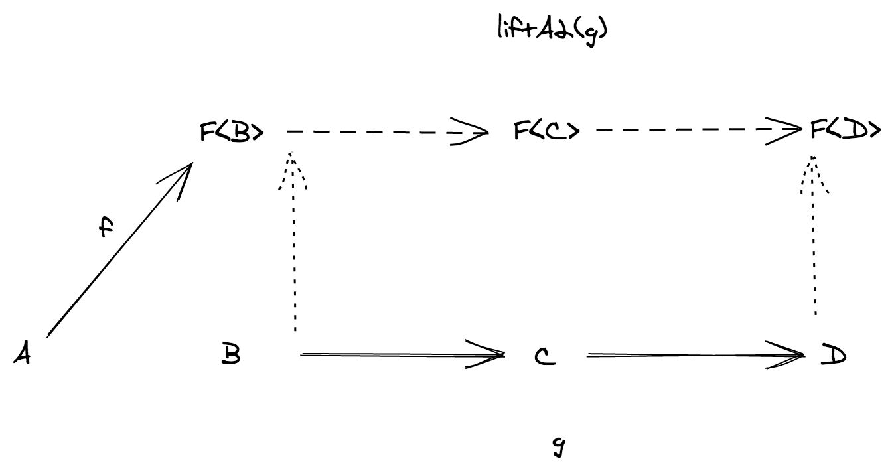

Come facciamo ad ottenerla? Siccome adesso `g` è unaria, possiamo usare l'istanza di funtore e la nostra vecchia `map`:

```ts
map(g): (fb: F<B>) => F<(c: C) => D>
```

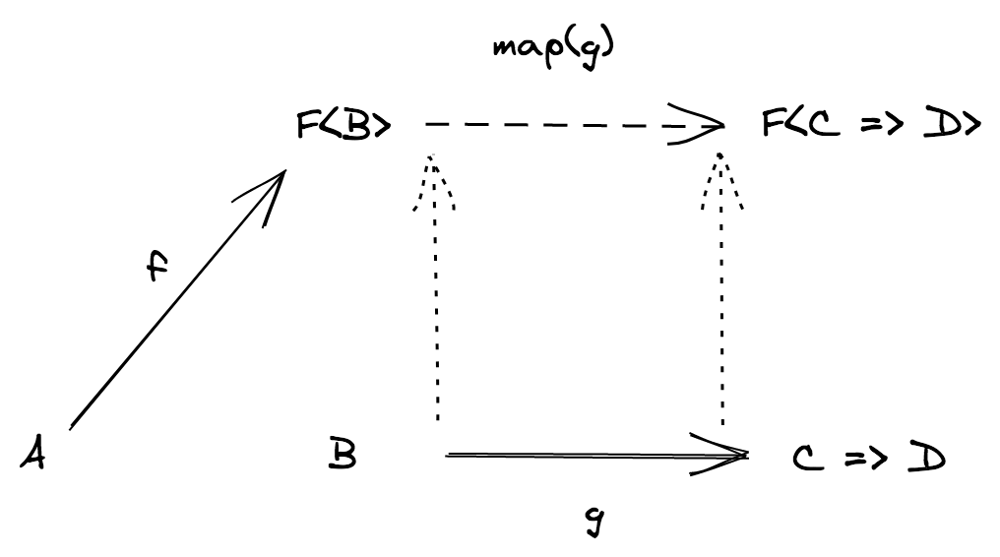

Ma ora siamo bloccati: non c'è alcuna operazione legale fornita dall'istanza di funtore che ci permette di "spacchettare" il tipo `F<(c: C) => D>` nel tipo `(fc: F<C>) => F<D>`.

Introduciamo perciò una nuova operazione `ap` che realizza questo spacchettamento:

```ts
declare const ap: <A>(
  fa: Task<A>
) => <B>(fab: Task<(a: A) => B>) => Task<B>
```

**Nota**. Come mai il nome "ap"? Perché può essere vista come una sorta di applicazione di funzione

```ts
// `apply` applica una funzione ad un valore
declare const apply: <A>(a: A      ) => <B>(f:      (a: A) => B ) => B

declare const ap:    <A>(a: Task<A>) => <B>(f: Task<(a: A) => B>) => Task<B>
// `ap` applica una funzione racchiusa in un effetto ad un valore racchiuso in un effetto
```

Ora, data l'operazione `ap` possiamo definire `liftA2`:

```ts
import { pipe } from 'fp-ts/function'
import * as T from 'fp-ts/Task'

const liftA2 = <B, C, D>(g: (b: B) => (c: C) => D) => (fb: T.Task<B>) => (
  fc: T.Task<C>
): T.Task<D> => pipe(fb, T.map(g), T.ap(fc))

interface User {
  readonly id: number
  readonly name: string
  readonly followers: ReadonlyArray<User>
}

const addFollower = (follower: User) => (user: User): User => ({
  ...user,
  followers: [...user.followers, follower]
})

// const addFollowerAsync: (fb: T.Task<User>) => (fc: T.Task<User>) => T.Task<User>
const addFollowerAsync = liftA2(addFollower)
```

e infine, comporre `fetchUser` con il risultato precedente:

```ts
import { flow, pipe } from 'fp-ts/function'
import * as T from 'fp-ts/Task'

const liftA2 = <B, C, D>(g: (b: B) => (c: C) => D) => (fb: T.Task<B>) => (
  fc: T.Task<C>
): T.Task<D> => pipe(fb, T.map(g), T.ap(fc))

interface User {
  readonly id: number
  readonly name: string
  readonly followers: ReadonlyArray<User>
}

const addFollower = (follower: User) => (user: User): User => ({
  ...user,
  followers: [...user.followers, follower]
})

declare const fetchUser: (id: number) => T.Task<User>

// const program: (id: number) => (fc: T.Task<User>) => T.Task<User>
const program = flow(fetchUser, liftA2(addFollower))

const userId = 1
const followerId = 3

// const result: T.Task<User>
const result = program(followerId)(fetchUser(userId))
```

Abbiamo trovato una procedura standard per comporre due funzioni `f: (a: A) => F<B>`, `g: (b: B, c: C) => D`:

1. si trasforma `g` tramite currying in una funzione `g: (b: B) => (c: C) => D`
2. si definisce la funzione `ap` per l'effetto `F` (funzione di libreria)
3. si definisce la funzione di utility `liftA2` per l'effetto `F` (funzione di libreria)
4. si ottiene la composizione con `flow(f, liftA2(g))`

Vediamo come è definita l'opererazione `ap` per alcuni type constructor già noti:

**Esempio** (`F = ReadonlyArray`)

```ts
import { increment, pipe } from 'fp-ts/function'

const ap = <A>(fa: ReadonlyArray<A>) => <B>(
  fab: ReadonlyArray<(a: A) => B>
): ReadonlyArray<B> => {
  const out: Array<B> = []
  for (const f of fab) {
    for (const a of fa) {
      out.push(f(a))
    }
  }
  return out
}

const double = (n: number): number => n * 2

console.log(pipe([double, increment], ap([1, 2, 3]))) // => [ 2, 4, 6, 2, 3, 4 ]
```

**Esempio** (`F = Option`)

```ts
import { pipe } from 'fp-ts/function'
import * as O from 'fp-ts/Option'

const ap = <A>(fa: O.Option<A>) => <B>(
  fab: O.Option<(a: A) => B>
): O.Option<B> =>
  pipe(
    fab,
    O.match(
      () => O.none,
      (f) =>
        pipe(
          fa,
          O.match(
            () => O.none,
            (a) => O.some(f(a))
          )
        )
    )
  )

const double = (n: number): number => n * 2

console.log(pipe(O.some(double), ap(O.some(1)))) // => some(2)
console.log(pipe(O.some(double), ap(O.none))) // => none
console.log(pipe(O.none, ap(O.some(1)))) // => none
console.log(pipe(O.none, ap(O.none))) // => none
```

**Esempio** (`F = IO`)

```ts
import { IO } from 'fp-ts/IO'

const ap = <A>(fa: IO<A>) => <B>(fab: IO<(a: A) => B>): IO<B> => () => {
  const f = fab()
  const a = fa()
  return f(a)
}
```

**Esempio** (`F = Task`)

```ts
import { Task } from 'fp-ts/Task'

const ap = <A>(fa: Task<A>) => <B>(fab: Task<(a: A) => B>): Task<B> => () =>
  Promise.all([fab(), fa()]).then(([f, a]) => f(a))
```

**Esempio** (`F = Reader`)

```ts
import { Reader } from 'fp-ts/Reader'

const ap = <R, A>(fa: Reader<R, A>) => <B>(
  fab: Reader<R, (a: A) => B>
): Reader<R, B> => (r) => {
  const f = fab(r)
  const a = fa(r)
  return f(a)
}
```

Abbiamo visto che con `ap` possiamo gestire funzioni con due parametri, ma che succede con le funzioni che accettano **tre** parametri? Abbiamo bisogno di *un'altra astrazione ancora*?

La buona notizia è che la risposta è no, `map` + `ap` sono sufficienti:

```ts
import { pipe } from 'fp-ts/function'
import * as T from 'fp-ts/Task'

const liftA3 = <B, C, D, E>(f: (b: B) => (c: C) => (d: D) => E) => (
  fb: T.Task<B>
) => (fc: T.Task<C>) => (fd: T.Task<D>): T.Task<E> =>
  pipe(fb, T.map(f), T.ap(fc), T.ap(fd))

const liftA4 = <B, C, D, E, F>(
  f: (b: B) => (c: C) => (d: D) => (e: E) => F
) => (fb: T.Task<B>) => (fc: T.Task<C>) => (fd: T.Task<D>) => (
  fe: T.Task<E>
): T.Task<F> => pipe(fb, T.map(f), T.ap(fc), T.ap(fd), T.ap(fe))

// etc...
```

Ora possiamo aggiornare la nostra "tabella di composizione":

| Program f | Program g     | Composition     |
| --------- | ------------- | --------------- |
| pure      | pure          | `g ∘ f`         |
| effectful | pure (unary)  | `map(g) ∘ f`    |
| effectful | pure, `n`-ary | `liftAn(g) ∘ f` |

## L'operazione `of`

Ora sappiamo che se abbiamo due funzioni `f: (a: A) => F<B>`, `g: (b: B, c: C) => D` possiamo ottenerne la composizione `h`:

```ts
h: (a: A) => (fb: F<B>) => F<D>
```

Per eseguire `h` abbiamo perciò bisogno di un valore di tipo `A` e di un valore di tipo `F<B>`.

Ma che succede se invece di un valore di tipo `F<B>` per il secondo parametro `fb` abbiamo a disposizione solo un valore di tipo `B`?

Sarebbe utile un'operazione che sia in grado di trasformare un valore di tipo `B` in un valore di tipo `F<B>`, in modo che si possa poi usare `h`.

Introduciamo perciò una tale operazione, chiamata `of` (possibili sinonimi **pure**, **return**):

```ts
declare const of: <B>(b: B) => F<B>
```

In letteratura si parla di **funtori applicativi** per i type constructor che ammettono ambedue le operazioni `ap` e `of`.

Vediamo come è definita l'opererazione `of` per alcuni type constructor noti:

**Esempio** (`F = ReadonlyArray`)

```ts
const of = <A>(a: A): ReadonlyArray<A> => [a]
```

**Esempio** (`F = Option`)

```ts
import * as O from 'fp-ts/Option'

const of = <A>(a: A): O.Option<A> => O.some(a)
```

**Esempio** (`F = IO`)

```ts
import { IO } from 'fp-ts/IO'

const of = <A>(a: A): IO<A> => () => a
```

**Esempio** (`F = Task`)

```ts
import { Task } from 'fp-ts/Task'

const of = <A>(a: A): Task<A> => () => Promise.resolve(a)
```

**Esempio** (`F = Reader`)

```ts
import { Reader } from 'fp-ts/Reader'

const of = <R, A>(a: A): Reader<R, A> => () => a
```

**Demo**

[`05_applicative.ts`](src/05_applicative.ts)

## I funtori applicativi compongono

I funtori applicativi compongono, ovvero dati due funtori applicativi `F` e `G`, la loro composizione `F<G<A>>` è ancora un funtore applicativo.

**Esempio** (`F = Task`, `G = Option`)

La `of` della composizione è la composizione delle `of`:

```ts
import { flow } from 'fp-ts/function'
import * as O from 'fp-ts/Option'
import * as T from 'fp-ts/Task'

type TaskOption<A> = T.Task<O.Option<A>>

const of: <A>(a: A) => TaskOption<A> = flow(O.of, T.of)
```

la `ap` della composizione si ottiene dal seguente pattern:

```ts
const ap = <A>(
  fa: TaskOption<A>
): (<B>(fab: TaskOption<(a: A) => B>) => TaskOption<B>) =>
  flow(
    T.map((gab) => (ga: O.Option<A>) => O.ap(ga)(gab)),
    T.ap(fa)
  )
```

## I funtori applicativi risolvono il problema centrale?

Non ancora. C'è ancora un ultimo importante caso da considerare: quando **entrambi** i programmi sono con effetti.

Ancora una volta abbiamo bisogno di qualche cosa in più, nel capitolo seguente parleremo di una delle astrazioni più importanti in programmazione funzionale: le **monadi**.

# Monadi

<center>


(Eugenio Moggi is a professor of computer science at the University of Genoa, Italy. He first described the general use of monads to structure programs)


(Philip Lee Wadler is an American computer scientist known for his contributions to programming language design and type theory)
</center>

Nell'ultimo capitolo abbiamo visto che possiamo comporre un programma con effetti `f: (a: A) => F<B>` con un programma `n`-ario puro `g`, ammesso che `F` ammetta una istanza di funtore applicativo:

| Program f | Program g     | Composition     |
| --------- | ------------- | --------------- |
| pure      | pure          | `g ∘ f`         |
| effectful | pure (unary)  | `map(g) ∘ f`    |
| effectful | pure, `n`-ary | `liftAn(g) ∘ f` |

Tuttavia dobbiamo risolvere un ultimo (e frequente) caso: quando **entrambi** i programmi sono con effetto:

```ts
f: (a: A) => F<B>
g: (b: B) => F<C>
```

Qual'è la composizione di `f` e `g`?

## Il problema dei contesti innestati

Per mostrare meglio perché abbiamo bisogno di qualcosa in più, vediamo qualche esempio.

**Esempio** (`F = Array`)

Supponiamo di voler ricavare i follower dei follower:

```ts
import { pipe } from 'fp-ts/function'
import * as A from 'fp-ts/ReadonlyArray'

interface User {
  readonly id: number
  readonly name: string
  readonly followers: ReadonlyArray<User>
}

const getFollowers = (user: User): ReadonlyArray<User> => user.followers

declare const user: User

// followersOfFollowers: ReadonlyArray<ReadonlyArray<User>>
const followersOfFollowers = pipe(user, getFollowers, A.map(getFollowers))
```

C'è qualcosa che non va, `followersOfFollowers` ha tipo `ReadonlyArray<ReadonlyArray<User>>` ma noi vorremmo `ReadonlyArray<User>`.

Abbiamo bisogno di appiattire (**flatten**) gli array innestati.

La funzione `flatten: <A>(mma: ReadonlyArray<ReadonlyArray<A>>) => ReadonlyArray<A>` esportata dal modulo `fp-ts/ReadonlyArray` fa al caso nostro:

```ts
// followersOfFollowers: ReadonlyArray<User>
const followersOfFollowers = pipe(
  user,
  getFollowers,
  A.map(getFollowers),
  A.flatten
)
```

Bene! Vediamo con un'altra struttura dati.

**Esempio** (`F = Option`)

Supponiamo di voler calcolare il reciproco del primo elemento di un array numerico:

```ts
import { pipe } from 'fp-ts/function'
import * as O from 'fp-ts/Option'
import * as A from 'fp-ts/ReadonlyArray'

const inverse = (n: number): O.Option<number> =>
  n === 0 ? O.none : O.some(1 / n)

// inverseHead: O.Option<O.Option<number>>
const inverseHead = pipe([1, 2, 3], A.head, O.map(inverse))
```

Opss, è successo di nuovo, `inverseHead` ha tipo `Option<Option<number>>` ma noi vogliamo `Option<number>`.

Abbiamo bisogno di appiattire le `Option` innestate.

La funzione `flatten: <A>(mma: Option<Option<A>>) => Option<A>` esportata dal modulo `fp-ts/Option` fa al caso nostro:

```ts
// inverseHead: O.Option<number>
const inverseHead = pipe([1, 2, 3], A.head, O.map(inverse), O.flatten)
```

Tutte quelle funzioni `flatten`... Non sono una coincidenza, c'è un pattern funzionale dietro le quinte: ambedue i type constructor `ReadonlyArray` e `Option` (e molti altri) ammettono una **istanza di monade** e

> `flatten` is the most peculiar operation of monads

**Nota**. Un possibile sinonimo di `flatten` è **join**.

Dunque cos'è una monade?

Ecco come spesso sono presentate...

## Definizione di monade

**Definizione**. Una monade è definita da tre cose:

(1) un type constructor `M` che ammette una istanza di funtore

(2) una funzione `of` (possibili sinonimi **pure**, **return**) con la seguente firma:

```ts
of: <A>(a: A) => M<A>
```

(3) una funzione `chain` (possibili sinonimi **flatMap**, **bind**) con la seguente firma:

```ts
chain: <A, B>(f: (a: A) => M<B>) => (ma: M<A>) => M<B>
```

Le funzioni `of` e `chain` devono obbedire a tre leggi:

- `chain(of) ∘ f = f` (**Left identity**)
- `chain(f) ∘ of = f` (**Right identity**)
- `chain(h) ∘ (chain(g) ∘ f) = chain((chain(h) ∘ g)) ∘ f` (**Associativity**)

ove `f`, `g`, `h` sono tutte funzioni con effetto e `∘` è l'usuale composizione di funzioni.

Dopo aver visto per la prima volta questa definizione avevo in testa molte domande:

- perché proprio quelle due operazioni `of` e `chain`? e perché hanno quella firma?
- come mai i sinonimi "pure" e "flatMap"?
- perché devono valere quelle leggi? Che cosa significano?
- come mai se `flatten` è così importante per le monadi non compare nella sua definizione?

Questo capitolo cercherà di rispondere a tutte queste domande.

Ora torniamo al nostro problema centrale: che cos'è la composizione di due funzioni `f` e `g` con effetto?


<center>(due Kleisli arrow)</center>

**Nota**. Una funzione con effetto è anche chiamata **Kleisli arrow**.

Per ora non so nemmeno che **tipo** abbia una tale composizione.

Un momento... abbiamo già incontrato una astrazione che parla specificatamente di composizione. Vi ricordate cosa ho detto a proposito delle categorie?

> Categories capture the essence of composition

Possiamo trasformare il nostro problema in un problema categoriale, ovvero: possiamo trovare una categoria che modella la composizione delle Kleisli arrows?

## La categoria di Kleisli

<center>


(Heinrich Kleisli, Swiss mathematician)
</center>

Cerchiamo di costruire una categoria *K* (chiamata **categoria di Kleisli**) che contenga *solo* Kleisli arrow:

- gli **oggetti** sono gli stessi oggetti della categoria *TS*, ovvero tutti i tipi di TypeScript.
- i **morfismi** sono costruiti così: ogni volta che c'è una Kleisli arrow `f: A ⟼ M<B>` in _TS_ tracciamo una freccia `f': A ⟼ B` in _K_

<center>
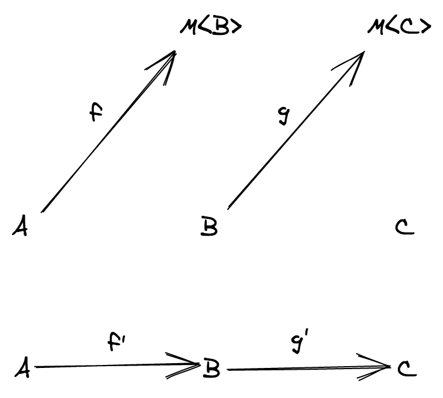

(sopra la categoria _TS_, sotto la costruzione di _K_)
</center>

Dunque cosa sarebbe la composizione di `f` e `g` in *K*? E' la freccia rossa chiamata `h'` nell'immagine qui sotto:

<center>
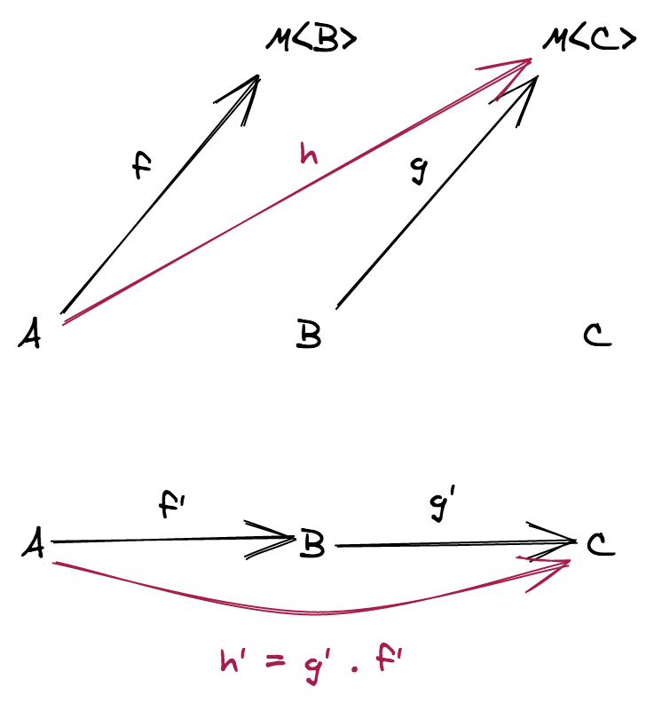

(sopra la categoria _TS_, sotto la costruzione di _K_)
</center>

Dato che `h'` è una freccia che va da `A` a `C` in `K`, possiamo far corrispondere una funzione `h` che va da `A` a `M<C>` in `TS`.

Quindi un buon candidato per la composizione di `f` e `g` in *TS* è ancora una Kleisli arrow con la seguente firma: `(a: A) => M<C>`.

Come facciamo a costruire concretamente una tale funzione? Beh, proviamoci!

## Definizione di `chain` passo dopo passo

Il punto (1) della definizione di monade ci dice che `M` ammette una istanza di funtore, percò possiamo usare `map` per trasformare la funzione `g: (b: B) => M<C>` in una funzione `map(g): (mb: M<B>) => M<M<C>>`

<center>


(come ottenere la funzione `h`)
</center>

Ma ora siamo bloccati: non c'è alcuna operazione legale della istanza di funtore che ci permette di appiattire un valore di tipo `M<M<C>>` in un valore di tipo `M<C>`, abbiamo bisogno di una operazione addizionale, chiamiamola `flatten`.

Se riusciamo a definire una tale operazione allora possiamo ottenere la composizione che stavamo cercando:

```
h = flatten ∘ map(g) ∘ f
```

Ma aspettate... contraendo `flatten ∘ map(g)` otteniamo "flatMap", ecco da dove viene il nome!

Dunque possiamo ottenere `chain` in questo modo

```
chain = flatten ∘ map(g)
```

<center>


(come agisce `chain` sulla funzione `g`)
</center>

Ora possiamo aggiornare la nostra "tabella di composizione"

| Program f | Program g     | Composition      |
| --------- | ------------- | ---------------- |
| pure      | pure          | `g ∘ f`          |
| effectful | pure (unary)  | `map(g) ∘ f`     |
| effectful | pure, `n`-ary | `liftAn(g) ∘ f`  |
| effectful | effectful     | `chain(g) ∘ f`   |

E per quanto riguarda l'operazione `of`? Ebbene, `of` proviene dai morfismi identità in *K*: per ogni morfismo identità 1<sub>A</sub> in _K_ deve esserci una corrispondente funzione da `A` a `M<A>` (ovvero `of: <A>(a: A) => M<A>`).

<center>


(come ottenere `of`)
</center>

Il fatto che la `of` sia l'elemento neutro rispetto alla `chain` permette questo tipo di controllo di flusso (piuttosto comune):

```ts
pipe(mb, M.chain(b => predicate(b) ? M.of(b) : g(b)))
```

ove `predicate: (b: B) => boolean`, `mb: M<B>` e `g: (b: B) => M<B>`.

Ultima domanda: da dove nascono le leggi? Esse non sono altro che le leggi categoriali in *K* tradotte in *TS*:

| Law            | _K_                               | _TS_                                                    |
| -------------- | --------------------------------- | ------------------------------------------------------- |
| Left identity  | 1<sub>B</sub> ∘ `f'` = `f'`       | `chain(of) ∘ f = f`                                     |
| Right identity | `f'` ∘ 1<sub>A</sub> = `f'`       | `chain(f) ∘ of = f`                                     |
| Associativity  | `h' ∘ (g' ∘ f') = (h' ∘ g') ∘ f'` | `chain(h) ∘ (chain(g) ∘ f) = chain((chain(h) ∘ g)) ∘ f` |

Se adesso torniamo agli esempi che mostravano il problema con i contesti innestati possiamo risolverli usando `chain`:

```ts
import { pipe } from 'fp-ts/function'
import * as O from 'fp-ts/Option'
import * as A from 'fp-ts/ReadonlyArray'

interface User {
  readonly id: number
  readonly name: string
  readonly followers: ReadonlyArray<User>
}

const getFollowers = (user: User): ReadonlyArray<User> => user.followers

declare const user: User

const followersOfFollowers: ReadonlyArray<User> = pipe(
  user,
  getFollowers,
  A.chain(getFollowers)
)

const inverse = (n: number): O.Option<number> =>
  n === 0 ? O.none : O.some(1 / n)

const inverseHead: O.Option<number> = pipe([1, 2, 3], A.head, O.chain(inverse))
```

Vediamo come è definita l'opererazione `chain` per alcuni type constructor noti:

**Esempio** (`F = ReadonlyArray`)

```ts
// trasforma funzioni `B -> ReadonlyArray<C>` in funzioni `ReadonlyArray<B> -> ReadonlyArray<C>`
const chain = <B, C>(g: (b: B) => ReadonlyArray<C>) => (
  mb: ReadonlyArray<B>
): ReadonlyArray<C> => {
  const out: Array<C> = []
  for (const b of mb) {
    out.push(...g(b))
  }
  return out
}
```

**Esempio** (`F = Option`)

```ts
import { match, none, Option } from 'fp-ts/Option'

// trasforma funzioni `B -> Option<C>` in funzioni `Option<B> -> Option<C>`
const chain = <B, C>(g: (b: B) => Option<C>): ((mb: Option<B>) => Option<C>) =>
  match(() => none, g)
```

**Esempio** (`F = IO`)

```ts
import { IO } from 'fp-ts/IO'

// trasforma funzioni `B -> IO<C>` in funzioni `IO<B> -> IO<C>`
const chain = <B, C>(g: (b: B) => IO<C>) => (mb: IO<B>): IO<C> => () =>
  g(mb())()
```

**Esempio** (`F = Task`)

```ts
import { Task } from 'fp-ts/Task'

// trasforma funzioni `B -> Task<C>` in funzioni `Task<B> -> Task<C>`
const chain = <B, C>(g: (b: B) => Task<C>) => (mb: Task<B>): Task<C> => () =>
  mb().then((b) => g(b)())
```

**Esempio** (`F = Reader`)

```ts
import { Reader } from 'fp-ts/Reader'

// trasforma funzioni `B -> Reader<R, C>` in funzioni `Reader<R, B> -> Reader<R, C>`
const chain = <B, R, C>(g: (b: B) => Reader<R, C>) => (
  mb: Reader<R, B>
): Reader<R, C> => (r) => g(mb(r))(r)
```

## Manipolazione di programmi

Vediamo ora come, grazie alla trasparenza referenziale e al concetto di monade, possiamo manipolare i programmi programmaticamente.

Ecco un piccolo programma che legge / scrive su un file:

```ts
import { log } from 'fp-ts/Console'
import { IO, chain } from 'fp-ts/IO'
import { pipe } from 'fp-ts/function'
import * as fs from 'fs'

// -----------------------------------------
// funzioni di libreria
// -----------------------------------------

const readFile = (filename: string): IO<string> => () =>
  fs.readFileSync(filename, 'utf-8')

const writeFile = (filename: string, data: string): IO<void> => () =>
  fs.writeFileSync(filename, data, { encoding: 'utf-8' })

// API derivata dalle precedenti
const modifyFile = (filename: string, f: (s: string) => string): IO<void> =>
  pipe(
    readFile(filename),
    chain((s) => writeFile(filename, f(s)))
  )

// -----------------------------------------
// programma
// -----------------------------------------

const program1 = pipe(
  readFile('file.txt'),
  chain(log),
  chain(() => modifyFile('file.txt', (s) => s + '\n// eof')),
  chain(() => readFile('file.txt')),
  chain(log)
)
```

L'azione:

```ts
pipe(
  readFile('file.txt'),
  chain(log)
)
```

è ripetuta due volte nel programma, ma dato che vale la trasparenza referenziale possiamo mettere a fattor comune l'azione assegnandola ad una costante:

```ts
const read = pipe(readFile('file.txt'), chain(log))
const modify = modifyFile('file.txt', (s) => s + '\n// eof')

const program2 = pipe(
  read,
  chain(() => modify),
  chain(() => read)
)
```

Possiamo persino definire un combinatore e sfruttarlo per rendere più compatto il codice:

```ts
const interleave = <A, B>(action: IO<A>, middle: IO<B>): IO<A> =>
  pipe(
    action,
    chain(() => middle),
    chain(() => action)
  )

const program3 = interleave(read, modify)
```

Un altro esempio: implementare una funzione simile a `time` di Unix (la parte relativa al tempo di esecuzione reale) per `IO`.

```ts
import * as IO from 'fp-ts/IO'
import { now } from 'fp-ts/Date'
import { log } from 'fp-ts/Console'
import { pipe } from 'fp-ts/function'

// logga la durata in millisecondi della computazione
export const time = <A>(ma: IO.IO<A>): IO.IO<A> =>
  pipe(
    now,
    IO.chain((startMillis) =>
      pipe(
        ma,
        IO.chain((a) =>
          pipe(
            now,
            IO.chain((endMillis) =>
              pipe(
                log(`Elapsed: ${endMillis - startMillis}`),
                IO.map(() => a)
              )
            )
          )
        )
      )
    )
  )
```

Esempio di utilizzo

```ts
import { randomInt } from 'fp-ts/Random'
import { Monoid, concatAll } from 'fp-ts/Monoid'
import { replicate } from 'fp-ts/ReadonlyArray'

const fib = (n: number): number => (n <= 1 ? 1 : fib(n - 1) + fib(n - 2))

// lancia `fib` con un intero causuale tra 30 e 35
// e logga sia l'input che l'output
const randomFib: IO.IO<void> = pipe(
  randomInt(30, 35),
  IO.chain((n) => log([n, fib(n)]))
)

// una istanza di monoide per `IO<void>`
const MonoidIO: Monoid<IO.IO<void>> = {
  concat: (second) => (first) => () => {
    first()
    second()
  },
  empty: IO.of(undefined)
}

// esegue `n` volte la computazione `mv`
const replicateIO = (n: number, mv: IO.IO<void>): IO.IO<void> =>
  concatAll(MonoidIO)(replicate(n, mv))

// -------------------
// esempio di utilizzo
// -------------------

time(replicateIO(3, randomFib))()
/*
[ 31, 2178309 ]
[ 33, 5702887 ]
[ 30, 1346269 ]
Elapsed: 89
*/
```

Stampando anche i parziali

```ts
time(replicateIO(3, time(randomFib)))()
/*
[ 33, 5702887 ]
Elapsed: 54
[ 30, 1346269 ]
Elapsed: 13
[ 32, 3524578 ]
Elapsed: 39
Elapsed: 106
*/
```

Una cosa interessante di lavorare con l'interfaccia monadica (`map`, `of`, `chain`) è la possibilità di poter iniettare le dipendenze di cui ha bisogno il programma, ivi compreso **il modo per concatenare le diverse computazioni**.

Per vederlo riprendiamo il piccolo programma che legge e scrive su file e operiamo il seguente refactoring:

```ts
import { IO } from 'fp-ts/IO'
import { pipe } from 'fp-ts/function'

// -----------------------------------------
// dipendenze (una "port" nella nomenclatura della Hexagonal Architecture)
// -----------------------------------------

interface Deps {
  readonly readFile: (filename: string) => IO<string>
  readonly writeFile: (filename: string, data: string) => IO<void>
  readonly log: <A>(a: A) => IO<void>
  readonly chain: <A, B>(f: (a: A) => IO<B>) => (ma: IO<A>) => IO<B>
}

// -----------------------------------------
// programma
// -----------------------------------------

const program4 = (D: Deps) => {
  const modifyFile = (filename: string, f: (s: string) => string) =>
    pipe(
      D.readFile(filename),
      D.chain((s) => D.writeFile(filename, f(s)))
    )

  return pipe(
    D.readFile('file.txt'),
    D.chain(D.log),
    D.chain(() => modifyFile('file.txt', (s) => s + '\n// eof')),
    D.chain(() => D.readFile('file.txt')),
    D.chain(D.log)
  )
}

// -----------------------------------------
// istanza per `Deps` (un "adapter" nella nomenclatura della Hexagonal Architecture)
// -----------------------------------------

import * as fs from 'fs'
import { log } from 'fp-ts/Console'
import { chain } from 'fp-ts/IO'

const DepsSync: Deps = {
  readFile: (filename) => () => fs.readFileSync(filename, 'utf-8'),
  writeFile: (filename: string, data: string) => () =>
    fs.writeFileSync(filename, data, { encoding: 'utf-8' }),
  log,
  chain
}

// dependency injection
program4(DepsSync)()
```

Ma c'è di più, possiamo persino astrarre l'effetto in cui gira il programma. Definiamo un nostro effetto `FileSystem` (l'effetto di leggere / scrivere sul file system):

```ts
import { IO } from 'fp-ts/IO'
import { pipe } from 'fp-ts/function'

// -----------------------------------------
// effetto del nostro programma
// -----------------------------------------

interface FileSystem<A> extends IO<A> {}

// -----------------------------------------
// dipendenze
// -----------------------------------------

interface Deps {
  readonly readFile: (filename: string) => FileSystem<string>
  readonly writeFile: (filename: string, data: string) => FileSystem<void>
  readonly log: <A>(a: A) => FileSystem<void>
  readonly chain: <A, B>(
    f: (a: A) => FileSystem<B>
  ) => (ma: FileSystem<A>) => FileSystem<B>
}

// -----------------------------------------
// programma
// -----------------------------------------

const program4 = (D: Deps) => {
  const modifyFile = (filename: string, f: (s: string) => string) =>
    pipe(
      D.readFile(filename),
      D.chain((s) => D.writeFile(filename, f(s)))
    )

  return pipe(
    D.readFile('file.txt'),
    D.chain(D.log),
    D.chain(() => modifyFile('file.txt', (s) => s + '\n// eof')),
    D.chain(() => D.readFile('file.txt')),
    D.chain(D.log)
  )
}
```

Ora, con un semplice cambiamento nella definizione dell'effetto `FileSystem`, possiamo modificare il programma in modo che possa girare in un contesto asincrono:

```diff
// -----------------------------------------
// effetto del nostro programma
// -----------------------------------------

-interface FileSystem<A> extends IO<A> {}
+interface FileSystem<A> extends Task<A> {}
```

dopodichè non ci resta che modificare l'istanza per `Deps` per adattarsi alla nuova definizione:

```ts
import { Task } from 'fp-ts/Task'
import { pipe } from 'fp-ts/function'

// -----------------------------------------
// effetto del nostro programma (modificato)
// -----------------------------------------

interface FileSystem<A> extends Task<A> {}

// -----------------------------------------
// dipendenze (NON modificato)
// -----------------------------------------

interface Deps {
  readonly readFile: (filename: string) => FileSystem<string>
  readonly writeFile: (filename: string, data: string) => FileSystem<void>
  readonly log: <A>(a: A) => FileSystem<void>
  readonly chain: <A, B>(
    f: (a: A) => FileSystem<B>
  ) => (ma: FileSystem<A>) => FileSystem<B>
}

// -----------------------------------------
// programma (NON modificato)
// -----------------------------------------

const program5 = (D: Deps) => {
  const modifyFile = (filename: string, f: (s: string) => string) =>
    pipe(
      D.readFile(filename),
      D.chain((s) => D.writeFile(filename, f(s)))
    )

  return pipe(
    D.readFile('file.txt'),
    D.chain(D.log),
    D.chain(() => modifyFile('file.txt', (s) => s + '\n// eof')),
    D.chain(() => D.readFile('file.txt')),
    D.chain(D.log)
  )
}

// -----------------------------------------
// istanza per `Deps` (modificato)
// -----------------------------------------

import * as fs from 'fs'
import { log } from 'fp-ts/Console'
import { chain, fromIO } from 'fp-ts/Task'

const DepsAsync: Deps = {
  readFile: (filename) => () =>
    new Promise((resolve) =>
      fs.readFile(filename, { encoding: 'utf-8' }, (_, s) => resolve(s))
    ),
  writeFile: (filename: string, data: string) => () =>
    new Promise((resolve) => fs.writeFile(filename, data, () => resolve())),
  log: (a) => fromIO(log(a)),
  chain
}

// dependency injection
program5(DepsAsync)()
```

**Quiz**. Gli esempi precedenti non tengono conto (volontariamente) di possibili errori (per esempio il fatto che non esista il file da cui leggiamo), come si potrebbe modificare l'effetto `FileSystem` per tenerne conto?

```ts
import { Task } from 'fp-ts/Task'
import { pipe } from 'fp-ts/function'
import * as E from 'fp-ts/Either'

// -----------------------------------------
// effetto del nostro programma (modificato)
// -----------------------------------------

interface FileSystem<A> extends Task<E.Either<Error, A>> {}

// -----------------------------------------
// dipendenze (NON modificato)
// -----------------------------------------

interface Deps {
  readonly readFile: (filename: string) => FileSystem<string>
  readonly writeFile: (filename: string, data: string) => FileSystem<void>
  readonly log: <A>(a: A) => FileSystem<void>
  readonly chain: <A, B>(
    f: (a: A) => FileSystem<B>
  ) => (ma: FileSystem<A>) => FileSystem<B>
}

// -----------------------------------------
// programma (NON modificato)
// -----------------------------------------

const program5 = (D: Deps) => {
  const modifyFile = (filename: string, f: (s: string) => string) =>
    pipe(
      D.readFile(filename),
      D.chain((s) => D.writeFile(filename, f(s)))
    )

  return pipe(
    D.readFile('-.txt'),
    D.chain(D.log),
    D.chain(() => modifyFile('file.txt', (s) => s + '\n// eof')),
    D.chain(() => D.readFile('file.txt')),
    D.chain(D.log)
  )
}

// -----------------------------------------
// istanza per `Deps` (modificato)
// -----------------------------------------

import * as fs from 'fs'
import { log } from 'fp-ts/Console'
import { chain, fromIO } from 'fp-ts/TaskEither'

const DepsAsync: Deps = {
  readFile: (filename) => () =>
    new Promise((resolve) =>
      fs.readFile(filename, { encoding: 'utf-8' }, (err, s) => {
        if (err !== null) {
          resolve(E.left(err))
        } else {
          resolve(E.right(s))
        }
      })
    ),
  writeFile: (filename: string, data: string) => () =>
    new Promise((resolve) =>
      fs.writeFile(filename, data, (err) => {
        if (err !== null) {
          resolve(E.left(err))
        } else {
          resolve(E.right(undefined))
        }
      })
    ),
  log: (a) => fromIO(log(a)),
  chain
}

// dependency injection
program5(DepsAsync)().then(console.log)
```

**Demo**

[`06_game.ts`](src/06_game.ts)
