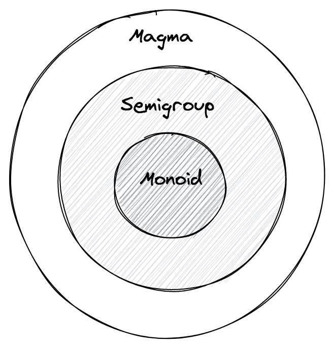

# モノイドで合成をモデリングする

これまで見てきた内容をまとめてみましょう。

**代数** が以下の要素の組み合わせであることを見てきました：

- ある型 `A`
- 型 `A` に関わるいくつかの演算
- いくつかの法則とそれらを組み合わせた性質

最初に見た代数はマグマであり、ある型 `A` 上に定義され、`concat` と呼ばれる1つの演算を持っていました。`Magma<A>` に関連する法則は存在せず、唯一の要件は `concat` 演算が `A` 上で **閉じている** ことでした。つまり、以下のように：

```ts
concat(first: A, second: A) => A
```

演算の結果もまた型 `A` の元でなければなりません。

その後、1つの単純な条件、**結合法則** を追加することで、任意の `Magma<A>` が `Semigroup<A>` としてさらに洗練されることや、結合法則によって計算の並列可能性が担保されることを見ました。

今度は半群に別の条件を追加します。

ある集合 `A` 上で定義された `半群` が与えられ、何らかの `concat` 演算がある場合、空（empty） と呼ぶ要素が `A` 内に存在し、`A` の任意の元 `a` に対して次の2つの方程式が成り立つ場合：

- **右単位元**: `concat(a, empty) = a`
- **左単位元**: `concat(empty, a) = a`

その `半群` は `モノイド` でもあります。

**注**: このセクションの残りの部分では、`empty` 要素を **単位元** と呼びます。文献によっては他の同義語を用いており、最も一般的なものは **中立元** と **単位元** です。

TypeScript　では、`マグマ` と `半群` が `interface` でモデル化できることを見てきました。そのため、同じことが `Monoid` にも適用できたとしても何の不思議もありません。

```ts
import { Semigroup } from 'fp-ts/Semigroup'

interface Monoid<A> extends Semigroup<A> {
  readonly empty: A
}
```

前の章で見た多くの半群は `モノイド` に拡張できます。型 `A` の元で、左右両方の単位元として成り立つものを見つけるだけでよいのです。

```ts
import { Monoid } from 'fp-ts/Monoid'

/** number 型における加算 `モノイド` */
const MonoidSum: Monoid<number> = {
  concat: (first, second) => first + second,
  empty: 0
}

/** number 型における積算 `モノイド` */
const MonoidProduct: Monoid<number> = {
  concat: (first, second) => first * second,
  empty: 1
}

const MonoidString: Monoid<string> = {
  concat: (first, second) => first + second,
  empty: ''
}

/** boolean 型における論理積モノイド */
const MonoidAll: Monoid<boolean> = {
  concat: (first, second) => first && second,
  empty: true
}

/** boolean 型における論理和モノイド */
const MonoidAny: Monoid<boolean> = {
  concat: (first, second) => first || second,
  empty: false
}
```

**クイズ**. 半群の章では、型 `ReadonlyArray<string>` が `Semigroup` インスタンスを許容することを見てきました：

```ts
import { Semigroup } from 'fp-ts/Semigroup'

const Semigroup: Semigroup<ReadonlyArray<string>> = {
  concat: (first, second) => first.concat(second)
}
```

この半群における単位元を見つけることはできるでしょうか？もし見つかるのであれば、それを `ReadonlyArray<string>` だけでなく `ReadonlyArray<A>` にも一般化できますか？

**クイズ** (難). モノイドが与えられたとき、単位元はただ1つしか存在しないことを証明しましょう。

この証明の結果として、モノイド毎に単位元は1つしか存在せず、したがって1つ見つければ探し続ける必要はありません。

私たちは、すべての半群がマグマであることを見てきましたが、すべてのマグマが半群であるわけではありません。同様に、すべてのモノイドは半群でありますが、すべての半群がモノイドであるわけではありません。

<center>

</center>

**例**

以下の例を考えてみましょう：

```ts
import { pipe } from 'fp-ts/function'
import { intercalate } from 'fp-ts/Semigroup'
import * as S from 'fp-ts/string'

const SemigroupIntercalate = pipe(S.Semigroup, intercalate('|'))

console.log(S.Semigroup.concat('a', 'b')) // => 'ab'
console.log(SemigroupIntercalate.concat('a', 'b')) // => 'a|b'
console.log(SemigroupIntercalate.concat('a', '')) // => 'a|'
```

この半群には、`concat(a, empty) = a` となる `string` 型の `empty` 値が存在しないことに注意してください。

そして最後に、少し「奇妙な」な例を紹介します。これは関数を含んでいます：

**例**

**自己準同型** は、入力と出力の型が同じ関数のことです：

```ts
type Endomorphism<A> = (a: A) => A
```

型 `A` が与えられた場合、`A` 上で定義されたすべての自己準同型は、次のようなモノイドです：

- `concat` 演算は関数合成
- 単位元は恒等関数

```ts
import { Endomorphism, flow, identity } from 'fp-ts/function'
import { Monoid } from 'fp-ts/Monoid'

export const getEndomorphismMonoid = <A>(): Monoid<Endomorphism<A>> => ({
  concat: flow,
  empty: identity
})
```

**注**: `identity` 関数の実装方法はただ1つです。

```ts
const identity = (a: A) => a
```

どんな入力値が与えられても、その値をそのまま出力します。

<!--
TODO:
We can start having a small taste of the importance of the `identity` function. While apparently useless per se, this function is vital to define a monoid for functions, in this case, endomorphisms. In fact, _doing nothing_, being _empty_ or _neutral_ is a tremendously valuable property to have when it comes to composition and we can think of the `identity` function as the number `0` of functions.
-->

## `concatAll` 関数

半群に比べてモノイドの素晴らしい特性の1つは、複数の要素を連結する際に初期値を与える必要がなくなることです。

```ts
import { concatAll } from 'fp-ts/Monoid'
import * as S from 'fp-ts/string'
import * as N from 'fp-ts/number'
import * as B from 'fp-ts/boolean'

console.log(concatAll(N.MonoidSum)([1, 2, 3, 4])) // => 10
console.log(concatAll(N.MonoidProduct)([1, 2, 3, 4])) // => 24
console.log(concatAll(S.Monoid)(['a', 'b', 'c'])) // => 'abc'
console.log(concatAll(B.MonoidAll)([true, false, true])) // => false
console.log(concatAll(B.MonoidAny)([true, false, true])) // => true
```

**クイズ**. なぜ初期値が要らなくなったのでしょうか？

## 直積モノイド

半群と同様に、`struct` の各フィールドに対してモノイドインスタンスを定義できれば、`struct` のモノイドインスタンスを定義することが可能です。

**例**

```ts
import { Monoid, struct } from 'fp-ts/Monoid'
import * as N from 'fp-ts/number'

type Point = {
  readonly x: number
  readonly y: number
}

const Monoid: Monoid<Point> = struct({
  x: N.MonoidSum,
  y: N.MonoidSum
})
```

**注**. `struct` と同様の動作をする `tuple` とコンビネータが存在します。

```ts
import { Monoid, tuple } from 'fp-ts/Monoid'
import * as N from 'fp-ts/number'

type Point = readonly [number, number]

const Monoid: Monoid<Point> = tuple(N.MonoidSum, N.MonoidSum)
```

**クイズ**. ジェネリックな型 `A` に対して「自由モノイド」を定義することは可能でしょうか？

**デモ** (キャンバス上に幾何学的な形状を描画するシステムを実装する)

[`03_shapes.ts`](../03_shapes.ts)
