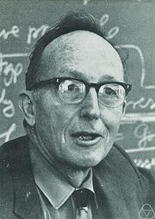
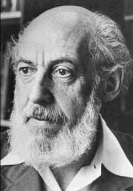
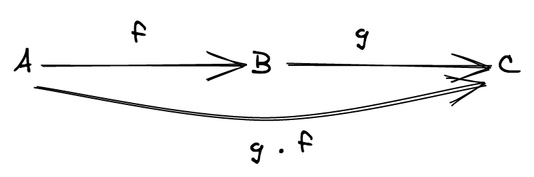
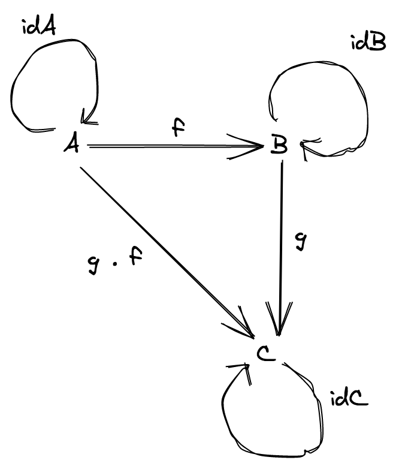

# 圏論

ここまで、関数型プログラミングの支柱が **合成** であることを見てきました。

> では、どのように問題解決を図るのだろうか？ 大きな問題を小さな問題に分解する。分解後の問題が依然として大きければ、さらに分解し続けるのである。最終的には、小さな問題を解くコードのみを書くことになる。こうして、プログラミングの神髄に至るのだ： 大きな問題を解く際に、小さなコードを組み合わせるのである。小さなピースを元に戻せないのであれば、分解することなど全くもって無意味である。 - Bartosz Milewski

この文章は一体何を言わんとしているのでしょう？ 2つのものが「組み合わさっている」とはどういうことなのでしょうか？ 「上手く」組み合わせるとはどういうことなのでしょうか？

> 複数のエンティティを、その中身を変更することなく、何らかの方法でそれらの振る舞いを、簡単に、かつ一般に合成できるのであれば、それらのエンティティは合成可能であると言うことができる。私は、合成可能性というものは、プログラミング・モデルにおいて、簡潔かつ高度な表現力の再利用・組み合わせのカギとなるものであると考えている。 - Paul Chiusano

関数型でプログラムを書いていると、しばしば pipeline のようになるということは先に述べました。

```ts
const program = pipe(
  input,
  f1, // 純粋関数
  f2, // 純粋関数
  f3, // 純粋関数
  ...
)
```

こんな風にコーディングすることで、どのぐらい簡潔になるのでしょうか？
ちょっとやってみましょう。

```ts
import { pipe } from 'fp-ts/function'
import * as RA from 'fp-ts/ReadonlyArray'

const double = (n: number): number => n * 2

/**
 * ReadonlyArray<number> を受け取り、先頭の要素を2倍にして返す。
 */
const program = (input: ReadonlyArray<number>): number =>
  pipe(
    input,
    RA.head, // コンパイルエラー！ 型 'Option<number>' は型 'number' に変換できません。
    double
  )
```

なぜコンパイル・エラーが起きるのでしょうか？
それは、`head` と `double` が合成可能でないからです。

```ts
head: (as: ReadonlyArray<number>) => Option<number>
double: (n: number) => number
```

`head` の戻りの型が `double` の引数の型に変換不可能だからです。

純粋関数でプログラミングするという我々の目標はここで終わりのようです……そうでしょうか？

この根本的な問いに答えるべく、なんらかの **厳密な理論** を参照する必要があります。

合成可能性の **形式的定義** を参照する必要があります。

幸運なことに、直近70年、人類最古の、そして人類最大のオープンソースプロジェクト（数学のこと）の大量のメンバが、合成可能性のための理論の研究に専念してきました。圏論です。Saunders Mac Lane, Samuel Eilenberg (1945) で確立された数学の一分野です。

> 圏は、合成の本質を捉える。

Saunders Mac Lane

<center>


(Saunders Mac Lane)



(Samuel Eilenberg)

</center>

以下の章では、圏が

- **プログラミング言語** 全般に通ずるモデル
- **合成** という概念のモデル

の基礎を成していることを見ていきます。

## 定義

圏の定義は、実際にはそこまで複雑ではありませんが、やや長いため、2つの部分に分けて説明します。

- 最初の部分は純粋に技術的な内容です（構成要素を定義する必要があります）。
- 2つ目の部分は、私たちの関心事である合成の概念に関するものです。


### 第1部 (構成要素)

圏とは、`(対象, 射)` のペアであり、以下のような構成要素から成り立っています：

- `対象` は **対象** の集合です
- `射` は、対象間の **射** （"矢印"とも呼ばれる） の集合です

**注** 「対象」という用語は英語で `object` ですが、プログラミングの「オブジェクト」の概念とは何の関係もありません。単に、検査できないブラックボックスであると、あるいは、様々な射を定義するための便利なプレースホルダーであると考えてください。

すべての射 `f` には、出発点の対象 `A` と到着点の対象 `B` があります。

すべての射において、 `A` と `B` は `対象` の内の一つです。`f: A ⟼ B` と書き、「f は A から B への射である」と言います。


**注** 以下、便宜上、対象を図示する際には名前のみ示すことにし、丸は省略します。

### 第2部 (合成)

「合成」と呼ばれる演算子 ∘ があり、以下の性質が成り立つとします：

- (**射の合成**) `射の集合` 内に2つの射 `f: A ⟼ B` と `g: B ⟼ C` がある場合、`f` と `g` の合成となる第3の射 `g ∘ f: A ⟼ C` も `射の集合` 内に存在する必要があります。



- (**結合法則**) `f: A ⟼ B`、`g: B ⟼ C`、`h: C ⟼ D` ならば、`h ∘ (g ∘ f) = (h ∘ g) ∘ f` が成り立ちます。


- (**単位元**) すべての対象 `X` に対して、`identity: X ⟼ X` という名前の**恒等射**が存在し、すべての射 `f: A ⟼ X` および `g: X ⟼ B` に対して、`identity ∘ f = f` および `g ∘ identity = g` が成り立ちます


**例**



この圏は非常に単純です。3つの対象と6つの射が存在します（1<sub>A</sub>、1<sub>B</sub>、1<sub>C</sub> はそれぞれ A、B、C の恒等射です）。

## 圏を用いたプログラミング言語のモデリング

圏は、**型付けされたプログラミング言語** の簡略モデルとして考えることができます。以下のように対応します。

- 対象は **型**
- 射は **関数**

- `∘` は通常の **関数合成**

以下の図で考えると、


3つの型と6つの関数だけからなる、架空の（そして単純な）プログラミング言語として考えることができます。

例:

- `A = string`
- `B = number`
- `C = boolean`
- `f = string => number`
- `g = number => boolean`
- `g ∘ f = string => boolean`

実装は以下のようなものが想定できます。

```ts
const idA = (s: string): string => s

const idB = (n: number): number => n

const idC = (b: boolean): boolean => b

const f = (s: string): number => s.length

const g = (n: number): boolean => n > 2

// gf = g ∘ f
const gf = (s: string): boolean => g(f(s))
```

## TypeScript における圏

簡略化された TypeScript のモデルとしての圏を定義することもできます。この圏を _TS_ と呼びましょう。以下のような特徴を持ちます：

- **対象** は TypeScript に存在しうるすべての型です: `string`, `number`, `ReadonlyArray<string>`, など。
- **射** は TypeScript のすべての関数です: `(a: A) => B`, `(b: B) => C`, など。ここで `A`, `B`, `C`, などは TypeScript の型です。
- **恒等射** はすべて、1つの多相的関数に集約されています。 `const identity = <A>(a: A): A => a`
- **射の合成** は通常の関数合成です (これは結合法則を満たすことが知られています)。

TypeScriptのモデルとして、圏 _TS_ はやや制約があるように見えるかもしれません。ループもなく、`if` もありません。ほとんど何もありません…… ですが、この簡略モデルは、目標である well-defined な合成の概念について考えるのに十分です。

## 合成の中核的な問題

圏 _TS_ では、`C = B` ならば、2つのジェネリックな関数 `f: (a: A) => B` と `g: (c: C) => D` を合成することができます。

```ts
function flow<A, B, C>(f: (a: A) => B, g: (b: B) => C): (a: A) => C {
  return (a) => g(f(a))
}

function pipe<A, B, C>(a: A, f: (a: A) => B, g: (b: B) => C): C {
  return flow(f, g)(a)
}
```

しかし、`B != C` の場合はどうなるのでしょう？このような関数をどのように合成すれば良いのでしょうか？諦めるべきでしょうか？

次のセクションでは、そのような合成が可能な条件について見ていきます。

**ネタバレ**

- `f: (a: A) => B` と `g: (b: B) => C` を合成するには、通常の関数合成を使用します
- `f: (a: A) => F<B>` と `g: (b: B) => C` を合成するには、`F` の **関手** インスタンスが必要です
- `f: (a: A) => F<B>` と `g: (b: B, c: C) => D` を合成するには、`F` の **アプリカティブ関手** インスタンスが必要です
- `f: (a: A) => F<B>` と `g: (b: B) => F<C>` を合成するには、`F` の **モナド** インスタンスが必要です


この章の初めに取り組んだ問題は、`F` が `Option` 型の場合、つまり次のような場合に対応します:

```ts
// A = ReadonlyArray<number>, B = number, F = Option
head: (as: ReadonlyArray<number>) => Option<number>
double: (n: number) => number
```

この問題を解決するために、次の章では関手について話します。
