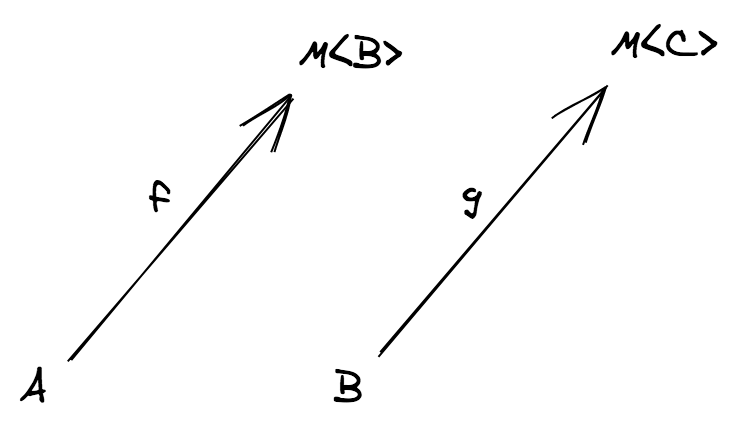
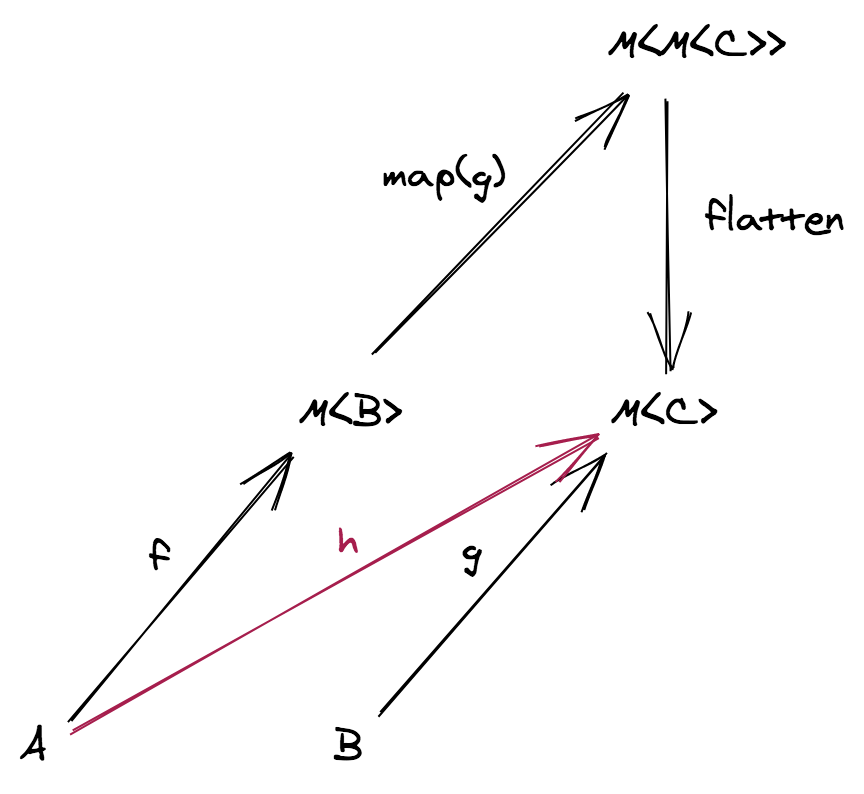
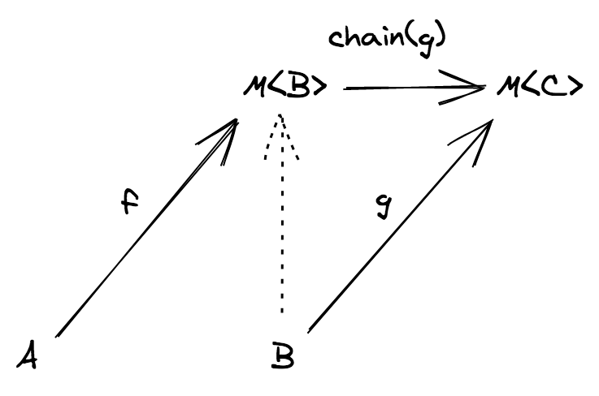
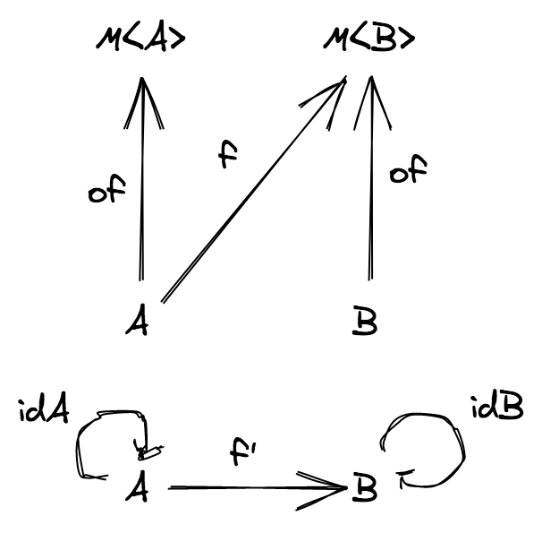

# モナド

<center>


(Eugenio Moggi は、イタリアジェノヴァ大学の計算機科学教授。彼はプログラムを構造化する為のモナドの一般的使用法を初めて記述した)


(Philip Lee Wadler はアメリカの計算機科学者であり、プログラミング言語や型理論における功績で知られている)

</center>

前章では、`F` がアプリカティブ関手インスタンスであるならば、作用プログラム `f: (a: A) => F<B>` と、`n` 項の純粋プログラム `g` を合成できるということを見てきました：

| プログラム f | プログラム g     | 合成     |
| --------- | ------------- | --------------- |
| 純粋      | 純粋          | `g ∘ f`         |
| 作用 | 純粋 (単項)  | `map(g) ∘ f`    |
| 作用 | 純粋, `n` 項 | `liftAn(g) ∘ f` |

最後に、非常に一般的なケースである、**両方とも** 作用プログラムである場合を解決しなければなりません：

```ts
f: (a: A) => F<B>
g: (b: B) => F<C>
```

`f` と `g` の合成はどうなるのでしょうか？

## 入れ子問題

どういった状況が未解決に当たるのか、例を見ておきます。

**例** (`F = Array`)

フォロワーのフォロワーを取得したい場合を考えます。

```ts
import { pipe } from 'fp-ts/function'
import * as A from 'fp-ts/ReadonlyArray'

interface User {
  readonly id: number
  readonly name: string
  readonly followers: ReadonlyArray<User>
}

const getFollowers = (user: User): ReadonlyArray<User> => user.followers

declare const user: User

// followersOfFollowers: ReadonlyArray<ReadonlyArray<User>>
const followersOfFollowers = pipe(user, getFollowers, A.map(getFollowers))
```

これはちょっとおかしなことになっています。`followersOfFollowers` の型は `ReadonlyArray<ReadonlyArray<User>>` ですが、本来は `ReadonlyArray<User>` であって欲しいところです。

入れ子になった配列を **平坦化** する必要があります。

`fp-ts/ReadonlyArray` が exports している関数 `flatten: <A>(mma: ReadonlyArray<ReadonlyArray<A>>) => ReadonlyArray<A>` がまさに求めているものです：

```ts
// followersOfFollowers: ReadonlyArray<User>
const followersOfFollowers = pipe(
  user,
  getFollowers,
  A.map(getFollowers),
  A.flatten
)
```

いいですね！ 他の型も見てみましょう。

**例** (`F = Option`)
数値配列の最初の要素の逆数を求めたい場合を考えます。
```ts
import { pipe } from 'fp-ts/function'
import * as O from 'fp-ts/Option'
import * as A from 'fp-ts/ReadonlyArray'

const inverse = (n: number): O.Option<number> =>
  n === 0 ? O.none : O.some(1 / n)

// inverseHead: O.Option<O.Option<number>>
const inverseHead = pipe([1, 2, 3], A.head, O.map(inverse))
```

おっと、またです。`inverseHead` の型は `Option<Option<number>>` ですが、`Option<number>` であって欲しいです。

入れ子になった `Option` をまた平坦化する必要があります。

`fp-ts/Option` モジュールが expose している関数 `flatten: <A>(mma: Option<Option<A>>) => Option<A>` が使えます：

```ts
// inverseHead: O.Option<number>
const inverseHead = pipe([1, 2, 3], A.head, O.map(inverse), O.flatten)
```

このような関数 `flatten` は偶然現れた訳ではありません。背後に、関数型のパターンが存在します。型コンストラクタ `ReadonlyArray` と `Option` （他にも多くありますが）は、**モナドインスタンス** であり、

> `flatten` はモナドの最も特徴的な操作です。

**注意**. `flatten` は一般的に **join** とも呼ばれます。

では、モナドとは何なのでしょうか？

以下、よくあるな説明を示します……

## モナドの定義

**定義**. モナドは3つの制約があります：

(1) 型コンストラクタ `M` は関手インスタンスであること

(2) 以下のシグネチャを持つ関数 `of` (**pure** や **return** とも呼ばれる) が定義されていること:

```ts
of: <A>(a: A) => M<A>
```

(3) 以下のシグネチャを持つ関数 `chain` (**flatMap** や **bind** とも呼ばれる) が定義されていること:

```ts
chain: <A, B>(f: (a: A) => M<B>) => (ma: M<A>) => M<B>
```

関数 `of` と `chain` は以下の制約を満たす必要があります：

- `chain(of) ∘ f = f` (**左単位元**)
- `chain(f) ∘ of = f` (**右単位元**)
- `chain(h) ∘ (chain(g) ∘ f) = chain((chain(h) ∘ g)) ∘ f` (**結合律**)

ただし、`f` `g` `h` はすべて作用プログラムであって、`*` は普通の関数合成を表します。

私が初めてこの定義を見たとき、多くの疑問が浮かびました：

- なぜ必要とされるのは他でもない `of` と `chain` なのか？ そして、なぜこれらはこういったシグネチャを持たねばならないのか？
- なぜ "pure" や "flatMap" のような同義語が存在するのか？
- なぜこうした制約が課されているのか？ これらは何を意味しているのか？
- `flatten` はモナドにとって重要であるのに、なぜその定義の中に現れないのか？

この章では、これらの問いすべてに対する答えを探していきます。

話を元の問いに戻しましょう： 2つの作用関数 `f` `g` はどうやって合成するのでしょうか？



<center>(2つのクライスリ射)</center>

**注意**. 作用関数は **クライスリ射** とも呼ばれます。

現時点では、そのような合成の型すらわかりません。

しかし、合成について具体的に示す抽象化をここまで見てきました。圏について述べたことを覚えていますか？

> 圏は合成の本質を捉えています

私たちの問題を次のような圏の問題に変換できます： クライスリ射の合成をモデル化する県を見つけることができるでしょうか？

## クライスリ圏

<center>


(スイスの数学者、Heinrich Kleisli)

</center>

クライスリ射のみを含む圏 **K**（クライスリ圏と呼ばれます）を構築してみましょう：

- **対象** ： 圏 **TS** の対象と同じであり、TypeScriptのすべての型です。
- **射** : **TS** にクライスリ射 `f: A ⟼ M<B>` が存在する場合、**K** に射 `f': A ⟼ B` にも射を描きます。
<center>


</center>

では、 **K** における `f` と `g` の合成はどうなるのでしょうか？ 下図の `h'` と名付けられた赤い射がこれに該当します。

<center>


（上は圏 **TS** 内の合成で、下は **K** 内の合成です）

</center>

`h'` が **K** 内における `A` から `C` への射であるとすると、これに対応する **TS** 内の `A` から `M<C>` 関数 `h` を見出すことができます。

したがって、**TS** での `f` と `g` の合成の候補として良いのは、次のシグネチャを持つクライスリ射です： `(a: A) => M<C>。`

そのような関数を実装してみましょう。

## `chain` を段階的に定義する

モナドの定義の第1の制約（1）によれば、`M` は関手インスタンスでなければならないということです。したがって、関数 `g: (b: B) => M<C>` を関数 `map(g): (mb: M<B>) => M<M<C>>` に変換するために `map` 関数を使用できます。

<center>


(どのようにして関数 `h` を得るのか)

</center>

ここで立ち往生しています。型 `M<M<C>>` の値を型 `M<C>` の値に平坦化できる合法的な操作は存在しません。他の演算子が必要です。これを `flatten` と呼ぶことにします。

以下のような操作を定義できれば、求めていた合成が見つかります：

```
h = flatten ∘ map(g) ∘ f
```

`flatten ∘ map(g)` の名前を組み合わせると "flatMap" となり、その名前が生まれます！

したがって、以下のような形で `chain` を得ました。

```
chain = flatten ∘ map(g)
```

<center>


(`chain` が関数 `g` に対して行う操作)

</center>

合成表を更新しましょう。

| プログラム f | プログラム g | 合成          |
| --------- | ------------- | --------------- |
| 純粋      | 純粋          | `g ∘ f`         |
| 作用      | 純粋 (単項 )  | `map(g) ∘ f`    |
| 作用      | 純粋, `n` 項  | `liftAn(g) ∘ f` |
| 作用      | 作用          | `chain(g) ∘ f`  |

`of` についてはどうでしょうか？ `of` は **K** 内の恒等射から生み出されます。つまり、**K** 内のすべての恒等射 1<sub>A</> に対して、 `A` から `M<A>` への対応付けをする関数がなければなりません。

<center>


(どこから `of` が生み出されるのか)

</center>

// TODO: neutral 訳す
// TODO: flux control 調べて直す
`of` が `chain` の neutral 要素であることから、以下のようなフラックス制御（非常に一般的）が可能になります：

```ts
pipe(
  mb,
  M.chain((b) => (predicate(b) ? M.of(b) : g(b)))
)
```

ただし、`predicate: (b: B) => boolean`、`mb: M<B>`、`g: (b: B) => M<B>` です。

最後の質問です： 法則はどこから来るのでしょうか？ それらは、**K** における圏論的制約の **TS** への変換そのものです：

| 法則           | **K**                             | **TS**                                                  |
| -------------- | --------------------------------- | ------------------------------------------------------- |
| 左単位元       | 1<sub>B</sub> ∘ `f'` = `f'`       | `chain(of) ∘ f = f`                                     |
| 右単位元       | `f'` ∘ 1<sub>A</sub> = `f'`       | `chain(f) ∘ of = f`                                     |
| 結合法則       | `h' ∘ (g' ∘ f') = (h' ∘ g') ∘ f'` | `chain(h) ∘ (chain(g) ∘ f) = chain((chain(h) ∘ g)) ∘ f` |

入れ子になった話題を抜けて元の問題に戻すと、`chain` を使ってそれらを解決できます：

```ts
import { pipe } from 'fp-ts/function'
import * as O from 'fp-ts/Option'
import * as A from 'fp-ts/ReadonlyArray'

interface User {
  readonly id: number
  readonly name: string
  readonly followers: ReadonlyArray<User>
}

const getFollowers = (user: User): ReadonlyArray<User> => user.followers

declare const user: User

const followersOfFollowers: ReadonlyArray<User> = pipe(
  user,
  getFollowers,
  A.chain(getFollowers)
)

const inverse = (n: number): O.Option<number> =>
  n === 0 ? O.none : O.some(1 / n)

const inverseHead: O.Option<number> = pipe([1, 2, 3], A.head, O.chain(inverse))
```

それでは、既に見てきた通常の型コンストラクタに対して、`chain` がどのように実装されるか見てみましょう：

**例** (`F = ReadonlyArray`)

```ts
// 関数 `B -> ReadonlyArray<C>` を関数 `ReadonlyArray<B> -> ReadonlyArray<C>` に変換する
const chain = <B, C>(g: (b: B) => ReadonlyArray<C>) => (
  mb: ReadonlyArray<B>
): ReadonlyArray<C> => {
  const out: Array<C> = []
  for (const b of mb) {
    out.push(...g(b))
  }
  return out
}
```

**例** (`F = Option`)

```ts
import { match, none, Option } from 'fp-ts/Option'

// 関数 `B -> Option<C>` を関数 `Option<B> -> Option<C>` に変換する
const chain = <B, C>(g: (b: B) => Option<C>): ((mb: Option<B>) => Option<C>) =>
  match(() => none, g)
```

**例** (`F = IO`)

```ts
import { IO } from 'fp-ts/IO'

// 関数 `B -> IO<C>` を関数 `IO<B> -> IO<C>` に変換する
const chain = <B, C>(g: (b: B) => IO<C>) => (mb: IO<B>): IO<C> => () =>
  g(mb())()
```

**例** (`F = Task`)

```ts
import { Task } from 'fp-ts/Task'

// 関数 `B -> Task<C>` を関数 `Task<B> -> Task<C>` に変換する
const chain = <B, C>(g: (b: B) => Task<C>) => (mb: Task<B>): Task<C> => () =>
  mb().then((b) => g(b)())
```

**例** (`F = Reader`)

```ts
import { Reader } from 'fp-ts/Reader'

// 関数 `B -> Reader<R, C>` を関数 `Reader<R, B> -> Reader<R, C>` に変換する
const chain = <B, R, C>(g: (b: B) => Reader<R, C>) => (
  mb: Reader<R, B>
): Reader<R, C> => (r) => g(mb(r))(r)
```

## プログラムの操作

さて、参照透過性とモナド概念によって、プログラムをプログラムで操作できる例を見てみます。

以下は、ファイルの読み取りと書き込みを行う簡単なプログラムです。

```ts
import { log } from 'fp-ts/Console'
import { IO, chain } from 'fp-ts/IO'
import { pipe } from 'fp-ts/function'
import * as fs from 'fs'

// -----------------------------------------
// ライブラリ関数
// -----------------------------------------

const readFile = (filename: string): IO<string> => () =>
  fs.readFileSync(filename, 'utf-8')

const writeFile = (filename: string, data: string): IO<void> => () =>
  fs.writeFileSync(filename, data, { encoding: 'utf-8' })

// 上の関数に由来する API
const modifyFile = (filename: string, f: (s: string) => string): IO<void> =>
  pipe(
    readFile(filename),
    chain((s) => writeFile(filename, f(s)))
  )

// -----------------------------------------
// プログラム
// -----------------------------------------

const program1 = pipe(
  readFile('file.txt'),
  chain(log),
  chain(() => modifyFile('file.txt', (s) => s + '\n// eof')),
  chain(() => readFile('file.txt')),
  chain(log)
)
```

このプログラム内では、

```ts
pipe(readFile('file.txt'), chain(log))
```

という操作が複数回繰り返されますが、参照透明性が成り立つため、それをまとめて定数に代入しておくことができます。

```ts
const read = pipe(readFile('file.txt'), chain(log))
const modify = modifyFile('file.txt', (s) => s + '\n// eof')

const program2 = pipe(
  read,
  chain(() => modify),
  chain(() => read)
)
```

さらに、コンビネータを定義し、コードをよりコンパクトにするために活用できます：

```ts
const interleave = <A, B>(action: IO<A>, middle: IO<B>): IO<A> =>
  pipe(
    action,
    chain(() => middle),
    chain(() => action)
  )

const program3 = interleave(read, modify)
```

別の例を挙げます： Unix の `time` に似た `IO` 用の機能を実装してみましょう（実行時間に関連する部分）。

```ts
import * as IO from 'fp-ts/IO'
import { now } from 'fp-ts/Date'
import { log } from 'fp-ts/Console'
import { pipe } from 'fp-ts/function'

// ミリ秒単位で実行時間のログを取る
export const time = <A>(ma: IO.IO<A>): IO.IO<A> =>
  pipe(
    now,
    IO.chain((startMillis) =>
      pipe(
        ma,
        IO.chain((a) =>
          pipe(
            now,
            IO.chain((endMillis) =>
              pipe(
                log(`Elapsed: ${endMillis - startMillis}`),
                IO.map(() => a)
              )
            )
          )
        )
      )
    )
  )
```

**余談** お気づきの通り、スコープを維持する必要がある場合に `chain` を使用すると冗長なコードになります。モナドスタイルをネイティブでサポートする言語では、この種の状況を簡素化する "do 記法" と呼ばれる構文サポートがあることが多いです。

例として Haskell を見てみましょう

```haskell
now :: IO Int
now = undefined -- `undefined` in Haskell is equivalent to TypeScript's declare

log :: String -> IO ()
log = undefined

time :: IO a -> IO a
time ma = do
  startMillis <- now
  a <- ma
  endMillis <- now
  log ("Elapsed:" ++ show (endMillis - startMillis))
  return a
```

TypeScript はこのような構文をサポートしていませんが、似たようなものを模倣することはできます：

```ts
import { log } from 'fp-ts/Console'
import { now } from 'fp-ts/Date'
import { pipe } from 'fp-ts/function'
import * as IO from 'fp-ts/IO'

// ミリ秒単位で実行時間のログを取る
export const time = <A>(ma: IO.IO<A>): IO.IO<A> =>
  pipe(
    IO.Do,
    IO.bind('startMillis', () => now),
    IO.bind('a', () => ma),
    IO.bind('endMillis', () => now),
    IO.chainFirst(({ endMillis, startMillis }) =>
      log(`Elapsed: ${endMillis - startMillis}`)
    ),
    IO.map(({ a }) => a)
  )
```

`time` コンビネータの使用例を見てみましょう：

```ts
import { randomInt } from 'fp-ts/Random'
import { Monoid, concatAll } from 'fp-ts/Monoid'
import { replicate } from 'fp-ts/ReadonlyArray'

const fib = (n: number): number => (n <= 1 ? 1 : fib(n - 1) + fib(n - 2))


// `fib` を30 から 35 までのランダムな整数で実行する
// 入力・出力の両方をログに取る
const randomFib: IO.IO<void> = pipe(
  randomInt(30, 35),
  IO.chain((n) => log([n, fib(n)]))
)

// `IO<void>` のモナドインスタンス
const MonoidIO: Monoid<IO.IO<void>> = {
  concat: (first, second) => () => {
    first()
    second()
  },
  empty: IO.of(undefined)
}

// `n` 回 `mv` 操作を実行する
const replicateIO = (n: number, mv: IO.IO<void>): IO.IO<void> =>
  concatAll(MonoidIO)(replicate(n, mv))

// -------------------
// 使用例
// -------------------

time(replicateIO(3, randomFib))()
/*
[ 31, 2178309 ]
[ 33, 5702887 ]
[ 30, 1346269 ]
Elapsed: 89
*/
```

一部分に関するログを取ることもできます：

```ts
time(replicateIO(3, time(randomFib)))()
/*
[ 33, 5702887 ]
Elapsed: 54
[ 30, 1346269 ]
Elapsed: 13
[ 32, 3524578 ]
Elapsed: 39
Elapsed: 106
*/
```

モナドインターフェース (`map`、`of`、`chain`) を用いる際に最も面白い側面の一つは、プログラムが必要とする依存関係と **異なる計算を連結する方法** を注入できる点です。

これを確認するために、ファイルの読み書きをする簡単なプログラムをリファクタリングしてみましょう：

```ts
import { IO } from 'fp-ts/IO'
import { pipe } from 'fp-ts/function'

// -----------------------------------------
// Deps インターフェース。 ヘキサゴナルアーキテクチャにおいて「ポート」と呼ばれるものです。
// -----------------------------------------

interface Deps {
  readonly readFile: (filename: string) => IO<string>
  readonly writeFile: (filename: string, data: string) => IO<void>
  readonly log: <A>(a: A) => IO<void>
  readonly chain: <A, B>(f: (a: A) => IO<B>) => (ma: IO<A>) => IO<B>
}

// -----------------------------------------
// プログラム
// -----------------------------------------

const program4 = (D: Deps) => {
  const modifyFile = (filename: string, f: (s: string) => string) =>
    pipe(
      D.readFile(filename),
      D.chain((s) => D.writeFile(filename, f(s)))
    )

  return pipe(
    D.readFile('file.txt'),
    D.chain(D.log),
    D.chain(() => modifyFile('file.txt', (s) => s + '\n// eof')),
    D.chain(() => D.readFile('file.txt')),
    D.chain(D.log)
  )
}

// -----------------------------------------
// `Deps` インスタンス。 ヘキサゴナルアーキテクチャにおいて「アダプタ」と呼ばれるものです。
// -----------------------------------------

import * as fs from 'fs'
import { log } from 'fp-ts/Console'
import { chain } from 'fp-ts/IO'

const DepsSync: Deps = {
  readFile: (filename) => () => fs.readFileSync(filename, 'utf-8'),
  writeFile: (filename: string, data: string) => () =>
    fs.writeFileSync(filename, data, { encoding: 'utf-8' }),
  log,
  chain
}

// 依存関係の注入
program4(DepsSync)()
```

さらに、プログラムの実行によって発生する作用を抽象化することもできます。独自の `FileSystem` 作用（ファイルシステム上の読み書き操作を表す作用）を定義できます。

```ts
import { IO } from 'fp-ts/IO'
import { pipe } from 'fp-ts/function'

// -----------------------------------------
// プログラムの作用
// -----------------------------------------

interface FileSystem<A> extends IO<A> {}

// -----------------------------------------
// 依存関係
// -----------------------------------------

interface Deps {
  readonly readFile: (filename: string) => FileSystem<string>
  readonly writeFile: (filename: string, data: string) => FileSystem<void>
  readonly log: <A>(a: A) => FileSystem<void>
  readonly chain: <A, B>(
    f: (a: A) => FileSystem<B>
  ) => (ma: FileSystem<A>) => FileSystem<B>
}

// -----------------------------------------
// プログラム
// -----------------------------------------

const program4 = (D: Deps) => {
  const modifyFile = (filename: string, f: (s: string) => string) =>
    pipe(
      D.readFile(filename),
      D.chain((s) => D.writeFile(filename, f(s)))
    )

  return pipe(
    D.readFile('file.txt'),
    D.chain(D.log),
    D.chain(() => modifyFile('file.txt', (s) => s + '\n// eof')),
    D.chain(() => D.readFile('file.txt')),
    D.chain(D.log)
  )
}
```

`FileSystem` 作用の定義を少し変更するだけで、プログラムを非同期に実行するように変更できます。

```diff
// -----------------------------------------
// プログラムの作用
// -----------------------------------------

-interface FileSystem<A> extends IO<A> {}
+interface FileSystem<A> extends Task<A> {}
```

あとは、`Deps` インスタンスを新しい定義に合わせて修正することだけです。

```ts
import { Task } from 'fp-ts/Task'
import { pipe } from 'fp-ts/function'

// -----------------------------------------
// プログラムの作用 (変更後)
// -----------------------------------------

interface FileSystem<A> extends Task<A> {}

// -----------------------------------------
// 依存関係 (変更無し)
// -----------------------------------------

interface Deps {
  readonly readFile: (filename: string) => FileSystem<string>
  readonly writeFile: (filename: string, data: string) => FileSystem<void>
  readonly log: <A>(a: A) => FileSystem<void>
  readonly chain: <A, B>(
    f: (a: A) => FileSystem<B>
  ) => (ma: FileSystem<A>) => FileSystem<B>
}

// -----------------------------------------
// プログラム (変更無し)
// -----------------------------------------

const program5 = (D: Deps) => {
  const modifyFile = (filename: string, f: (s: string) => string) =>
    pipe(
      D.readFile(filename),
      D.chain((s) => D.writeFile(filename, f(s)))
    )

  return pipe(
    D.readFile('file.txt'),
    D.chain(D.log),
    D.chain(() => modifyFile('file.txt', (s) => s + '\n// eof')),
    D.chain(() => D.readFile('file.txt')),
    D.chain(D.log)
  )
}

// -----------------------------------------
// `Deps` インスタンス (変更後)
// -----------------------------------------

import * as fs from 'fs'
import { log } from 'fp-ts/Console'
import { chain, fromIO } from 'fp-ts/Task'

const DepsAsync: Deps = {
  readFile: (filename) => () =>
    new Promise((resolve) =>
      fs.readFile(filename, { encoding: 'utf-8' }, (_, s) => resolve(s))
    ),
  writeFile: (filename: string, data: string) => () =>
    new Promise((resolve) => fs.writeFile(filename, data, () => resolve())),
  log: (a) => fromIO(log(a)),
  chain
}

// 依存関係の注入
program5(DepsAsync)()
```

**クイズ** 上記の例では、わざと潜在的なエラーを見逃しています。例えば、操作しようとしたファイルが存在しない可能性があります。`FileSystem` 作用を修正して、これを考慮するにはどうすればよいでしょうか？

```ts
import { Task } from 'fp-ts/Task'
import { pipe } from 'fp-ts/function'
import * as E from 'fp-ts/Either'

// -----------------------------------------
// プログラムの作用 (変更後)
// -----------------------------------------

interface FileSystem<A> extends Task<E.Either<Error, A>> {}

// -----------------------------------------
// 依存関係 (変更無し)
// -----------------------------------------

interface Deps {
  readonly readFile: (filename: string) => FileSystem<string>
  readonly writeFile: (filename: string, data: string) => FileSystem<void>
  readonly log: <A>(a: A) => FileSystem<void>
  readonly chain: <A, B>(
    f: (a: A) => FileSystem<B>
  ) => (ma: FileSystem<A>) => FileSystem<B>
}

// -----------------------------------------
// プログラム (変更無し)
// -----------------------------------------

const program5 = (D: Deps) => {
  const modifyFile = (filename: string, f: (s: string) => string) =>
    pipe(
      D.readFile(filename),
      D.chain((s) => D.writeFile(filename, f(s)))
    )

  return pipe(
    D.readFile('-.txt'),
    D.chain(D.log),
    D.chain(() => modifyFile('file.txt', (s) => s + '\n// eof')),
    D.chain(() => D.readFile('file.txt')),
    D.chain(D.log)
  )
}

// -----------------------------------------
// `Deps` インスタンス (変更後)
// -----------------------------------------

import * as fs from 'fs'
import { log } from 'fp-ts/Console'
import { chain, fromIO } from 'fp-ts/TaskEither'

const DepsAsync: Deps = {
  readFile: (filename) => () =>
    new Promise((resolve) =>
      fs.readFile(filename, { encoding: 'utf-8' }, (err, s) => {
        if (err !== null) {
          resolve(E.left(err))
        } else {
          resolve(E.right(s))
        }
      })
    ),
  writeFile: (filename: string, data: string) => () =>
    new Promise((resolve) =>
      fs.writeFile(filename, data, (err) => {
        if (err !== null) {
          resolve(E.left(err))
        } else {
          resolve(E.right(undefined))
        }
      })
    ),
  log: (a) => fromIO(log(a)),
  chain
}

// 依存関係の注入
program5(DepsAsync)().then(console.log)
```

**Demo**

[`06_game.ts`](../06_game.ts)
