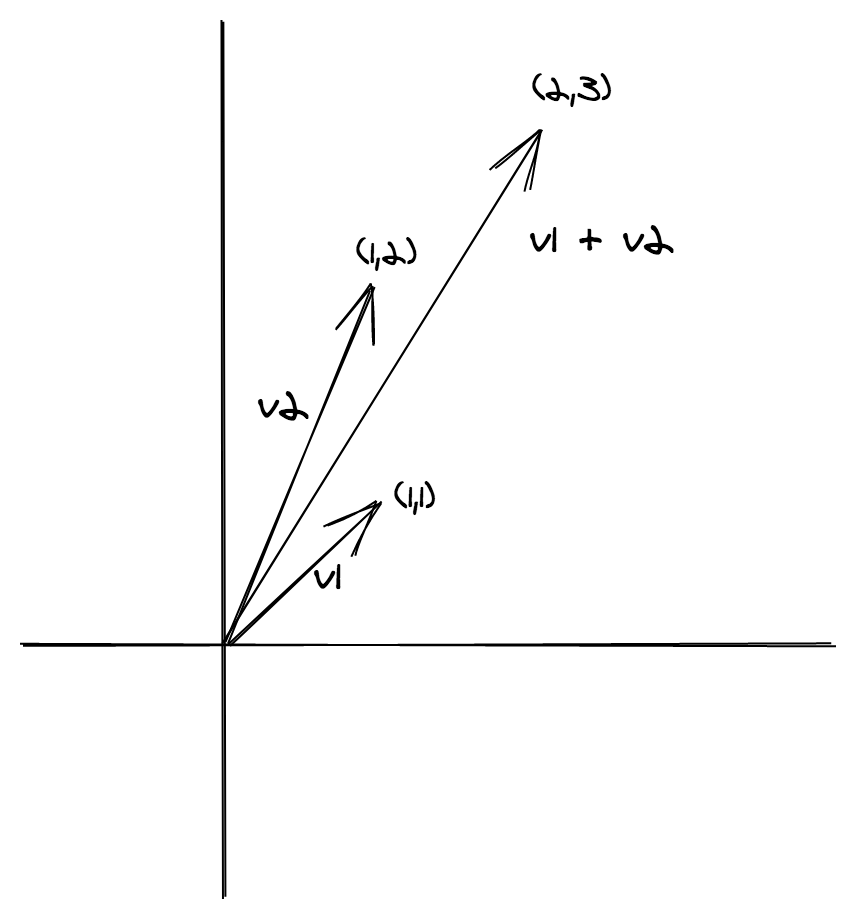

<!-- markdownlint-disable-file MD033 -->
# 用半群建模组合（Modelling composition with Semigroups）

半群是组合两个或多个值的方法。

半群是一种代数结构，通常定义为以下各项的特定组合：

- 一个或多个集合(set)
- 在这些集合上的一个或多个运算
- 运算满足0或多个定律

代数是数学家试图以最纯粹的形式捕捉一个想法，消除一切多余的东西的方法。

> 当修改代数时，唯一允许的运算是代数本身根据其自身遵循的定律所定义的运算

代数可以被认为是**接口**的抽象

> 当接口被修改时，唯一允许的运算是接口本身根据其自身规律定义的运算

在讨论半群之前，我们首先看一个代数结构的例子，_原群(magma)_。

## 原群(Magma)的定义

我们可以用 TypeScript 的`interface` 去建模一个原群

```ts
interface Magma<A> {
  readonly concat: (first: A, second: A) => A;
}
```

上述的代码描述了这样一种代数结构，它拥有：

- 一个集合`A`
- 集合`A`上的运算`concat`。集合`A`在该运算下 _闭合(closed)_。这意味着对`A` 的任意元素进行该运算，它的结果仍然是`A`的元素。由于结果仍然是`A`，因此可以再次把它用作`concat`的输入，并根据需要重复任意次。换句话说，`concat`是`A`的`combinator`.

让我们实现一个具体的`Magma<A>`实例，其中`A`是`number`.

```ts
import { Magma } from 'fp-ts/Magma';

const MagmaSub: Magma<number> = {
  concat: (first, second) => first - second,
};

// helper
const getPipeableConcat =
  <A,>(M: Magma<A>) =>
  (second: A) =>
  (first: A): A =>
    M.concat(first, second);

const concat = getPipeableConcat(MagmaSub);

// usage example

import { pipe } from 'fp-ts/function';

pipe(10, concat(2), concat(3), concat(1), concat(2), console.log);
// => 2
```

**测验**：`concat`是一个 _封闭性(Closure)_ 运算这一事实看似不起眼，其实非常重要。如果`A`是自然数的集合而不是 JavaScript的number类型(正负浮点数的集合), 我们能用`MagmaSub`的`concat`去定义`Magma<Natural>`吗? 你能想到其他的定义在自然数上的不具备 _封闭性_ 的`concat`运算吗?

> [答案](../quiz-answers/magma-concat-closed.md)

**定义**：给定一个非空集合`A`和一个定义在`A`上的二元封闭性运算`*`，我们把组合`(A, *)`叫做 _原群(magma)_ (`A`与`*`构成了原群)。

原群不遵守任何定律，它只需要满足封闭性。让我们看看需要满足另一个定律的代数：半群。

## 半群(semigroup)的定义

> 给定一个原群，如果`concat`满足**结合律**，则它是一个 _半群_。

术语"结合律"意味着下列等式对于`A`中的任意`x`，`y`，`z`成立：

```ts
(x * y) * z = x * (y * z)

// 或
concat(concat(a, b), c) = concat(a, concat(b, c))
```

用通俗的话来说，结合律告诉我们不必担心表达式中的括号，我们可以简单地写成`x * y * z`(没有歧义)。

**例**：

字符串拼接遵循结合律。

```ts
("a" + "b") + "c" = "a" + ("b" + "c") = "abc"
```

每个半群一定是原群，反之则不成立。


**例**：

刚才的`MagmaSub`就不是半群因为它的`concat`不遵循结合律。

```ts
import { pipe } from 'fp-ts/function';
import { Magma } from 'fp-ts/Magma';

const MagmaSub: Magma<number> = {
  concat: (first, second) => first - second,
};

pipe(MagmaSub.concat(MagmaSub.concat(1, 2), 3), console.log); // => -4
pipe(MagmaSub.concat(1, MagmaSub.concat(2, 3)), console.log); // => 2
```

半群抓住了可并行运算的本质。

如果我们知道存在这样一个遵循结合律的运算，我们可以将一个计算进一步拆分为两个子计算，每个子计算又可以进一步拆分为子计算。

```ts
a * b * c * d * e * f * g * h = ((a * b) * (c * d)) * ((e * f) * (g * h))
```

子计算可以并列运行。

与`Magma`类似，`Semigroup`也可以通过TypeScript的`interface`定义:

```ts
// fp-ts/lib/Semigroup.ts

interface Semigroup<A> extends Magma<A> {}
```

以下定律必须成立：

- **结合律**: 如果`S`是一个半群则对任意属于`S`的`x`，`y`，`z`，下式必然成立：

```ts
S.concat(S.concat(x, y), z) = S.concat(x, S.concat(y, z));
```

**注**： 遗憾的是，无法使用TypeScript的类型系统实现该定律.

让我们为`ReadonlyArray<string>`实现一个半群:

```ts
import * as Se from 'fp-ts/Semigroup';

const Semigroup: Se.Semigroup<ReadonlyArray<string>> = {
  concat: (first, second) => first.concat(second),
};
```

`concat`这个名称对于数组来说是有意义的(稍后我们会看到)，但是根据上下文和我们要实现的实例类型`A`，`concat`可能有不同的解释和含义：

- 串联(concatenation)
- 组合(combination)
- 合并(merging)
- 融合(fusion)
- 选择(selection)
- 求和(sum)
- 代换(substitution)

以及许多其它的含义。

**例**：

下方的代码展示了如何实现一个半群`(number, +)`，`+`表示一般的加法运算。

```ts
import { Semigroup } from 'fp-ts/Semigroup';

/** 闭合于`加法`运算下的`number`半群 */
const SemigroupSum: Semigroup<number> = {
  concat: (first, second) => first + second,
};
```

**测验**：定义在[`01_retry.ts`](../01_retry.ts)中的combinator `concat`能否用来给`RetryPolicy`定义一个半群接口？

> [答案](../quiz-answers/semigroup-demo-concat.md)

下方的代码展示了如何实现一个半群`(number, *)`，`*`表示一般的乘法运算。

```ts
import { Semigroup } from 'fp-ts/Semigroup';

/** 闭合于`乘法`运算下的`number`半群 */
const SemigroupProduct: Semigroup<number> = {
  concat: (first, second) => first * second,
};
```

**注**： 这里有一个常见错误是仅将半群与类型一起考虑(而不考虑运算)。对于类型`A`，我们可以定义多个`Semigroup<A>`的**实例**。我们已经看到了对于`number`，我们可以用 _加法_ 或 _乘法_ 去定义一个半群。实际上，类型不同但运算相同的半群也完全存在。`SemigroupSum`也可以由自然数而不是无符号浮点数(number)来实现。

这里有另一个`string`类型的例子：

```ts
import { Semigroup } from 'fp-ts/Semigroup';

const SemigroupString: Semigroup<string> = {
  concat: (first, second) => first + second,
};
```

这里还有一个`boolean`类型的例子：

```ts
import { Semigroup } from 'fp-ts/Semigroup';

const SemigroupAll: Semigroup<boolean> = {
  concat: (first, second) => first && second,
};

const SemigroupAny: Semigroup<boolean> = {
  concat: (first, second) => first || second,
};
```

## `concatAll`函数

根据定义，`concat`每次仅组合`A`的两个元素。是否可以将任意数量的元素组合起来？

`concatAll`函数需要：

- 一个半群的实例
- 一个初始值
- 元素的数组

```ts
import * as S from 'fp-ts/Semigroup';
import * as N from 'fp-ts/number';

const sum = S.concatAll(N.SemigroupSum)(2);

console.log(sum([1, 2, 3, 4])); // => 12

const product = S.concatAll(N.SemigroupProduct)(3);

console.log(product([1, 2, 3, 4])); // => 72
```

**测验**：为什么需要提供一个初始值？

> [答案](../quiz-answers/semigroup-concatAll-initial-value.md)

**例**：

让我们通过重新实现JavaScript标准库中的一些流行函数来展示`concatAll`的一些应用。

```ts
import * as B from 'fp-ts/boolean';
import { concatAll } from 'fp-ts/Semigroup';
import * as S from 'fp-ts/struct';

const every =
  <A,>(predicate: (a: A) => boolean) =>
  (as: ReadonlyArray<A>): boolean =>
    concatAll(B.SemigroupAll)(true)(as.map(predicate));

const some =
  <A,>(predicate: (a: A) => boolean) =>
  (as: ReadonlyArray<A>): boolean =>
    concatAll(B.SemigroupAny)(false)(as.map(predicate));

const assign: (as: ReadonlyArray<object>) => object = concatAll(
  S.getAssignSemigroup<object>(),
)({});
```

**测验**：以下半群实例合法吗(是否遵守半群定律)？

```ts
import { Semigroup } from 'fp-ts/Semigroup';

/** 总是返回第一个参数 */
const first = <A,>(): Semigroup<A> => ({
  concat: (first, _second) => first,
});
```

> [答案](../quiz-answers/semigroup-first.md)

**测验**：以下半群实例合法吗？

```ts
import { Semigroup } from 'fp-ts/Semigroup';

/** 总是返回第二个参数 */
const last = <A,>(): Semigroup<A> => ({
  concat: (_first, second) => second,
});
```

> [答案](../quiz-answers/semigroup-second.md)

## 对偶半群(dual semigroup)

给定一个半群实例，只需交换运算对象的组合顺序即可获得新的半群实例：

```ts
import { pipe } from 'fp-ts/function';
import { Semigroup } from 'fp-ts/Semigroup';
import * as S from 'fp-ts/string';

// 一个半群combinator
const reverse = <A,>(s: Semigroup<A>): Semigroup<A> => ({
  concat: (first, second) => s.concat(second, first),
});

pipe(S.Semigroup.concat('a', 'b'), console.log); // => 'ab'
pipe(reverse(S.Semigroup).concat('a', 'b'), console.log); // => 'ba'
```

**测验**：这个combinator是有意义的，因为一般来说`concat`运算是不满足[**交换律**](https://en.wikipedia.org/wiki/Commutative_property)的, 你能分别找到一个`concat`满足交换律与不满足交换律的例子吗？

> [答案](../quiz-answers/semigroup-commutative.md)

## 半群的积(Semigroup product)

让我们试着为更复杂的类型定义一个半群实例：

```ts
import * as N from 'fp-ts/number';
import { Semigroup } from 'fp-ts/Semigroup';

// 建模一个从原点开始的向量
type Vector = {
  readonly x: number;
  readonly y: number;
};

// 建模两个向量的和
const SemigroupVector: Semigroup<Vector> = {
  concat: (first, second) => ({
    x: N.SemigroupSum.concat(first.x, second.x),
    y: N.SemigroupSum.concat(first.y, second.y),
  }),
};
```

**例**：

```ts
const v1: Vector = { x: 1, y: 1 };
const v2: Vector = { x: 1, y: 2 };

console.log(SemigroupVector.concat(v1, v2)); // => { x: 2, y: 3 }
```



样板太多？好消息是，半群背后的**数学理论**告诉我们，如果我们可以为`Vector`这样的复杂类型的每个字段实现一个半群实例，我们就可以为它本身实现一个半群实例。

`fp-ts/Semigroup`模块导出了一个非常便利的`struct` combinator:

```ts
import { struct } from 'fp-ts/Semigroup';

// 建模两个向量的和
const SemigroupVector: Semigroup<Vector> = struct({
  x: N.SemigroupSum,
  y: N.SemigroupSum,
});
```

**注**：还有一个类似于`struct`的combinator可以用于元祖：`tuple`

```ts
import * as N from 'fp-ts/number';
import { Semigroup, tuple } from 'fp-ts/Semigroup';

// 建模一个从原点开始的向量
type Vector = readonly [number, number];

// 建模两个向量的和
const SemigroupVector: Semigroup<Vector> = tuple(
  N.SemigroupSum,
  N.SemigroupSum,
);

const v1: Vector = [1, 1];
const v2: Vector = [1, 2];

console.log(SemigroupVector.concat(v1, v2)); // => [2, 3]
```

**测验**：给定任意`Semigroup<A>`并从`A`中任意选择一个元素`middle`，如果将其插入`concat`的两个参数之间，结果是否仍然是半群？

```ts
import { pipe } from 'fp-ts/function';
import { Semigroup } from 'fp-ts/Semigroup';
import * as S from 'fp-ts/string';

export const intercalate =
  <A,>(middle: A) =>
  (S: Semigroup<A>): Semigroup<A> => ({
    concat: (first, second) => S.concat(S.concat(first, middle), second),
  });

const SemigroupIntercalate = pipe(S.Semigroup, intercalate('|'));

pipe(
  SemigroupIntercalate.concat('a', SemigroupIntercalate.concat('b', 'c')),
  console.log,
); // => 'a|b|c'
```

## 找到任意类型的半群实例

结合律是一个非常严格的限制，如果给定一个特定类型`A`且无法在`A`上找到满足结合律的运算会发生什么？

假设我们有如下的类型定义：

```ts
type User = {
  readonly id: number;
  readonly name: string;
};
```

在数据库中，有同一个`user`的多个副本(例如，修改的历史记录)。

```ts
// 内部API
declare const getCurrent: (id: number) => User;
declare const getHistory: (id: number) => ReadonlyArray<User>;
```

我们需要实现一个公共API

```ts
export declare const getUser: (id: number) => User;
```

它根据某些标准考虑其所有的副本。标准应该返回最新的副本，或最旧的副本，或当前副本，等等。

我们当然可以为每一个标准定义一个API：

```ts
export declare const getMostRecentUser: (id: number) => User;
export declare const getLeastRecentUser: (id: number) => User;
export declare const getCurrentUser: (id: number) => User;
// etc...
```

要返回`User`类型的值，我们需要考虑所有副本并对它们进行**合并**(或**选择**)。这意味着我可以使用`Semigroup<User>`对这个问题进行建模。

话虽如此，但现在还不清楚什么叫做"合并两个`user`"，也不清楚这个合并操作是否满足结合律。

通过为`NonEmptyArray<A>`而不是`A`本身定义半群实例，我们**总是**可以为任意给定的类型`A`定义一个半群实例。这个半群被称作`A`上的**自由半群(free semigroup)**:

```ts
import { Semigroup } from 'fp-ts/Semigroup';

// 代表非空数组，意味着数组中至少有一个A类型的元素
type ReadonlyNonEmptyArray<A> = ReadonlyArray<A> & {
  readonly 0: A;
};

// 两个非空数组的串联仍然是非空数组
const getSemigroup = <A,>(): Semigroup<ReadonlyNonEmptyArray<A>> => ({
  concat: (first, second) => [first[0], ...first.slice(1), ...second],
});
```

接下来，我们可以将`A`类型的元素映射到`ReadonlyNonEmptyArray<A>`的"单例"上，意为只有一个元素的数组。

```ts
// 向非空数组中插入一个元素
const of = <A,>(a: A): ReadonlyNonEmptyArray<A> => [a];
```

让我们把这个技术应用在`User`类型上:

```ts
import {
  getSemigroup,
  of,
  ReadonlyNonEmptyArray,
} from 'fp-ts/ReadonlyNonEmptyArray';
import { Semigroup } from 'fp-ts/Semigroup';

type User = {
  readonly id: number;
  readonly name: string;
};

// 这个半群定义是对`ReadonlyNonEmptyArray<User>`而不是`User`的
const S: Semigroup<ReadonlyNonEmptyArray<User>> = getSemigroup<User>();

declare const user1: User;
declare const user2: User;
declare const user3: User;

// const merge: ReadonlyNonEmptyArray<User>
const merge = S.concat(S.concat(of(user1), of(user2)), of(user3));

// 通过手动将所有的user装进数组中也可以获得相同的结果
const merge2: ReadonlyNonEmptyArray<User> = [user1, user2, user3];
```

可以看到，`A`上的自由半群仍然是一个半群，其中的元素都是`A`的可能，非空，有限序列。

`A`上的自由半群可以被视为一种连接`A`类型元素的"懒惰"的方式，同时保留了其数据内容。

包含`[user1, user2, user3]`的"合并"值, 告诉我们要连接的元素以及它们的顺序。

现在，有三种方式去设计`getUser` API:

1. 可以定义`Semigroup<User>`，并且想要直接进行`合并(merge)`。

   ```ts
   declare const SemigroupUser: Semigroup<User>;

   export const getUser = (id: number): User => {
     const current = getCurrent(id);
     const history = getHistory(id);
     return concatAll(SemigroupUser)(current)(history);
   };
   ```

2. 无法定义`Semigroup<User>`，或者想开放将合并策略的实现，因此需要向API的使用者询问:

   ```ts
   export const getUser =
     (SemigroupUser: Semigroup<User>) =>
     (id: number): User => {
       const current = getCurrent(id);
       const history = getHistory(id);
       // 立即合并
       return concatAll(SemigroupUser)(current)(history);
     };
   ```

3. 无法定义`Semigroup<User>`，并且也不想向用户需求它。

   这种情况下，`User`的自由半群可以排上用场：

   ```ts
   export const getUser = (id: number): ReadonlyNonEmptyArray<User> => {
     const current = getCurrent(id);
     const history = getHistory(id);
     // 不继续合并，直接返回user的自由半群
     return [current, ...history];
   };
   ```

应该注意的是，即使确实有一个`Semigroup<A>`实例，使用自由半群可能仍然很方便，原因如下：

- 避免执行可能昂贵且无意义的计算
- 避免传递半群实例
- 允许 API 使用者决定哪个是正确的合并策略（通过使用`concatAll`）。

## 由排序导出的半群(Order-derivable Semigroups)

由于`number`是**全序**(意味着对于任意的x，y，一定满足`x <= y`或`x >= y`)，我们可以用`min`或`max`运算来定义另外两个`Semigroup<number>`实例。

```ts
import { Semigroup } from 'fp-ts/Semigroup';

const SemigroupMin: Semigroup<number> = {
  concat: (first, second) => Math.min(first, second),
};

const SemigroupMax: Semigroup<number> = {
  concat: (first, second) => Math.max(first, second),
};
```

**测验**：为什么`number`是全序这个前提非常重要？

为与`number`不同的类型定义这样的半群(`SemigroupMin`与`SemigroupMax`)将非常有用。

是否有可能表现其他类型的 _全序_ 的概念？

在讨论 _排序_ 之前，首先我们需要先讨论 _相等_ 的概念。
