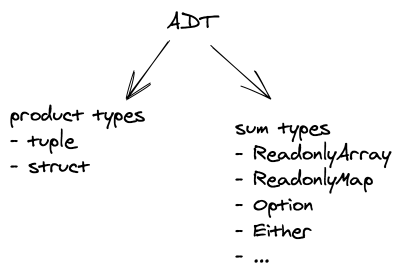

<!-- markdownlint-disable-file MD033 -->
# 代数数据类型(Algebraic Data Types)

构建新应用程序的第一步是定义其领域模型(domain model)。TypeScript提供了许多工具来完成这件事。**代数数据类型**是其中之一。

<!--
  还有什么其他的工具？
-->

## 什么是ADT？

> 在计算机编程中，尤其是函数式编程和类型论中，代数数据类型是一种复合类型，即**由其他类型组合而成的类型**。

两个常见的代数数据类型系列是：

- **积类型(product type)**
- **和类型(sum product)**



让我们从更熟悉的那个开始：积类型。

## 积类型(Product types)

积类型是由集合`I`索引的类型 T<sub>i</sub> 的集合。

该系列的两个成员分别是n元组，其中`I`是自然数：

```ts
type Tuple1 = [string]; // I = [0]
type Tuple2 = [string, number]; // I = [0, 1]
type Tuple3 = [string, number, boolean]; // I = [0, 1, 2]

// Accessing by index
type Fst = Tuple2[0]; // string
type Snd = Tuple2[1]; // number
```

和结构体(struct)，其中`I`是一组标签(label)：

```ts
// I = {"name", "age"}
interface Person {
  name: string;
  age: number;
}

// 使用label访问
type Name = Person['name']; // string
type Age = Person['age']; // number
```

积类型可以是 **多态的(polimorphic)**。

**例**：

```ts
//                ↓ 类型参数
type HttpResponse<A> = {
  readonly code: number;
  readonly body: A;
};
```

### 为什么叫积类型？

如果我们用`C(A)`标记`A`类型的元素数量（在数学中也称为**基数(cardinality)**），则以下等式成立：

```ts
C([A, B]) = C(A) * C(B);
```

> 乘积的基数是基数的乘积。

**例**：

`null` 类型的基数为1，因为它只有一个成员：`null`。

**例**：

`boolean`类型的基数为2，因为它有两个成员：`true`和`false`。

**例**：

```ts
type Hour = 1 | 2 | 3 | 4 | 5 | 6 | 7 | 8 | 9 | 10 | 11 | 12;
type Period = 'AM' | 'PM';
type Clock = [Hour, Period];
```

`Hour`有12个成员。`Period`有2个成员。所以`Clock`有`12 * 2 = 24`元素。

**测验**：`Clock`的基数是多少？

```ts
// 与之前相同
type Hour = 1 | 2 | 3 | 4 | 5 | 6 | 7 | 8 | 9 | 10 | 11 | 12;
// 与之前相同
type Period = 'AM' | 'PM';

// 不再是元组
type Clock = {
  readonly hour: Hour;
  readonly period: Period;
};
```

### 什么时候可以使用积类型

每当它的 _组件_ 是 **相互独立** 的时候。

```ts
type Clock = [Hour, Period];
```

这里`Hour`和`Period`是独立的，即`Hour`的值不影响`Period`的值，反之亦然。每对`[Hour, period]`都是合法且有意义的。

## 和类型(Sum types)

和类型是一种数据结构，其中可以保存不同（但固定）类型的值。在单个实例中只能使用其中一种类型，并且通常有一个“标记值”来区分这些类型。

在TypeScript'的官方文档中它们被称作[可辨识联合(discriminated union)](https://www.typescriptlang.org/docs/handbook/2/narrowing.html#discriminated-unions).

需要注意的是，联合的成员必须**不相交(disjoint)**，不能有属于多个成员的值。
**注**：可辨识联合(discriminated union)，联合类型(union type)，不相交并集(disjoint union)在本节中是同义的。

**例**：

```ts
type StringsOrNumbers = ReadonlyArray<string> | ReadonlyArray<number>;
```

不是不相交并集，因为`[]`同时属于两个成员。

**测验**：下面的集合是不相交的吗？

```ts
type Member1 = { readonly a: string };
type Member2 = { readonly b: number };
type MyUnion = Member1 | Member2;
```

在函数式编程中，我们倾向于尽可能地使用不相交并集。

幸运的是，在TypeScript中，有一种安全的方法可以确保集合是不相交的：添加一个特殊的`tag`字段。

**例** ([redux actions](https://redux.js.org/introduction/getting-started#basic-example))：

联合类型`Action`对[todo app](https://todomvc.com/)中的部分操作进行了建模。

```ts
type Action =
  | {
      type: 'ADD_TODO';
      text: string;
    }
  | {
      type: 'UPDATE_TODO';
      id: number;
      text: string;
      completed: boolean;
    }
  | {
      type: 'DELETE_TODO';
      id: number;
    };
```

`type`标签确保联合类型中的每个类型是不相交的。

充当标签的字段由开发人员自行决定，不需要一定是`type`（例如，在 fp-ts 中，按照惯例使用名称`_tag`）。

现在我们已经看到了一些例子，我们可以更明确地定义代数数据类型：

> 一般来说，代数数据类型指定一个或多个选项的和，其中每个选项是零或多个字段的乘积。

和类型可以是**多态的**和**递归的**。

**例** (链表)

```ts
//               ↓ 类型参数
export type List<A> =
  | { readonly _tag: 'Nil' }
  | { readonly _tag: 'Cons'; readonly head: A; readonly tail: List<A> };
//                                                              ↑ 递归
```

**测验** (TypeScript)：判断下列数据类型是和类型还是积类型。

- `ReadonlyArray<A>`
- `Record<string, A>`
- `Record<'k1' | 'k2', A>`
- `ReadonlyMap<string, A>`
- `ReadonlyMap<'k1' | 'k2', A>`

### 构造函数

具有n个元素的和类型至少需要n个**构造函数**，每个成员各一个：

**例** (redux action)

```ts
export type Action =
  | {
      readonly type: 'ADD_TODO';
      readonly text: string;
    }
  | {
      readonly type: 'UPDATE_TODO';
      readonly id: number;
      readonly text: string;
      readonly completed: boolean;
    }
  | {
      readonly type: 'DELETE_TODO';
      readonly id: number;
    };

export const add = (text: string): Action => ({
  type: 'ADD_TODO',
  text,
});

export const update = (
  id: number,
  text: string,
  completed: boolean,
): Action => ({
  type: 'UPDATE_TODO',
  id,
  text,
  completed,
});

export const del = (id: number): Action => ({
  type: 'DELETE_TODO',
  id,
});
```

**例** (TypeScript，链表)

```ts
export type List<A> =
  | { readonly _tag: 'Nil' }
  | { readonly _tag: 'Cons'; readonly head: A; readonly tail: List<A> };

// a nullary constructor can be implemented as a constant
export const nil: List<never> = { _tag: 'Nil' };

export const cons = <A,>(head: A, tail: List<A>): List<A> => ({
  _tag: 'Cons',
  head,
  tail,
});

// equivalent to an array containing [1, 2, 3]
const myList = cons(1, cons(2, cons(3, nil)));
```

### 模式匹配(Pattern matching)

JavaScript不支持[模式匹配](https://github.com/tc39/proposal-pattern-matching) (TypeScript也不支持)。但我们可以使用`match`函数来模拟它。

**例** (TypeScript，链表)

```ts
interface Nil {
  readonly _tag: 'Nil';
}

interface Cons<A> {
  readonly _tag: 'Cons';
  readonly head: A;
  readonly tail: List<A>;
}

export type List<A> = Nil | Cons<A>;

export const match =
  <R, A>(onNil: () => R, onCons: (head: A, tail: List<A>) => R) =>
  (fa: List<A>): R => {
    switch (fa._tag) {
      case 'Nil':
        return onNil();
      case 'Cons':
        return onCons(fa.head, fa.tail);
    }
  };

// 如果链表为空则返回`true`
export const isEmpty = match(
  () => true,
  () => false,
);

// 返回链表的第一个元素或`undefined`
export const head = match(
  () => undefined,
  (head, _tail) => head,
);

// 递归地返回链表的长度
export const length: <A>(fa: List<A>) => number = match(
  () => 0,
  (_, tail) => 1 + length(tail),
);
```

**测验**：为什么`head` API 不是最优的？

> [答案](../quiz-answers/pattern-matching.md)

**注**：TypeScript为和类型提供了一个很棒的功能：**[详尽性检查(exhaustive check)](https://www.typescriptlang.org/docs/handbook/2/narrowing.html#exhaustiveness-checking)**。类型检查器可以 _检查_ 是否所有可能的情况都由函数体中定义的`switch`处理了。

### 为什么叫和类型？

因为以下恒等式成立：

```ts
C(A | B) = C(A) + C(B);
```

> 和的基数是基数的和

**例** (`Option`类型)

```ts
interface None {
  readonly _tag: 'None';
}

interface Some<A> {
  readonly _tag: 'Some';
  readonly value: A;
}

type Option<A> = None | Some<A>;
```

从通用公式`C(Option<A>) = 1 + C(A)`我们可以导出`Option<boolean>`类型的基数：`1 + 2 = 3`。

### 什么时候该使用和类型

当用积类型实现时，组件会**互相依赖**时。

**例** (`React` props)

```tsx
import * as React from 'react';

interface Props {
  readonly editable: boolean;
  readonly onChange?: (text: string) => void;
}

class Textbox extends React.Component<Props> {
  render() {
    if (this.props.editable) {
      // error: Cannot invoke an object which is possibly 'undefined' :(
      this.props.onChange('a');
    }
    return <div />;
  }
}
```

这里的问题是`Props`被建模为一个积，但`onChange`**依赖**`editable`

和类型更适合这种场景：

```ts
import * as React from 'react';

type Props =
  | {
      readonly type: 'READONLY';
    }
  | {
      readonly type: 'EDITABLE';
      readonly onChange: (text: string) => void;
    };

class Textbox extends React.Component<Props> {
  render() {
    switch (this.props.type) {
      case 'EDITABLE':
        this.props.onChange('a'); // :)
    }
    return <div />;
  }
}
```

**例** (node callbacks)

```ts
declare function readFile(
  path: string,
  //         ↓ ---------- ↓ CallbackArgs
  callback: (err?: Error, data?: string) => void,
): void;
```

`readFile`的结果被建模为积类型（准确地地说是一个元组），稍后传递给`callback`：

```ts
type CallbackArgs = [Error | undefined, string | undefined];
```

但是回调的组件(指参数)是互相依赖的：我们**要么**得到一个`Error`**要么**得到一个`string`:

| err         | data        | 合法性 |
| ----------- | ----------- | ----- |
| `Error`     | `undefined` | ✓     |
| `undefined` | `string`    | ✓     |
| `Error`     | `string`    | ✘     |
| `undefined` | `undefined` | ✘     |

这个API显然不是基于以下前提建模的：

> 使不可能的状态无法表示

和类型会是更好的选择，但是应该选择哪个呢？让我们看看如何以函数式的方式处理错误。

**测验**：最近，返回`Promise`的API比回调 API 更受欢迎。

```ts
declare function readFile(path: string): Promise<string>;
```

当使用像 TypeScript 这样的静态类型语言时，你能发现`Promise`的一些缺点吗？

## 函数式风格的错误处理(Functional error handling)

让我们看看如何以函数式方式处理错误。

返回错误或引发异常的函数就是部分函数的示例。

在纯函数和偏函数一章中，我们看到每个偏函数`f`总是可以转化为全函数`f'`

```plaintext
f': X ⟶ Option(Y)
```

现在我们对TypeScript中的联合类型有了更多的了解，我们可以毫无问题地定义`Option`。

### `Option`类型

`Option<A>`类型代表计算的作用(返回值)，该计算可能失败（`None`）或返回类型为`A`的值（`Some<A>`）：

```ts
// 代表失败
interface None {
  readonly _tag: 'None';
}

// 代表成功
interface Some<A> {
  readonly _tag: 'Some';
  readonly value: A;
}

type Option<A> = None | Some<A>;
```

构造函数与模式匹配：

```ts
const none: Option<never> = { _tag: 'None' };

const some = <A,>(value: A): Option<A> => ({ _tag: 'Some', value });

const match =
  <R, A>(onNone: () => R, onSome: (a: A) => R) =>
  (fa: Option<A>): R => {
    switch (fa._tag) {
      case 'None':
        return onNone();
      case 'Some':
        return onSome(fa.value);
    }
  };
```

`Option`类型可用于避免抛出异常或表示可选值，因此我们可以从以下：

```ts
// 类型系统不知道该计算可能会失败
//                                       ↓ 这是一个谎言
const head = <A,>(as: ReadonlyArray<A>): A => {
  if (as.length === 0) {
    throw new Error('Empty array');
  }
  return as[0];
};

let s: string;
try {
  s = String(head([]));
} catch (e) {
  s = e.message;
}
```

改为：

```ts
import { pipe } from 'fp-ts/function';

//                                      ↓ 类型系统现在知道这个计算可能会失败
const head = <A,>(as: ReadonlyArray<A>): Option<A> =>
  as.length === 0 ? none : some(as[0]);

declare const numbers: ReadonlyArray<number>;

const result = pipe(
  head(numbers),
  match(
    () => 'Empty array',
    (n) => String(n),
  ),
);
```

上述代码，**错误的可能性被编码进了类型系统中**。

如果我们在不进行任何检查的情况下尝试访问`Option`的`value`，类型系统将警告我们可能会出现错误：

```ts
declare const numbers: ReadonlyArray<number>;

const result = head(numbers);
result.value; // type checker error: Property 'value' does not exist on type 'Option<number>'
```

访问`Option`中包含的值的唯一方法是使用`match`函数处理失败的情况。

```ts
pipe(result, match(
  () => /** 错误处理 */
  (n) => /** 编写业务逻辑 */
))
```

能否为之前章节中看到的抽象定义`Option`实例？让我们从`Eq`开始。

#### `Eq`实例

假设我们有两个`Option<string>`类型的值，并且我们想要比较它们以检查它们是否相等：

```ts
import { pipe } from 'fp-ts/function';
import { match, Option } from 'fp-ts/Option';

declare const o1: Option<string>;
declare const o2: Option<string>;

const result: boolean = pipe(
  o1,
  match(
    // onNone o1
    () =>
      pipe(
        o2,
        match(
          // onNone o2
          () => true,
          // onSome o2
          () => false,
        ),
      ),
    // onSome o1
    (s1) =>
      pipe(
        o2,
        match(
          // onNone o2
          () => false,
          // onSome o2
          (s2) => s1 === s2, // 字符串相等
        ),
      ),
  ),
);
```

如果我们有两个`Option<number>`类型的值怎么办？再写一遍相同代码会非常烦人，毕竟唯一的区别是我们如何比较`Option`中包含的两个值。

因此，我们可以通过要求用户为`A`提供`Eq`实例来概括必要的代码，然后为`Option<A>`派生一个`Eq`实例。

换句话说，我们可以定义一个 **combinator** `getEq`：给定一个`Eq<A>`这个combinator返回一个`Eq<Option<A>>`：

```ts
import { Eq } from 'fp-ts/Eq';
import { pipe } from 'fp-ts/function';
import { match, Option, none, some } from 'fp-ts/Option';

export const getEq = <A,>(E: Eq<A>): Eq<Option<A>> => ({
  equals: (first, second) =>
    pipe(
      first,
      match(
        () =>
          pipe(
            second,
            match(
              () => true,
              () => false,
            ),
          ),
        (a1) =>
          pipe(
            second,
            match(
              () => false,
              (a2) => E.equals(a1, a2), // `Eq<A>`的相等性检查
            ),
          ),
      ),
    ),
});

import * as S from 'fp-ts/string';

const EqOptionString = getEq(S.Eq);

console.log(EqOptionString.equals(none, none)); // => true
console.log(EqOptionString.equals(none, some('b'))); // => false
console.log(EqOptionString.equals(some('a'), none)); // => false
console.log(EqOptionString.equals(some('a'), some('b'))); // => false
console.log(EqOptionString.equals(some('a'), some('a'))); // => true
```

为`Option<A>`定义`Eq`实例的好处是，能够使用我们之前见过的所有的`Eq`的 combinator。

以下是如何为`Option<readonly [string, number]>`定义`Eq`实例：

```ts
import { tuple } from 'fp-ts/Eq';
import * as N from 'fp-ts/number';
import { getEq, Option, some } from 'fp-ts/Option';
import * as S from 'fp-ts/string';

type MyTuple = readonly [string, number];

const EqMyTuple = tuple<MyTuple>(S.Eq, N.Eq);

const EqOptionMyTuple = getEq(EqMyTuple);

const o1: Option<MyTuple> = some(['a', 1]);
const o2: Option<MyTuple> = some(['a', 2]);
const o3: Option<MyTuple> = some(['b', 1]);

console.log(EqOptionMyTuple.equals(o1, o1)); // => true
console.log(EqOptionMyTuple.equals(o1, o2)); // => false
console.log(EqOptionMyTuple.equals(o1, o3)); // => false
```

如果稍微修改一下导入，我们可以获得`Ord`的类似结果：

```ts
import * as N from 'fp-ts/number';
import { getOrd, Option, some } from 'fp-ts/Option';
import { tuple } from 'fp-ts/Ord';
import * as S from 'fp-ts/string';

type MyTuple = readonly [string, number];

const OrdMyTuple = tuple<MyTuple>(S.Ord, N.Ord);

const OrdOptionMyTuple = getOrd(OrdMyTuple);

const o1: Option<MyTuple> = some(['a', 1]);
const o2: Option<MyTuple> = some(['a', 2]);
const o3: Option<MyTuple> = some(['b', 1]);

console.log(OrdOptionMyTuple.compare(o1, o1)); // => 0
console.log(OrdOptionMyTuple.compare(o1, o2)); // => -1
console.log(OrdOptionMyTuple.compare(o1, o3)); // => -1
```

##### `Semigroup`与`Monoid`实例

现在，假设我们想要“合并”两个不同的`Option<A>`：有四种不同的情况：

| x       | y       | concat(x, y) |
| ------- | ------- | ------------ |
| none    | none    | none         |
| some(a) | none    | none         |
| none    | some(a) | none         |
| some(a) | some(b) | ?            |

最后一种情况有一个问题，我们需要一个方法来“合并”两个不同的`A`。

如果我们有这样的方法就好了...这不正是我们的老朋友`Semigroup`的工作吗！？

| x        | y        | concat(x, y)           |
| -------- | -------- | ---------------------- |
| some(a1) | some(a2) | some(S.concat(a1, a2)) |

我们需要做的就是要求用户为`A`提供一个`Semigroup`实例，然后为`Option<A>`派生一个`Semigroup`实例。

```ts
// 实现留给读者作为练习
declare const getApplySemigroup: <A>(S: Semigroup<A>) => Semigroup<Option<A>>;
```

**测验**：是否可以在上面的半群中添加一个单位元使其成为幺半群？

```ts
// 实现留给读者作为练习
declare const getApplicativeMonoid: <A>(M: Monoid<A>) => Monoid<Option<A>>;
```

可以为`Option<A>`定义一个幺半群实例，其行为如下：

| x        | y        | concat(x, y)           |
| -------- | -------- | ---------------------- |
| none     | none     | none                   |
| some(a1) | none     | some(a1)               |
| none     | some(a2) | some(a2)               |
| some(a1) | some(a2) | some(S.concat(a1, a2)) |

```ts
// 实现留给读者作为练习
declare const getMonoid: <A>(S: Semigroup<A>) => Monoid<Option<A>>;
```

**测验**：幺半群的`empty`是什么？

> [答案](../quiz-answers/option-semigroup-monoid-second.md)

**例**：

利用`getMonoid`我们可以派生出另外两个有用的幺半群:

(返回最左边的非`None`值)

| x        | y        | concat(x, y) |
| -------- | -------- | ------------ |
| none     | none     | none         |
| some(a1) | none     | some(a1)     |
| none     | some(a2) | some(a2)     |
| some(a1) | some(a2) | some(a1)     |

```ts
import { Monoid } from 'fp-ts/Monoid';
import { getMonoid, Option } from 'fp-ts/Option';
import { first } from 'fp-ts/Semigroup';

export const getFirstMonoid = <A = never,>(): Monoid<Option<A>> =>
  getMonoid(first());
```

和它的对偶:

(返回最右边的非`None`值)

| x        | y        | concat(x, y) |
| -------- | -------- | ------------ |
| none     | none     | none         |
| some(a1) | none     | some(a1)     |
| none     | some(a2) | some(a2)     |
| some(a1) | some(a2) | some(a2)     |

```ts
import { Monoid } from 'fp-ts/Monoid';
import { getMonoid, Option } from 'fp-ts/Option';
import { last } from 'fp-ts/Semigroup';

export const getLastMonoid = <A = never,>(): Monoid<Option<A>> =>
  getMonoid(last());
```

**例**：

在管理可选值时`getLastMonoid`非常有用。让我们看一个示例，我们想要派生文本编辑器（在本例中为 VSCode）的用户设置。

```ts
import { Monoid, struct } from 'fp-ts/Monoid';
import { getMonoid, none, Option, some } from 'fp-ts/Option';
import { last } from 'fp-ts/Semigroup';

/** VSCode settings */
interface Settings {
  /** 控制 font family */
  readonly fontFamily: Option<string>;
  /** 控制 font size */
  readonly fontSize: Option<number>;
  /** 限制渲染minimap时使用的列数 */
  readonly maxColumn: Option<number>;
}

const monoidSettings: Monoid<Settings> = struct({
  fontFamily: getMonoid(last()),
  fontSize: getMonoid(last()),
  maxColumn: getMonoid(last()),
});

const workspaceSettings: Settings = {
  fontFamily: some('Courier'),
  fontSize: none,
  maxColumn: some(80),
};

const userSettings: Settings = {
  fontFamily: some('Fira Code'),
  fontSize: some(12),
  maxColumn: none,
};

/** userSettings 覆盖 workspaceSettings */
console.log(monoidSettings.concat(workspaceSettings, userSettings));
/*
{ fontFamily: some("Fira Code"),
  fontSize: some(12),
  maxColumn: some(80) }
*/
```

**测验**：假设VSCode每行无法管理超过“80”列，我们如何修改“monoidSettings”的定义以考虑到这一点？

### `Either`类型

`Either`的常见用途是作为`Option`的替代方案来处理可能失败的计算的影响，同时能够指定失败的原因。

在此用法中，`None`被`Left`替代，其中包含有关错误的有用信息。`Right`代替`Some`。

```ts
// 代表失败
interface Left<E> {
  readonly _tag: 'Left';
  readonly left: E;
}

// 代表成功
interface Right<A> {
  readonly _tag: 'Right';
  readonly right: A;
}

type Either<E, A> = Left<E> | Right<A>;
```

构造函数与模式匹配：

```ts
const left = <E, A>(left: E): Either<E, A> => ({ _tag: 'Left', left });

const right = <A, E>(right: A): Either<E, A> => ({ _tag: 'Right', right });

const match =
  <E, R, A>(onLeft: (left: E) => R, onRight: (right: A) => R) =>
  (fa: Either<E, A>): R => {
    switch (fa._tag) {
      case 'Left':
        return onLeft(fa.left);
      case 'Right':
        return onRight(fa.right);
    }
  };
```

回到之前的回调的例子：

```ts
declare function readFile(
  path: string,
  callback: (err?: Error, data?: string) => void,
): void;

readFile('./myfile', (err, data) => {
  let message: string;
  if (err !== undefined) {
    message = `Error: ${err.message}`;
  } else if (data !== undefined) {
    message = `Data: ${data.trim()}`;
  } else {
    // 理论上永远不会发生
    message = 'The impossible happened';
  }
  console.log(message);
});
```

我们可以修改它的签名为：

```ts
declare function readFile(
  path: string,
  callback: (result: Either<Error, string>) => void,
): void;
```

然后这样使用这个API：

```ts
readFile('./myfile', (e) =>
  pipe(
    e,
    match(
      (err) => `Error: ${err.message}`,
      (data) => `Data: ${data.trim()}`,
    ),
    console.log,
  ),
);
```
