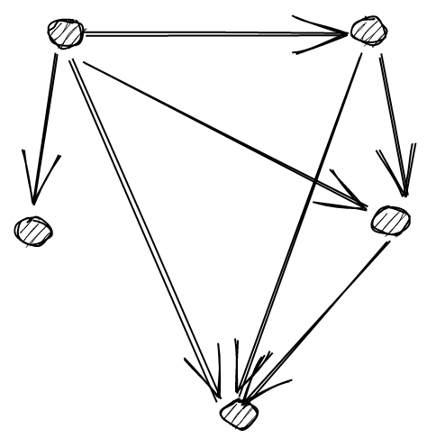

<!-- markdownlint-disable-file MD033 -->
# 范畴论(Category theory)

我们已经看到，函数式编程的基石是**组合**。

> 我们如何解决问题？我们将更大的问题分解为更小的问题。如果较小的问题仍然太大，我们会进一步分解它们，依此类推。最后，我们编写解决所有小问题的代码。然后是编程的本质：我们编写这些代码片段来创建更大问题的解决方案。如果我们无法将碎片重新组合在一起，那么分解就没有意义。- Bartosz Milewski

但这到底意味着什么？我们如何判断两个事物是否可以 _组合_？我们怎么判断两个事物是否组合得 _很好_ 呢？

> 如果我们可以轻松且普遍地以某种方式组合实体的行为，而无需修改所组合的实体，则实体是可组合的。我认为可组合性是实现重用以及实现编程模型中可简洁表达的组合扩展所必需的关键要素。- Paul Chiusano

在第一章中我们了解到，函数式程序往往被编写为管道：

```ts
const program = pipe(
  input,
  f1, // 纯函数
  f2, // 纯函数
  f3, // 纯函数
  ...
)
```

但要坚持这种风格谈何容易呢？这真的可行吗？咱们试试吧：

```ts
import { pipe } from 'fp-ts/function';
import * as RA from 'fp-ts/ReadonlyArray';

const double = (n: number): number => n * 2;

/**
 * 给定一个ReadonlyArray<number>，把它的第一个元素*2然后返回
 */
const program = (input: ReadonlyArray<number>): number =>
  pipe(
    input,
    RA.head, // 编译错误！`Option<number>`不可分配给类型`number`
    double,
  );
```

为什么会编译报错？因为`head`和`double`不能组合。

```ts
head: (as: ReadonlyArray<number>) => Option<number>;
double: (n: number) => number;
```

`head`的到达域与`double`的定义域不一致。

那该怎么办呢？放弃？

应该参考一个**严谨的理论**来回答这些基本问题。我们需要对组合概念进行**正式定义**。

幸运的是，70 多年来，属于人类历史上运行时间最长、规模最庞大的开源项目（数学）的一大批学者一直致力于开发一种针对可组合性的理论：**范畴论**，这是数学的一个分支，由Saunders Mac Lane与Samuel Eilenberg一起创立(1945)。


(Saunders Mac Lane)


(Samuel Eilenberg)

我们将在接下来的章节看到，范畴如何构成了以下内容的基础：

- 通用**编程语言**的模型
- **组合**概念的模型

## 范畴的定义

范畴的定义虽然并不复杂，但有点长，因此我将其分为两部分：

- 第一个仅仅是技术性的（我们需要定义其组成部分）
- 第二部分包含我们更感兴趣的内容：组合的概念

### 第一部分（组成）

一个范畴包含两类数学对象，`对象（Objects）`与`态射（Morphisms）`，其中：

- `对象（Objects）`是对象（object）的集合
- `态射（Morphisms）`是对象（object）间的态射（morphisms）（也称箭头）的集合



**注**：“对象”一词与OOP无关。可以将对象视为无法检查的黑匣子，或者定义态射的简单占位符。

每个态射`f`都有一个源对象`A`和一个目标对象`B`，其中`A`和`B`都包含在`Objects`中。`f: A ⟼ B`读作“`f`是从`A`到`B`的态射”.


**注**：为了简单起见，之后的图中仅使用标签表示对象，省略圆圈。

### 第二部分（组合）

存在一个称为“组合”的运算`∘`，它具有以下性质：

- （**态射的组合**）只要`f: A ⟼ B`和`g: B ⟼ C`是`Morphisms`中的两个态射，则`Morphisms`中必定存在第三个态射`g ∘ f: A ⟼ C`，称为`f`与`g`的 _组合_。


- （**结合律**）如果有`f: A ⟼ B`、`g: B ⟼ C`，`h: C ⟼ D`，则 `h ∘ (g ∘ f) = (h ∘ g) ∘ f`


- (**单位元**) 对于每个对象`X`，都有一个态射`identity: X ⟼ X`称为`X`的 _单位态射_，使得对每个态射`f: A ⟼ X`，都会有`identity ∘ f = f = f ∘ identity`。


**例**：


这个范畴很简单，只有三个对象和六个态射（idA、idB、idC是A、B、C的单位态射）。

## 用范畴建模编程语言

范畴可以被视为**类型化编程语言**的简化模型，其中：

- 对象(object)是**类型**
- 态射(morphism)是**函数**
- `∘`是一般的**函数组合**

如下图：


可以被视为一种虚构的（且简单的）编程语言，只有三种类型和六个函数

如:

- `A = string`
- `B = number`
- `C = boolean`
- `f = string => number`
- `g = number => boolean`
- `g ∘ f = string => boolean`

实现可能类似于：

```ts
const idA = (s: string): string => s;

const idB = (n: number): number => n;

const idC = (b: boolean): boolean => b;

const f = (s: string): number => s.length;

const g = (n: number): boolean => n > 2;

// gf = g ∘ f
const gf = (s: string): boolean => g(f(s));
```

### 一个TypeScript的范畴

我们可以定义一个范畴，称之为 _TS_，作为 TypeScript 语言的简化模型，其中：

- **对象**是所有可能的TypeScript类型：`string`、`number`、`ReadonlyArray<string>` 等...
- **态射**是所有的TypeScript函数：`(a: A) => B`、`(b: B) => C`、...其中 `A`、`B`、`C`、. .. 是TypeScript类型
- **单位态射**全部编码在单个多态函数`const Identity = <A>(a: A): A => a` 中
- **态射的组合**是通常的函数组合（我们知道它是满足结合律的）

作为TypeScript的模型，_TS_ 范畴可能看起来有点局限：没有循环，没有`if`，几乎什么都没有。话虽这么说，简化的模型足够丰富，可以帮助我们实现我们的目标：推理明确定义的组合概念。

### 函数组合的核心问题

在 _TS_ 范畴中，只要`C = B`，我们就可以组合两个泛型函数`f: (a: A) => B`和`g: (c: C) => D`。

```ts
function flow<A, B, C>(f: (a: A) => B, g: (b: B) => C): (a: A) => C {
  return (a) => g(f(a));
}

function pipe<A, B, C>(a: A, f: (a: A) => B, g: (b: B) => C): C {
  return flow(f, g)(a);
}
```

但是如果`B != C`会发生什么？我们如何组合两个这样的函数？

在接下来的章节中，我们将了解在什么条件下可以进行这种组合。

**剧透**：

- 要组合`f: (a: A) => B`与`g: (b: B) => C`，我们使用常用的函数组合。
- 要组合`f: (a: A) => F<B>`与`g: (b: B) => C`，我们需要`F`的 **函子（functor）** 实例。
- 要组合`f: (a: A) => F<B>` with `g: (b: B, c: C) => D`，我们需要`F`的 **应用函子（applicative functor）** 实例。
- 要组合`f: (a: A) => F<B>`与`g: (b: B) => F<C>`，我们需要`F`的 **单子（monad）** 实例。


在本章开头提出的问题对应于第二种情况，其中`F`是`Option`类型：

```ts
// A = ReadonlyArray<number>, B = number, F = Option
head: (as: ReadonlyArray<number>) => Option<number>;
double: (n: number) => number;
```

为了解决这个问题，下一章我们将讨论函子。
